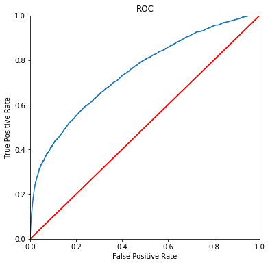
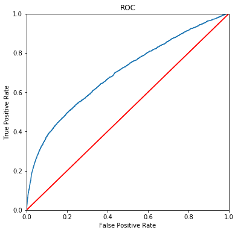

# 統計演習

https://archive.ics.uci.edu/ml/datasets/bank+marketing  
のデータを利用

## サマリ

### ターゲットのユーザー像(ペルソナ)

契約成否でデータを比較（Excelで）  
以下の像が浮かび上がった

* 若者か高齢者（学生か退職者）で
* 前回電話したときに携帯でかけていて
* それも3月、4月、10月のいずれかだった人

### ROIを最大化させるための予測モデル

* 基本的なアプローチ
 1. 以下のCategoryを掛け合わせた新しいCategoryを作成
    * age
    * job
    * contact
    * month
 2. logistic回帰でモデルを作成
 3. モデル作成時に利用したデータを利用して予測結果を取得
 4. 予測結果からモデルを評価（AUC）
 5. 良いモデルだったら、ROIが最大となるようなしきい値を算出（電話1回500円、契約成功LTVは2000円）
 6. テストデータを上記のモデルで評価する

* ほかは以下を使っている
    * const
    * campaign
    * pdays
    * previous
    * emp.var.rate
    * nr.employed
    * job
    * marital
    * education
    * housing
    * loan
    * contact
    * poutcome
    * range_age (10歳おきのCategory)


* テストデータの予測結果を算出し、訓練データで算出したしきい値0.27を適用すると
  -   1,488,500 円の利益がでる
* その時のConfusionMatrix

|        |          | Predict  |          |
|--------|----------|----------|----------|
|        |          | Positive | Negative |
| Actual | Positive | 1544      | 349     |
|        | Negative | 1655      | 572    |

* 適合率: 48.3%
  -  ランダムに電話した場合は46%の確率で契約取れるはずなので、少しは上がったと考えられる
  - 実はTestModel2の方が50.5%で4つを組み合わせた場合より適合率が高いので、アタックリストとしてはTestModel2の方が良い

# データ補完パート

## ライブラリの読み込み


```python
import pandas as pd
import pandas.io.sql as psql
import numpy as np
import matplotlib
import matplotlib.pyplot as plt
import pymysql
import random
import copy
import statsmodels.api as sm
random.seed(0)
import pylab as pl
from sklearn.metrics import roc_curve, auc as calc_auc
from sklearn.metrics import confusion_matrix

%matplotlib inline
```

    /Users/isapro/.pyenv/versions/anaconda3-5.1.0/lib/python3.6/site-packages/statsmodels/compat/pandas.py:56: FutureWarning: The pandas.core.datetools module is deprecated and will be removed in a future version. Please use the pandas.tseries module instead.
      from pandas.core import datetools


## 関数定義

### 欠損値カウント処理


```python
# 指定されたDataFrameのうちObjectタイプになっているカラムについて、欠損値名（指定しなければunknown）でチェックする
def count_nan_value_at_object(data, nan_value = "unknown"):
    for obj in data.select_dtypes(include=object).columns:
        num = data[data[obj] == nan_value][obj].count()
        print('column %s\tnum %d' % (obj, num))
```

### 欠損値補完処理


```python
# 指定されたDataFrameのうち、対象として選択したカラム名の欠損値（指定しなければunknown)を他の値の出現割合に応じて保管する
# 破壊的メソッド
def comp_missing_category_value(data, target, nan_value = "unknown"):
    if data.job.dtype != "object":
        return

    # 値が入っているところだけを取り出す（出現頻度に応じた補完をするため）
    not_unknown_df = data[data[target] != nan_value][target]
    not_unknown_df.reset_index(drop=True,inplace=True)
    
    # 値が入っている割合に従い、欠損値を補正する
    data.loc[data[target] == nan_value, target] = pd.Categorical(not_unknown_df[random.randint(0,not_unknown_df.count())])

```

### 不要カラム削除処理


```python
def drop_columns_as_start_with(data, drop_list):
    X = data.copy()
    for c in drop_list:
        for t in [s for s in X if s.startswith(c)]:
            X.drop(t, axis=1, inplace=True)
    return X
```

### CPRProt作成処理


```python
def CPRProtFigure(X, result):
    total = len(X.columns)
    ncol = 3
    nrow = int(total / ncol) + 1
    fig = plt.figure(figsize=(20, nrow*4))
    plt.subplots_adjust(wspace=0.3, hspace=0.5)
    for i in range(0,total):
        ax = fig.add_subplot(nrow,ncol,i+1)
        result.plot_partial_residuals(X.columns[i], ax)

    return plt
```

### ROCプロット作成処理


```python
def ROCPlot(Y, prY):
    # 偽陽性、真陽性、しきい値の組み合わせを取得する
    fpr, tpr, thresholds = roc_curve(Y, prY)
    # AUCを計算する
    roc_auc = calc_auc(fpr, tpr)
   
    # ROC曲線用の処理
    i = np.arange(len(tpr)) # index for df
    roc = pd.DataFrame({'fpr' : pd.Series(fpr, index=i),'tpr' : pd.Series(tpr, index = i), '1-fpr' : pd.Series(1-fpr, index = i), 'tf' : pd.Series(tpr - (1-fpr), index = i), 'thresholds' : pd.Series(thresholds, index = i)})
    roc.loc[(roc.tf-0).abs().argsort()[:1]]

    # 描画
    fig = plt.figure(figsize=(6, 6))
    plt.plot(roc['fpr'],roc['tpr'])
    plt.xlabel('False Positive Rate')
    plt.ylabel('True Positive Rate')
    plt.ylim([0,1])
    plt.xlim([0,1])
    plt.plot([[0,0],[1,1]], c='r')
    plt.title('ROC')

    return plt, roc_auc
```


```python
def TestModel1(data):
     # 新しい変数の作成
    new_category = ["job","range_age","education"]
    for job in data["job"].unique():
        for range_age in data["range_age"].unique():
            for edu in data["education"].unique():
                data.loc[(data["job"] == job) & (data["range_age"] == range_age) & (data["education"] == edu), "personal"] = f'{job}+{range_age}+{edu}'
    for cat in new_category:
        data.drop(cat, axis=1, inplace=True)
    return new_category

```


```python
def TestModel2(data):
     # 新しい変数の作成
    new_category = ["contact","education"]
    for k1 in data["contact"].unique():
        for k2 in data["education"].unique():
                data.loc[(data["contact"] == k1) & (data["education"] == k2), "personal"] = f'{k1}+{k2}'
    for cat in new_category:
        data.drop(cat, axis=1, inplace=True)                
    return new_category
```


```python
def TestModel3(data):
     # 新しい変数の作成
    new_category = ["contact","month","range_age","job"]
    for k1 in data["contact"].unique():
        for k2 in data["month"].unique():
            for k3 in data["range_age"].unique():
                for k4 in data["job"].unique():
                    data.loc[\
                        (data["contact"] == k1) &\
                        (data["month"] == k2) &\
                        (data["range_age"] == k3) &\
                        (data["job"] == k4), "personal"] = f'{k1}+{k2}+{k3}+{k4}'
    for cat in new_category:
        data.drop(cat, axis=1, inplace=True)                
    return new_category
```


```python
def TestModel4(data):
     # 新しい変数の作成
    new_category = ["contact","range_age","job"]
    for k1 in data["contact"].unique():
        for k2 in data["range_age"].unique():
            for k3 in data["job"].unique():
                    data.loc[\
                        (data["contact"] == k1) &\
                        (data["range_age"] == k2) &\
                        (data["job"] == k3), "personal"] = f'{k1}+{k2}+{k3}'
    for cat in new_category:
        data.drop(cat, axis=1, inplace=True)                
    return new_category
```

## MAIN関数


```python
def BANKMarketingDataCrensing(data):
    # 変数定義
    comp_list = ["job","marital","education","default","housing","loan"]
    dummy_list = ["job","marital","education","default","housing","loan","contact","month","day_of_week","poutcome","range_age","personal"]
#     dummy_list = ["job","marital","education","default","housing","loan","contact","month","day_of_week","poutcome","range_age"]

    # データの補完
    for target in comp_list:
        comp_missing_category_value(data, target, nan_value = "unknown")
    
    # ageのビンズ化(10歳ずつのカテゴリ)
    age_labels = [ "{0}_{1}".format(i, i + 9) for i in range(0, 100, 10) ]
    data.loc[:, "range_age"] = pd.cut(data.loc[:,'age'], np.arange(0, 101, 10), labels = age_labels)
    
    # 新しい変数の作成
#     used_array =  TestModel1(data)
#     used_array = TestModel2(data)
    used_array = TestModel3(data)
#     used_array = TestModel4(data)
    for v in used_array:
        dummy_list.remove(v)
    
    # ダミー化
    analyze_data = data.copy()
    analyze_data = pd.get_dummies(analyze_data, columns=dummy_list, drop_first=True)
    
    # 切片の追加
    analyze_data = sm.add_constant(analyze_data)
    
    return analyze_data

def BANKMarketingCreateTrainData(data):
    # 変数定義
    drop_list = ['contract', 'duration','age','month','default','euribor3m','cons.','day_of','y']

    # dataの整形
    analyze_data = BANKMarketingDataCrensing(data)

    # 目的変数の作成
    analyze_data['contract'] = data['y'].apply(lambda x : 1 if x == "yes" else 0)
    
    # 目的変数と説明変数を抜き出して作成。説明変数からは不要なカラムを削除
    analyze_data_Y = analyze_data['contract']
    analyze_data_X = drop_columns_as_start_with(analyze_data, drop_list)

    # 分析用データの返却
    return analyze_data_X, analyze_data_Y

def BANKMarketingCreateTestData(data):
    # 変数定義
    drop_list = ['contract', 'duration','age','month','default','euribor3m','cons.','day_of','y']

    # dataの整形
    analyze_data = BANKMarketingDataCrensing(data)
    
    # 説明変数からは不要なカラムを削除
    analyze_data_X = drop_columns_as_start_with(analyze_data, drop_list)

    # 分析用データの返却
    return analyze_data_X

def BANKMarketingGLM(X, Y):
    # GLMの実行
    #モデルの構築
    model = sm.GLM(Y.astype(float), X, family=sm.families.Binomial())
    #fitに回帰した結果が入っているので、これをresに代入する
    res = model.fit()

    return res, X, Y

def BANKMarketingPredictProfit(Y, prY):
    # 変数定義
    thresholds = np.arange(0.01, 1.01, 0.01)
    profits = []
    max_t = 0
    max_p = 0
    max_tn = 0
    max_fp = 0
    max_fn = 0
    max_tp = 0

    # 最大値を探す
    for t in thresholds:
        # しきい値に対して0,1に変換する
        prY2 = prY.map(lambda x: 1 if x > t else 0)
        
        # 混同行列を作成
        tn, fp, fn, tp = confusion_matrix(Y, prY2).ravel()
        
        # 評価結果と最大値の更新
        y = 2000 * tp - 500 * (tp + fp)
        profits.append(y)
        if(max_t==0 or max_y < y):
            max_t = t
            max_y = y
            max_tn = tn
            max_fp = fp
            max_fn = fn
            max_tp = tp

    # 評価結果の描画
    fig, ax = plt.subplots()
    plt.plot(thresholds, profits)
    plt.scatter(max_t, max_y, marker='o', color='r', s=50)
    plt.xlabel('thresholds')
    plt.ylabel('profits')
    plt.title('Profit and loss graph')

    return plt, max_y, max_t, max_tp, max_fn, max_fp, max_tn

```

### 一発で予測結果を取得する関数


```python
def ippatu(train, test, t):
    # 整形
    trainX, trainY = BANKMarketingCreateTrainData(train)
    testX, testY = BANKMarketingCreateTrainData(test)

    # trainデータにあって、testデータに無いカラムは0で埋める
    for c in trainX.columns:
        if(c not in testX.columns):
            testX[c] = 0

    # testデータにあって、trainデータに無いカラムは捨て去る
    for c in testX.columns:
        if(c not in trainX.columns):
            testX.drop(c, axis=1, inplace=True)

    # 予測モデル
    res, trainX, trainY = BANKMarketingGLM(trainX,trainY)
    
    # 予測結果の取得
    test_predY = res.predict(testX)

    # しきい値を使って0,1に直す
    test_predY2 = test_predY.map(lambda x: 1 if x > t else 0)

    # 混同行列を作成
    tn, fp, fn, tp = confusion_matrix(testY, test_predY2).ravel()

    # 利益を算出
    y = 2000 * tp - 500 * (tp + fp)

    # 最適化された予測結果の格納
    temp = test.copy()
    temp['predict'] = test_predY2
    
    return temp, y, tp, fn, fp, tn
```

## Main処理


```python
# データの読み込み
data = pd.read_csv('bank_marketing_train.csv')
# データの整形
X, Y = BANKMarketingCreateTrainData(data)
# 予測結果の取得
res, X, Y = BANKMarketingGLM(X,Y)
# 予測結果の表示
res.summary()
```


<table class="simpletable">
<caption>Generalized Linear Model Regression Results</caption>
<tr>
  <th>Dep. Variable:</th>      <td>contract</td>     <th>  No. Observations:  </th>  <td> 37068</td> 
</tr>
<tr>
  <th>Model:</th>                 <td>GLM</td>       <th>  Df Residuals:      </th>  <td> 36448</td> 
</tr>
<tr>
  <th>Model Family:</th>       <td>Binomial</td>     <th>  Df Model:          </th>  <td>   619</td> 
</tr>
<tr>
  <th>Link Function:</th>        <td>logit</td>      <th>  Scale:             </th>    <td>1.0</td>  
</tr>
<tr>
  <th>Method:</th>               <td>IRLS</td>       <th>  Log-Likelihood:    </th> <td> -8384.5</td>
</tr>
<tr>
  <th>Date:</th>           <td>Thu, 11 Apr 2019</td> <th>  Deviance:          </th> <td>  16769.</td>
</tr>
<tr>
  <th>Time:</th>               <td>21:14:40</td>     <th>  Pearson chi2:      </th> <td>3.58e+04</td>
</tr>
<tr>
  <th>No. Iterations:</th>        <td>26</td>        <th>                     </th>     <td> </td>   
</tr>
</table>
<table class="simpletable">
<tr>
                       <td></td>                         <th>coef</th>     <th>std err</th>      <th>z</th>      <th>P>|z|</th>  <th>[0.025</th>    <th>0.975]</th>  
</tr>
<tr>
  <th>const</th>                                      <td>  597.2910</td> <td>  140.736</td> <td>    4.244</td> <td> 0.000</td> <td>  321.453</td> <td>  873.129</td>
</tr>
<tr>
  <th>campaign</th>                                   <td>   -0.0386</td> <td>    0.010</td> <td>   -3.893</td> <td> 0.000</td> <td>   -0.058</td> <td>   -0.019</td>
</tr>
<tr>
  <th>pdays</th>                                      <td>   -0.0009</td> <td>    0.001</td> <td>   -1.357</td> <td> 0.175</td> <td>   -0.002</td> <td>    0.000</td>
</tr>
<tr>
  <th>previous</th>                                   <td>    0.0943</td> <td>    0.239</td> <td>    0.395</td> <td> 0.693</td> <td>   -0.374</td> <td>    0.563</td>
</tr>
<tr>
  <th>emp.var.rate</th>                               <td>    3.5655</td> <td>    0.947</td> <td>    3.764</td> <td> 0.000</td> <td>    1.709</td> <td>    5.422</td>
</tr>
<tr>
  <th>nr.employed</th>                                <td>   -0.1158</td> <td>    0.027</td> <td>   -4.248</td> <td> 0.000</td> <td>   -0.169</td> <td>   -0.062</td>
</tr>
<tr>
  <th>marital_married</th>                            <td>    0.0072</td> <td>    0.074</td> <td>    0.097</td> <td> 0.922</td> <td>   -0.137</td> <td>    0.152</td>
</tr>
<tr>
  <th>marital_single</th>                             <td>    0.0610</td> <td>    0.082</td> <td>    0.741</td> <td> 0.458</td> <td>   -0.100</td> <td>    0.222</td>
</tr>
<tr>
  <th>education_basic.6y</th>                         <td>    0.2632</td> <td>    0.121</td> <td>    2.172</td> <td> 0.030</td> <td>    0.026</td> <td>    0.501</td>
</tr>
<tr>
  <th>education_basic.9y</th>                         <td>    0.1457</td> <td>    0.100</td> <td>    1.459</td> <td> 0.145</td> <td>   -0.050</td> <td>    0.341</td>
</tr>
<tr>
  <th>education_high.school</th>                      <td>    0.1718</td> <td>    0.100</td> <td>    1.719</td> <td> 0.086</td> <td>   -0.024</td> <td>    0.368</td>
</tr>
<tr>
  <th>education_illiterate</th>                       <td>    0.9552</td> <td>    0.806</td> <td>    1.186</td> <td> 0.236</td> <td>   -0.624</td> <td>    2.534</td>
</tr>
<tr>
  <th>education_professional.course</th>              <td>    0.1400</td> <td>    0.115</td> <td>    1.214</td> <td> 0.225</td> <td>   -0.086</td> <td>    0.366</td>
</tr>
<tr>
  <th>education_university.degree</th>                <td>    0.3133</td> <td>    0.104</td> <td>    3.013</td> <td> 0.003</td> <td>    0.109</td> <td>    0.517</td>
</tr>
<tr>
  <th>housing_yes</th>                                <td>   -0.0659</td> <td>    0.043</td> <td>   -1.520</td> <td> 0.128</td> <td>   -0.151</td> <td>    0.019</td>
</tr>
<tr>
  <th>loan_yes</th>                                   <td>    0.0043</td> <td>    0.060</td> <td>    0.072</td> <td> 0.943</td> <td>   -0.113</td> <td>    0.121</td>
</tr>
<tr>
  <th>poutcome_nonexistent</th>                       <td>    0.6250</td> <td>    0.265</td> <td>    2.362</td> <td> 0.018</td> <td>    0.106</td> <td>    1.144</td>
</tr>
<tr>
  <th>poutcome_success</th>                           <td>    0.9841</td> <td>    0.667</td> <td>    1.474</td> <td> 0.140</td> <td>   -0.324</td> <td>    2.292</td>
</tr>
<tr>
  <th>personal_cellular+apr+20_29+admin.</th>         <td>   -0.4422</td> <td>    0.460</td> <td>   -0.961</td> <td> 0.336</td> <td>   -1.344</td> <td>    0.459</td>
</tr>
<tr>
  <th>personal_cellular+apr+20_29+blue-collar</th>    <td>   -0.9412</td> <td>    0.551</td> <td>   -1.709</td> <td> 0.087</td> <td>   -2.021</td> <td>    0.138</td>
</tr>
<tr>
  <th>personal_cellular+apr+20_29+entrepreneur</th>   <td>   -1.2199</td> <td>    0.910</td> <td>   -1.340</td> <td> 0.180</td> <td>   -3.004</td> <td>    0.565</td>
</tr>
<tr>
  <th>personal_cellular+apr+20_29+management</th>     <td>   -1.5107</td> <td>    0.788</td> <td>   -1.916</td> <td> 0.055</td> <td>   -3.056</td> <td>    0.034</td>
</tr>
<tr>
  <th>personal_cellular+apr+20_29+self-employed</th>  <td>   -0.4857</td> <td>    0.607</td> <td>   -0.800</td> <td> 0.424</td> <td>   -1.676</td> <td>    0.704</td>
</tr>
<tr>
  <th>personal_cellular+apr+20_29+services</th>       <td>   -1.5679</td> <td>    0.655</td> <td>   -2.395</td> <td> 0.017</td> <td>   -2.851</td> <td>   -0.285</td>
</tr>
<tr>
  <th>personal_cellular+apr+20_29+student</th>        <td>   -1.1553</td> <td>    0.544</td> <td>   -2.123</td> <td> 0.034</td> <td>   -2.222</td> <td>   -0.089</td>
</tr>
<tr>
  <th>personal_cellular+apr+20_29+technician</th>     <td>   -1.9747</td> <td>    0.585</td> <td>   -3.375</td> <td> 0.001</td> <td>   -3.122</td> <td>   -0.828</td>
</tr>
<tr>
  <th>personal_cellular+apr+20_29+unemployed</th>     <td>   -0.4315</td> <td>    0.676</td> <td>   -0.639</td> <td> 0.523</td> <td>   -1.756</td> <td>    0.893</td>
</tr>
<tr>
  <th>personal_cellular+apr+30_39+admin.</th>         <td>   -1.5049</td> <td>    0.455</td> <td>   -3.307</td> <td> 0.001</td> <td>   -2.397</td> <td>   -0.613</td>
</tr>
<tr>
  <th>personal_cellular+apr+30_39+blue-collar</th>    <td>   -2.3808</td> <td>    0.490</td> <td>   -4.861</td> <td> 0.000</td> <td>   -3.341</td> <td>   -1.421</td>
</tr>
<tr>
  <th>personal_cellular+apr+30_39+entrepreneur</th>   <td>   -2.4918</td> <td>    0.847</td> <td>   -2.942</td> <td> 0.003</td> <td>   -4.152</td> <td>   -0.832</td>
</tr>
<tr>
  <th>personal_cellular+apr+30_39+housemaid</th>      <td>   -1.8559</td> <td>    1.145</td> <td>   -1.620</td> <td> 0.105</td> <td>   -4.101</td> <td>    0.389</td>
</tr>
<tr>
  <th>personal_cellular+apr+30_39+management</th>     <td>   -2.0447</td> <td>    0.567</td> <td>   -3.605</td> <td> 0.000</td> <td>   -3.157</td> <td>   -0.933</td>
</tr>
<tr>
  <th>personal_cellular+apr+30_39+retired</th>        <td>  -27.3154</td> <td> 2.62e+05</td> <td>   -0.000</td> <td> 1.000</td> <td>-5.13e+05</td> <td> 5.13e+05</td>
</tr>
<tr>
  <th>personal_cellular+apr+30_39+self-employed</th>  <td>   -1.3268</td> <td>    0.606</td> <td>   -2.191</td> <td> 0.028</td> <td>   -2.514</td> <td>   -0.140</td>
</tr>
<tr>
  <th>personal_cellular+apr+30_39+services</th>       <td>   -2.4382</td> <td>    0.547</td> <td>   -4.455</td> <td> 0.000</td> <td>   -3.511</td> <td>   -1.365</td>
</tr>
<tr>
  <th>personal_cellular+apr+30_39+student</th>        <td>    0.2388</td> <td>    0.827</td> <td>    0.289</td> <td> 0.773</td> <td>   -1.382</td> <td>    1.860</td>
</tr>
<tr>
  <th>personal_cellular+apr+30_39+technician</th>     <td>   -1.6876</td> <td>    0.477</td> <td>   -3.540</td> <td> 0.000</td> <td>   -2.622</td> <td>   -0.753</td>
</tr>
<tr>
  <th>personal_cellular+apr+30_39+unemployed</th>     <td>   -1.0360</td> <td>    0.787</td> <td>   -1.317</td> <td> 0.188</td> <td>   -2.578</td> <td>    0.506</td>
</tr>
<tr>
  <th>personal_cellular+apr+40_49+admin.</th>         <td>   -1.5362</td> <td>    0.484</td> <td>   -3.175</td> <td> 0.001</td> <td>   -2.484</td> <td>   -0.588</td>
</tr>
<tr>
  <th>personal_cellular+apr+40_49+blue-collar</th>    <td>   -2.3525</td> <td>    0.507</td> <td>   -4.642</td> <td> 0.000</td> <td>   -3.346</td> <td>   -1.359</td>
</tr>
<tr>
  <th>personal_cellular+apr+40_49+entrepreneur</th>   <td>   -2.2567</td> <td>    0.683</td> <td>   -3.302</td> <td> 0.001</td> <td>   -3.596</td> <td>   -0.917</td>
</tr>
<tr>
  <th>personal_cellular+apr+40_49+housemaid</th>      <td>    0.5251</td> <td>    1.007</td> <td>    0.521</td> <td> 0.602</td> <td>   -1.449</td> <td>    2.499</td>
</tr>
<tr>
  <th>personal_cellular+apr+40_49+management</th>     <td>   -2.2022</td> <td>    0.605</td> <td>   -3.641</td> <td> 0.000</td> <td>   -3.388</td> <td>   -1.017</td>
</tr>
<tr>
  <th>personal_cellular+apr+40_49+retired</th>        <td>  -27.4459</td> <td> 4.15e+05</td> <td>-6.62e-05</td> <td> 1.000</td> <td>-8.13e+05</td> <td> 8.13e+05</td>
</tr>
<tr>
  <th>personal_cellular+apr+40_49+self-employed</th>  <td>   -1.4925</td> <td>    0.763</td> <td>   -1.956</td> <td> 0.050</td> <td>   -2.988</td> <td>    0.003</td>
</tr>
<tr>
  <th>personal_cellular+apr+40_49+services</th>       <td>   -1.8318</td> <td>    0.533</td> <td>   -3.436</td> <td> 0.001</td> <td>   -2.877</td> <td>   -0.787</td>
</tr>
<tr>
  <th>personal_cellular+apr+40_49+technician</th>     <td>   -1.1436</td> <td>    0.516</td> <td>   -2.218</td> <td> 0.027</td> <td>   -2.154</td> <td>   -0.133</td>
</tr>
<tr>
  <th>personal_cellular+apr+40_49+unemployed</th>     <td>   -2.6512</td> <td>    1.151</td> <td>   -2.304</td> <td> 0.021</td> <td>   -4.907</td> <td>   -0.396</td>
</tr>
<tr>
  <th>personal_cellular+apr+50_59+admin.</th>         <td>   -1.2278</td> <td>    0.533</td> <td>   -2.302</td> <td> 0.021</td> <td>   -2.273</td> <td>   -0.182</td>
</tr>
<tr>
  <th>personal_cellular+apr+50_59+blue-collar</th>    <td>   -2.0963</td> <td>    0.633</td> <td>   -3.314</td> <td> 0.001</td> <td>   -3.336</td> <td>   -0.857</td>
</tr>
<tr>
  <th>personal_cellular+apr+50_59+entrepreneur</th>   <td>   -1.5620</td> <td>    0.676</td> <td>   -2.309</td> <td> 0.021</td> <td>   -2.888</td> <td>   -0.236</td>
</tr>
<tr>
  <th>personal_cellular+apr+50_59+housemaid</th>      <td>   -0.4560</td> <td>    0.702</td> <td>   -0.650</td> <td> 0.516</td> <td>   -1.831</td> <td>    0.919</td>
</tr>
<tr>
  <th>personal_cellular+apr+50_59+management</th>     <td>   -1.4555</td> <td>    0.628</td> <td>   -2.316</td> <td> 0.021</td> <td>   -2.687</td> <td>   -0.224</td>
</tr>
<tr>
  <th>personal_cellular+apr+50_59+retired</th>        <td>   -0.4441</td> <td>    0.557</td> <td>   -0.797</td> <td> 0.425</td> <td>   -1.536</td> <td>    0.648</td>
</tr>
<tr>
  <th>personal_cellular+apr+50_59+self-employed</th>  <td>   -1.2092</td> <td>    0.899</td> <td>   -1.345</td> <td> 0.179</td> <td>   -2.972</td> <td>    0.553</td>
</tr>
<tr>
  <th>personal_cellular+apr+50_59+services</th>       <td>   -2.3192</td> <td>    0.862</td> <td>   -2.692</td> <td> 0.007</td> <td>   -4.008</td> <td>   -0.631</td>
</tr>
<tr>
  <th>personal_cellular+apr+50_59+technician</th>     <td>   -0.4980</td> <td>    0.564</td> <td>   -0.883</td> <td> 0.377</td> <td>   -1.604</td> <td>    0.608</td>
</tr>
<tr>
  <th>personal_cellular+apr+50_59+unemployed</th>     <td>   -0.6516</td> <td>    1.548</td> <td>   -0.421</td> <td> 0.674</td> <td>   -3.685</td> <td>    2.382</td>
</tr>
<tr>
  <th>personal_cellular+apr+60_69+admin.</th>         <td>    0.0385</td> <td>    1.478</td> <td>    0.026</td> <td> 0.979</td> <td>   -2.858</td> <td>    2.934</td>
</tr>
<tr>
  <th>personal_cellular+apr+60_69+management</th>     <td>   27.6325</td> <td> 5.87e+05</td> <td> 4.71e-05</td> <td> 1.000</td> <td>-1.15e+06</td> <td> 1.15e+06</td>
</tr>
<tr>
  <th>personal_cellular+apr+60_69+retired</th>        <td>    0.2467</td> <td>    0.526</td> <td>    0.469</td> <td> 0.639</td> <td>   -0.784</td> <td>    1.277</td>
</tr>
<tr>
  <th>personal_cellular+apr+60_69+self-employed</th>  <td>  -27.7457</td> <td> 5.87e+05</td> <td>-4.73e-05</td> <td> 1.000</td> <td>-1.15e+06</td> <td> 1.15e+06</td>
</tr>
<tr>
  <th>personal_cellular+apr+60_69+technician</th>     <td>  -27.5644</td> <td> 3.39e+05</td> <td>-8.14e-05</td> <td> 1.000</td> <td>-6.64e+05</td> <td> 6.64e+05</td>
</tr>
<tr>
  <th>personal_cellular+apr+60_69+unemployed</th>     <td>    0.3387</td> <td>    1.484</td> <td>    0.228</td> <td> 0.819</td> <td>   -2.570</td> <td>    3.247</td>
</tr>
<tr>
  <th>personal_cellular+apr+70_79+blue-collar</th>    <td>  -27.0693</td> <td> 5.87e+05</td> <td>-4.61e-05</td> <td> 1.000</td> <td>-1.15e+06</td> <td> 1.15e+06</td>
</tr>
<tr>
  <th>personal_cellular+apr+70_79+housemaid</th>      <td>  -27.3095</td> <td> 5.87e+05</td> <td>-4.65e-05</td> <td> 1.000</td> <td>-1.15e+06</td> <td> 1.15e+06</td>
</tr>
<tr>
  <th>personal_cellular+apr+70_79+retired</th>        <td>    0.0836</td> <td>    0.653</td> <td>    0.128</td> <td> 0.898</td> <td>   -1.196</td> <td>    1.364</td>
</tr>
<tr>
  <th>personal_cellular+apr+70_79+self-employed</th>  <td>  -28.9964</td> <td> 5.87e+05</td> <td>-4.94e-05</td> <td> 1.000</td> <td>-1.15e+06</td> <td> 1.15e+06</td>
</tr>
<tr>
  <th>personal_cellular+apr+80_89+retired</th>        <td>   -1.1098</td> <td>    0.908</td> <td>   -1.222</td> <td> 0.222</td> <td>   -2.890</td> <td>    0.671</td>
</tr>
<tr>
  <th>personal_cellular+aug+20_29+admin.</th>         <td>    0.5716</td> <td>    0.717</td> <td>    0.797</td> <td> 0.426</td> <td>   -0.834</td> <td>    1.977</td>
</tr>
<tr>
  <th>personal_cellular+aug+20_29+blue-collar</th>    <td>  -23.9749</td> <td> 2.22e+05</td> <td>   -0.000</td> <td> 1.000</td> <td>-4.35e+05</td> <td> 4.35e+05</td>
</tr>
<tr>
  <th>personal_cellular+aug+20_29+entrepreneur</th>   <td>  -24.1403</td> <td> 4.15e+05</td> <td>-5.81e-05</td> <td> 1.000</td> <td>-8.14e+05</td> <td> 8.14e+05</td>
</tr>
<tr>
  <th>personal_cellular+aug+20_29+housemaid</th>      <td>  -23.9946</td> <td>  2.4e+05</td> <td>   -0.000</td> <td> 1.000</td> <td> -4.7e+05</td> <td>  4.7e+05</td>
</tr>
<tr>
  <th>personal_cellular+aug+20_29+management</th>     <td>  -24.1035</td> <td> 1.63e+05</td> <td>   -0.000</td> <td> 1.000</td> <td>-3.19e+05</td> <td> 3.19e+05</td>
</tr>
<tr>
  <th>personal_cellular+aug+20_29+self-employed</th>  <td>  -24.1389</td> <td>  2.4e+05</td> <td>   -0.000</td> <td> 1.000</td> <td> -4.7e+05</td> <td>  4.7e+05</td>
</tr>
<tr>
  <th>personal_cellular+aug+20_29+services</th>       <td>    4.3628</td> <td>    1.392</td> <td>    3.134</td> <td> 0.002</td> <td>    1.634</td> <td>    7.092</td>
</tr>
<tr>
  <th>personal_cellular+aug+20_29+student</th>        <td>  -24.1984</td> <td> 5.86e+05</td> <td>-4.13e-05</td> <td> 1.000</td> <td>-1.15e+06</td> <td> 1.15e+06</td>
</tr>
<tr>
  <th>personal_cellular+aug+20_29+technician</th>     <td>    0.5963</td> <td>    0.733</td> <td>    0.814</td> <td> 0.416</td> <td>   -0.840</td> <td>    2.033</td>
</tr>
<tr>
  <th>personal_cellular+aug+30_39+admin.</th>         <td>    0.2825</td> <td>    0.681</td> <td>    0.414</td> <td> 0.679</td> <td>   -1.053</td> <td>    1.618</td>
</tr>
<tr>
  <th>personal_cellular+aug+30_39+blue-collar</th>    <td>  -23.9863</td> <td> 1.69e+05</td> <td>   -0.000</td> <td> 1.000</td> <td>-3.32e+05</td> <td> 3.32e+05</td>
</tr>
<tr>
  <th>personal_cellular+aug+30_39+entrepreneur</th>   <td>    0.5972</td> <td>    1.219</td> <td>    0.490</td> <td> 0.624</td> <td>   -1.793</td> <td>    2.987</td>
</tr>
<tr>
  <th>personal_cellular+aug+30_39+housemaid</th>      <td>  -23.9348</td> <td> 7.69e+04</td> <td>   -0.000</td> <td> 1.000</td> <td>-1.51e+05</td> <td> 1.51e+05</td>
</tr>
<tr>
  <th>personal_cellular+aug+30_39+management</th>     <td>    0.9241</td> <td>    0.745</td> <td>    1.240</td> <td> 0.215</td> <td>   -0.537</td> <td>    2.385</td>
</tr>
<tr>
  <th>personal_cellular+aug+30_39+self-employed</th>  <td>    1.2806</td> <td>    0.808</td> <td>    1.584</td> <td> 0.113</td> <td>   -0.304</td> <td>    2.865</td>
</tr>
<tr>
  <th>personal_cellular+aug+30_39+services</th>       <td>    0.1960</td> <td>    1.211</td> <td>    0.162</td> <td> 0.871</td> <td>   -2.178</td> <td>    2.570</td>
</tr>
<tr>
  <th>personal_cellular+aug+30_39+student</th>        <td>    2.1080</td> <td>    1.300</td> <td>    1.622</td> <td> 0.105</td> <td>   -0.440</td> <td>    4.656</td>
</tr>
<tr>
  <th>personal_cellular+aug+30_39+technician</th>     <td>    0.7718</td> <td>    0.673</td> <td>    1.148</td> <td> 0.251</td> <td>   -0.546</td> <td>    2.090</td>
</tr>
<tr>
  <th>personal_cellular+aug+30_39+unemployed</th>     <td>    0.5608</td> <td>    0.981</td> <td>    0.572</td> <td> 0.567</td> <td>   -1.362</td> <td>    2.483</td>
</tr>
<tr>
  <th>personal_cellular+aug+40_49+admin.</th>         <td>    0.9119</td> <td>    0.686</td> <td>    1.330</td> <td> 0.184</td> <td>   -0.432</td> <td>    2.256</td>
</tr>
<tr>
  <th>personal_cellular+aug+40_49+blue-collar</th>    <td>    0.8536</td> <td>    0.704</td> <td>    1.212</td> <td> 0.225</td> <td>   -0.526</td> <td>    2.234</td>
</tr>
<tr>
  <th>personal_cellular+aug+40_49+entrepreneur</th>   <td>    1.6564</td> <td>    0.904</td> <td>    1.832</td> <td> 0.067</td> <td>   -0.116</td> <td>    3.428</td>
</tr>
<tr>
  <th>personal_cellular+aug+40_49+housemaid</th>      <td>    0.3634</td> <td>    0.976</td> <td>    0.372</td> <td> 0.710</td> <td>   -1.549</td> <td>    2.276</td>
</tr>
<tr>
  <th>personal_cellular+aug+40_49+management</th>     <td>    0.4263</td> <td>    0.835</td> <td>    0.511</td> <td> 0.610</td> <td>   -1.210</td> <td>    2.063</td>
</tr>
<tr>
  <th>personal_cellular+aug+40_49+retired</th>        <td>  -23.9655</td> <td> 2.93e+05</td> <td>-8.17e-05</td> <td> 1.000</td> <td>-5.75e+05</td> <td> 5.75e+05</td>
</tr>
<tr>
  <th>personal_cellular+aug+40_49+self-employed</th>  <td>   -0.0069</td> <td>    0.974</td> <td>   -0.007</td> <td> 0.994</td> <td>   -1.916</td> <td>    1.902</td>
</tr>
<tr>
  <th>personal_cellular+aug+40_49+services</th>       <td>    1.1175</td> <td>    0.735</td> <td>    1.521</td> <td> 0.128</td> <td>   -0.323</td> <td>    2.558</td>
</tr>
<tr>
  <th>personal_cellular+aug+40_49+technician</th>     <td>    0.1277</td> <td>    0.727</td> <td>    0.176</td> <td> 0.860</td> <td>   -1.296</td> <td>    1.552</td>
</tr>
<tr>
  <th>personal_cellular+aug+40_49+unemployed</th>     <td>    0.3224</td> <td>    1.213</td> <td>    0.266</td> <td> 0.790</td> <td>   -2.055</td> <td>    2.700</td>
</tr>
<tr>
  <th>personal_cellular+aug+50_59+admin.</th>         <td>    0.1641</td> <td>    0.750</td> <td>    0.219</td> <td> 0.827</td> <td>   -1.306</td> <td>    1.635</td>
</tr>
<tr>
  <th>personal_cellular+aug+50_59+blue-collar</th>    <td>    0.3425</td> <td>    0.762</td> <td>    0.449</td> <td> 0.653</td> <td>   -1.152</td> <td>    1.837</td>
</tr>
<tr>
  <th>personal_cellular+aug+50_59+entrepreneur</th>   <td>    1.6206</td> <td>    1.256</td> <td>    1.290</td> <td> 0.197</td> <td>   -0.842</td> <td>    4.083</td>
</tr>
<tr>
  <th>personal_cellular+aug+50_59+housemaid</th>      <td>    0.8527</td> <td>    0.887</td> <td>    0.961</td> <td> 0.336</td> <td>   -0.886</td> <td>    2.591</td>
</tr>
<tr>
  <th>personal_cellular+aug+50_59+management</th>     <td>    1.1577</td> <td>    0.810</td> <td>    1.430</td> <td> 0.153</td> <td>   -0.430</td> <td>    2.745</td>
</tr>
<tr>
  <th>personal_cellular+aug+50_59+retired</th>        <td>    0.8020</td> <td>    0.742</td> <td>    1.081</td> <td> 0.280</td> <td>   -0.652</td> <td>    2.256</td>
</tr>
<tr>
  <th>personal_cellular+aug+50_59+self-employed</th>  <td>    1.7594</td> <td>    0.792</td> <td>    2.221</td> <td> 0.026</td> <td>    0.207</td> <td>    3.312</td>
</tr>
<tr>
  <th>personal_cellular+aug+50_59+services</th>       <td>    0.1328</td> <td>    0.973</td> <td>    0.137</td> <td> 0.891</td> <td>   -1.774</td> <td>    2.040</td>
</tr>
<tr>
  <th>personal_cellular+aug+50_59+technician</th>     <td>    0.5819</td> <td>    0.765</td> <td>    0.761</td> <td> 0.447</td> <td>   -0.917</td> <td>    2.080</td>
</tr>
<tr>
  <th>personal_cellular+aug+50_59+unemployed</th>     <td>  -23.9744</td> <td> 1.96e+05</td> <td>   -0.000</td> <td> 1.000</td> <td>-3.83e+05</td> <td> 3.83e+05</td>
</tr>
<tr>
  <th>personal_cellular+dec+30_39+blue-collar</th>    <td>  -24.3234</td> <td> 5.87e+05</td> <td>-4.14e-05</td> <td> 1.000</td> <td>-1.15e+06</td> <td> 1.15e+06</td>
</tr>
<tr>
  <th>personal_cellular+dec+40_49+technician</th>     <td>  -24.3503</td> <td> 5.87e+05</td> <td>-4.15e-05</td> <td> 1.000</td> <td>-1.15e+06</td> <td> 1.15e+06</td>
</tr>
<tr>
  <th>personal_cellular+jul+10_19+admin.</th>         <td>  -24.0040</td> <td> 5.87e+05</td> <td>-4.09e-05</td> <td> 1.000</td> <td>-1.15e+06</td> <td> 1.15e+06</td>
</tr>
<tr>
  <th>personal_cellular+jul+10_19+blue-collar</th>    <td>  -23.8983</td> <td> 5.87e+05</td> <td>-4.07e-05</td> <td> 1.000</td> <td>-1.15e+06</td> <td> 1.15e+06</td>
</tr>
<tr>
  <th>personal_cellular+jul+10_19+student</th>        <td>    0.4225</td> <td>    1.303</td> <td>    0.324</td> <td> 0.746</td> <td>   -2.131</td> <td>    2.976</td>
</tr>
<tr>
  <th>personal_cellular+jul+20_29+admin.</th>         <td>    1.0144</td> <td>    0.679</td> <td>    1.495</td> <td> 0.135</td> <td>   -0.316</td> <td>    2.344</td>
</tr>
<tr>
  <th>personal_cellular+jul+20_29+blue-collar</th>    <td>    1.0175</td> <td>    0.686</td> <td>    1.484</td> <td> 0.138</td> <td>   -0.327</td> <td>    2.362</td>
</tr>
<tr>
  <th>personal_cellular+jul+20_29+entrepreneur</th>   <td>    0.9395</td> <td>    0.985</td> <td>    0.954</td> <td> 0.340</td> <td>   -0.990</td> <td>    2.869</td>
</tr>
<tr>
  <th>personal_cellular+jul+20_29+housemaid</th>      <td>  -23.9571</td> <td> 1.63e+05</td> <td>   -0.000</td> <td> 1.000</td> <td>-3.19e+05</td> <td> 3.19e+05</td>
</tr>
<tr>
  <th>personal_cellular+jul+20_29+management</th>     <td>    1.0185</td> <td>    0.840</td> <td>    1.213</td> <td> 0.225</td> <td>   -0.627</td> <td>    2.664</td>
</tr>
<tr>
  <th>personal_cellular+jul+20_29+retired</th>        <td>  -23.9438</td> <td> 3.38e+05</td> <td>-7.08e-05</td> <td> 1.000</td> <td>-6.63e+05</td> <td> 6.63e+05</td>
</tr>
<tr>
  <th>personal_cellular+jul+20_29+self-employed</th>  <td>    0.4401</td> <td>    1.003</td> <td>    0.439</td> <td> 0.661</td> <td>   -1.525</td> <td>    2.405</td>
</tr>
<tr>
  <th>personal_cellular+jul+20_29+services</th>       <td>    1.1728</td> <td>    0.694</td> <td>    1.689</td> <td> 0.091</td> <td>   -0.188</td> <td>    2.533</td>
</tr>
<tr>
  <th>personal_cellular+jul+20_29+student</th>        <td>    0.3125</td> <td>    0.837</td> <td>    0.373</td> <td> 0.709</td> <td>   -1.329</td> <td>    1.954</td>
</tr>
<tr>
  <th>personal_cellular+jul+20_29+technician</th>     <td>    0.6826</td> <td>    0.717</td> <td>    0.952</td> <td> 0.341</td> <td>   -0.723</td> <td>    2.088</td>
</tr>
<tr>
  <th>personal_cellular+jul+20_29+unemployed</th>     <td>    0.7022</td> <td>    0.899</td> <td>    0.781</td> <td> 0.435</td> <td>   -1.060</td> <td>    2.465</td>
</tr>
<tr>
  <th>personal_cellular+jul+30_39+admin.</th>         <td>    1.0386</td> <td>    0.670</td> <td>    1.551</td> <td> 0.121</td> <td>   -0.274</td> <td>    2.351</td>
</tr>
<tr>
  <th>personal_cellular+jul+30_39+blue-collar</th>    <td>    1.0281</td> <td>    0.677</td> <td>    1.518</td> <td> 0.129</td> <td>   -0.300</td> <td>    2.356</td>
</tr>
<tr>
  <th>personal_cellular+jul+30_39+entrepreneur</th>   <td>    0.8337</td> <td>    0.804</td> <td>    1.037</td> <td> 0.300</td> <td>   -0.742</td> <td>    2.409</td>
</tr>
<tr>
  <th>personal_cellular+jul+30_39+housemaid</th>      <td>    0.5357</td> <td>    0.976</td> <td>    0.549</td> <td> 0.583</td> <td>   -1.378</td> <td>    2.449</td>
</tr>
<tr>
  <th>personal_cellular+jul+30_39+management</th>     <td>    1.6107</td> <td>    0.722</td> <td>    2.231</td> <td> 0.026</td> <td>    0.195</td> <td>    3.026</td>
</tr>
<tr>
  <th>personal_cellular+jul+30_39+retired</th>        <td>    2.6337</td> <td>    1.336</td> <td>    1.971</td> <td> 0.049</td> <td>    0.014</td> <td>    5.253</td>
</tr>
<tr>
  <th>personal_cellular+jul+30_39+self-employed</th>  <td>    0.9010</td> <td>    0.772</td> <td>    1.168</td> <td> 0.243</td> <td>   -0.611</td> <td>    2.413</td>
</tr>
<tr>
  <th>personal_cellular+jul+30_39+services</th>       <td>    1.4023</td> <td>    0.690</td> <td>    2.032</td> <td> 0.042</td> <td>    0.050</td> <td>    2.755</td>
</tr>
<tr>
  <th>personal_cellular+jul+30_39+student</th>        <td>    0.8224</td> <td>    1.224</td> <td>    0.672</td> <td> 0.502</td> <td>   -1.577</td> <td>    3.221</td>
</tr>
<tr>
  <th>personal_cellular+jul+30_39+technician</th>     <td>    0.9390</td> <td>    0.687</td> <td>    1.366</td> <td> 0.172</td> <td>   -0.408</td> <td>    2.286</td>
</tr>
<tr>
  <th>personal_cellular+jul+30_39+unemployed</th>     <td>    0.9659</td> <td>    0.894</td> <td>    1.080</td> <td> 0.280</td> <td>   -0.787</td> <td>    2.718</td>
</tr>
<tr>
  <th>personal_cellular+jul+40_49+admin.</th>         <td>    0.7393</td> <td>    0.674</td> <td>    1.096</td> <td> 0.273</td> <td>   -0.583</td> <td>    2.061</td>
</tr>
<tr>
  <th>personal_cellular+jul+40_49+blue-collar</th>    <td>    0.9230</td> <td>    0.689</td> <td>    1.339</td> <td> 0.180</td> <td>   -0.428</td> <td>    2.274</td>
</tr>
<tr>
  <th>personal_cellular+jul+40_49+entrepreneur</th>   <td>    0.4980</td> <td>    0.832</td> <td>    0.599</td> <td> 0.549</td> <td>   -1.132</td> <td>    2.128</td>
</tr>
<tr>
  <th>personal_cellular+jul+40_49+housemaid</th>      <td>    0.0268</td> <td>    0.975</td> <td>    0.028</td> <td> 0.978</td> <td>   -1.884</td> <td>    1.938</td>
</tr>
<tr>
  <th>personal_cellular+jul+40_49+management</th>     <td>   -0.0658</td> <td>    0.881</td> <td>   -0.075</td> <td> 0.940</td> <td>   -1.792</td> <td>    1.660</td>
</tr>
<tr>
  <th>personal_cellular+jul+40_49+retired</th>        <td>    1.8283</td> <td>    0.906</td> <td>    2.018</td> <td> 0.044</td> <td>    0.052</td> <td>    3.604</td>
</tr>
<tr>
  <th>personal_cellular+jul+40_49+self-employed</th>  <td>    1.1462</td> <td>    0.840</td> <td>    1.365</td> <td> 0.172</td> <td>   -0.499</td> <td>    2.792</td>
</tr>
<tr>
  <th>personal_cellular+jul+40_49+services</th>       <td>    0.7709</td> <td>    0.750</td> <td>    1.027</td> <td> 0.304</td> <td>   -0.700</td> <td>    2.241</td>
</tr>
<tr>
  <th>personal_cellular+jul+40_49+student</th>        <td>  -23.8981</td> <td> 3.39e+05</td> <td>-7.05e-05</td> <td> 1.000</td> <td>-6.64e+05</td> <td> 6.64e+05</td>
</tr>
<tr>
  <th>personal_cellular+jul+40_49+technician</th>     <td>    0.3641</td> <td>    0.725</td> <td>    0.502</td> <td> 0.616</td> <td>   -1.057</td> <td>    1.786</td>
</tr>
<tr>
  <th>personal_cellular+jul+40_49+unemployed</th>     <td>    0.0126</td> <td>    1.208</td> <td>    0.010</td> <td> 0.992</td> <td>   -2.356</td> <td>    2.381</td>
</tr>
<tr>
  <th>personal_cellular+jul+50_59+admin.</th>         <td>    0.9780</td> <td>    0.710</td> <td>    1.377</td> <td> 0.168</td> <td>   -0.414</td> <td>    2.369</td>
</tr>
<tr>
  <th>personal_cellular+jul+50_59+blue-collar</th>    <td>    0.7774</td> <td>    0.720</td> <td>    1.080</td> <td> 0.280</td> <td>   -0.633</td> <td>    2.188</td>
</tr>
<tr>
  <th>personal_cellular+jul+50_59+entrepreneur</th>   <td>    0.7721</td> <td>    0.894</td> <td>    0.864</td> <td> 0.388</td> <td>   -0.980</td> <td>    2.524</td>
</tr>
<tr>
  <th>personal_cellular+jul+50_59+housemaid</th>      <td>   -0.2512</td> <td>    0.988</td> <td>   -0.254</td> <td> 0.799</td> <td>   -2.188</td> <td>    1.686</td>
</tr>
<tr>
  <th>personal_cellular+jul+50_59+management</th>     <td>    0.8809</td> <td>    0.771</td> <td>    1.143</td> <td> 0.253</td> <td>   -0.630</td> <td>    2.392</td>
</tr>
<tr>
  <th>personal_cellular+jul+50_59+retired</th>        <td>    1.2076</td> <td>    0.706</td> <td>    1.711</td> <td> 0.087</td> <td>   -0.175</td> <td>    2.591</td>
</tr>
<tr>
  <th>personal_cellular+jul+50_59+self-employed</th>  <td>    2.1556</td> <td>    0.925</td> <td>    2.331</td> <td> 0.020</td> <td>    0.343</td> <td>    3.968</td>
</tr>
<tr>
  <th>personal_cellular+jul+50_59+services</th>       <td>    0.1899</td> <td>    0.973</td> <td>    0.195</td> <td> 0.845</td> <td>   -1.718</td> <td>    2.098</td>
</tr>
<tr>
  <th>personal_cellular+jul+50_59+technician</th>     <td>    0.0377</td> <td>    0.834</td> <td>    0.045</td> <td> 0.964</td> <td>   -1.597</td> <td>    1.672</td>
</tr>
<tr>
  <th>personal_cellular+jul+50_59+unemployed</th>     <td>    1.6435</td> <td>    1.002</td> <td>    1.640</td> <td> 0.101</td> <td>   -0.321</td> <td>    3.608</td>
</tr>
<tr>
  <th>personal_cellular+jul+60_69+retired</th>        <td>  -25.9864</td> <td> 3.39e+05</td> <td>-7.67e-05</td> <td> 1.000</td> <td>-6.64e+05</td> <td> 6.64e+05</td>
</tr>
<tr>
  <th>personal_cellular+jul+70_79+retired</th>        <td>  -26.0714</td> <td> 5.87e+05</td> <td>-4.44e-05</td> <td> 1.000</td> <td>-1.15e+06</td> <td> 1.15e+06</td>
</tr>
<tr>
  <th>personal_cellular+jun+10_19+student</th>        <td>    2.1363</td> <td>    1.368</td> <td>    1.561</td> <td> 0.118</td> <td>   -0.546</td> <td>    4.818</td>
</tr>
<tr>
  <th>personal_cellular+jun+10_19+technician</th>     <td>   28.7326</td> <td> 5.88e+05</td> <td> 4.89e-05</td> <td> 1.000</td> <td>-1.15e+06</td> <td> 1.15e+06</td>
</tr>
<tr>
  <th>personal_cellular+jun+20_29+admin.</th>         <td>    1.0147</td> <td>    0.630</td> <td>    1.612</td> <td> 0.107</td> <td>   -0.219</td> <td>    2.249</td>
</tr>
<tr>
  <th>personal_cellular+jun+20_29+blue-collar</th>    <td>    0.1200</td> <td>    0.863</td> <td>    0.139</td> <td> 0.889</td> <td>   -1.572</td> <td>    1.812</td>
</tr>
<tr>
  <th>personal_cellular+jun+20_29+entrepreneur</th>   <td>  -25.9685</td> <td> 5.86e+05</td> <td>-4.43e-05</td> <td> 1.000</td> <td>-1.15e+06</td> <td> 1.15e+06</td>
</tr>
<tr>
  <th>personal_cellular+jun+20_29+management</th>     <td>    0.0723</td> <td>    1.053</td> <td>    0.069</td> <td> 0.945</td> <td>   -1.992</td> <td>    2.137</td>
</tr>
<tr>
  <th>personal_cellular+jun+20_29+retired</th>        <td>  -26.3344</td> <td> 5.87e+05</td> <td>-4.48e-05</td> <td> 1.000</td> <td>-1.15e+06</td> <td> 1.15e+06</td>
</tr>
<tr>
  <th>personal_cellular+jun+20_29+self-employed</th>  <td>   -1.3649</td> <td>    1.194</td> <td>   -1.143</td> <td> 0.253</td> <td>   -3.706</td> <td>    0.976</td>
</tr>
<tr>
  <th>personal_cellular+jun+20_29+services</th>       <td>    0.8354</td> <td>    0.779</td> <td>    1.072</td> <td> 0.284</td> <td>   -0.691</td> <td>    2.362</td>
</tr>
<tr>
  <th>personal_cellular+jun+20_29+student</th>        <td>    0.9342</td> <td>    0.686</td> <td>    1.361</td> <td> 0.173</td> <td>   -0.411</td> <td>    2.279</td>
</tr>
<tr>
  <th>personal_cellular+jun+20_29+technician</th>     <td>    0.6820</td> <td>    0.684</td> <td>    0.997</td> <td> 0.319</td> <td>   -0.659</td> <td>    2.023</td>
</tr>
<tr>
  <th>personal_cellular+jun+20_29+unemployed</th>     <td>    0.3030</td> <td>    1.073</td> <td>    0.282</td> <td> 0.778</td> <td>   -1.799</td> <td>    2.405</td>
</tr>
<tr>
  <th>personal_cellular+jun+30_39+admin.</th>         <td>    0.5269</td> <td>    0.641</td> <td>    0.822</td> <td> 0.411</td> <td>   -0.730</td> <td>    1.783</td>
</tr>
<tr>
  <th>personal_cellular+jun+30_39+blue-collar</th>    <td>    0.2909</td> <td>    0.777</td> <td>    0.375</td> <td> 0.708</td> <td>   -1.231</td> <td>    1.813</td>
</tr>
<tr>
  <th>personal_cellular+jun+30_39+entrepreneur</th>   <td>    1.4697</td> <td>    0.931</td> <td>    1.579</td> <td> 0.114</td> <td>   -0.355</td> <td>    3.294</td>
</tr>
<tr>
  <th>personal_cellular+jun+30_39+housemaid</th>      <td>    0.4951</td> <td>    1.363</td> <td>    0.363</td> <td> 0.717</td> <td>   -2.177</td> <td>    3.167</td>
</tr>
<tr>
  <th>personal_cellular+jun+30_39+management</th>     <td>    0.7350</td> <td>    0.737</td> <td>    0.998</td> <td> 0.318</td> <td>   -0.709</td> <td>    2.179</td>
</tr>
<tr>
  <th>personal_cellular+jun+30_39+self-employed</th>  <td>    1.6992</td> <td>    0.944</td> <td>    1.800</td> <td> 0.072</td> <td>   -0.151</td> <td>    3.549</td>
</tr>
<tr>
  <th>personal_cellular+jun+30_39+services</th>       <td>    0.2945</td> <td>    0.797</td> <td>    0.369</td> <td> 0.712</td> <td>   -1.268</td> <td>    1.857</td>
</tr>
<tr>
  <th>personal_cellular+jun+30_39+student</th>        <td>    0.2148</td> <td>    1.301</td> <td>    0.165</td> <td> 0.869</td> <td>   -2.335</td> <td>    2.764</td>
</tr>
<tr>
  <th>personal_cellular+jun+30_39+technician</th>     <td>    0.7802</td> <td>    0.682</td> <td>    1.143</td> <td> 0.253</td> <td>   -0.557</td> <td>    2.117</td>
</tr>
<tr>
  <th>personal_cellular+jun+30_39+unemployed</th>     <td>    0.6674</td> <td>    0.966</td> <td>    0.691</td> <td> 0.490</td> <td>   -1.226</td> <td>    2.561</td>
</tr>
<tr>
  <th>personal_cellular+jun+40_49+admin.</th>         <td>    0.3597</td> <td>    0.692</td> <td>    0.520</td> <td> 0.603</td> <td>   -0.997</td> <td>    1.716</td>
</tr>
<tr>
  <th>personal_cellular+jun+40_49+blue-collar</th>    <td>    1.5264</td> <td>    0.984</td> <td>    1.552</td> <td> 0.121</td> <td>   -0.401</td> <td>    3.454</td>
</tr>
<tr>
  <th>personal_cellular+jun+40_49+entrepreneur</th>   <td>    0.7273</td> <td>    1.369</td> <td>    0.531</td> <td> 0.595</td> <td>   -1.955</td> <td>    3.410</td>
</tr>
<tr>
  <th>personal_cellular+jun+40_49+housemaid</th>      <td>   -0.6483</td> <td>    1.357</td> <td>   -0.478</td> <td> 0.633</td> <td>   -3.308</td> <td>    2.012</td>
</tr>
<tr>
  <th>personal_cellular+jun+40_49+management</th>     <td>    0.0418</td> <td>    0.904</td> <td>    0.046</td> <td> 0.963</td> <td>   -1.731</td> <td>    1.815</td>
</tr>
<tr>
  <th>personal_cellular+jun+40_49+self-employed</th>  <td>    0.6542</td> <td>    1.255</td> <td>    0.521</td> <td> 0.602</td> <td>   -1.805</td> <td>    3.114</td>
</tr>
<tr>
  <th>personal_cellular+jun+40_49+services</th>       <td>    0.9488</td> <td>    1.091</td> <td>    0.870</td> <td> 0.385</td> <td>   -1.190</td> <td>    3.088</td>
</tr>
<tr>
  <th>personal_cellular+jun+40_49+technician</th>     <td>   -0.1499</td> <td>    0.911</td> <td>   -0.165</td> <td> 0.869</td> <td>   -1.935</td> <td>    1.635</td>
</tr>
<tr>
  <th>personal_cellular+jun+40_49+unemployed</th>     <td>    0.8345</td> <td>    0.818</td> <td>    1.021</td> <td> 0.307</td> <td>   -0.768</td> <td>    2.437</td>
</tr>
<tr>
  <th>personal_cellular+jun+50_59+admin.</th>         <td>   -0.0541</td> <td>    0.745</td> <td>   -0.073</td> <td> 0.942</td> <td>   -1.514</td> <td>    1.406</td>
</tr>
<tr>
  <th>personal_cellular+jun+50_59+blue-collar</th>    <td>    2.0165</td> <td>    0.925</td> <td>    2.180</td> <td> 0.029</td> <td>    0.203</td> <td>    3.830</td>
</tr>
<tr>
  <th>personal_cellular+jun+50_59+entrepreneur</th>   <td>  -26.1587</td> <td> 4.15e+05</td> <td> -6.3e-05</td> <td> 1.000</td> <td>-8.14e+05</td> <td> 8.14e+05</td>
</tr>
<tr>
  <th>personal_cellular+jun+50_59+housemaid</th>      <td>    1.9372</td> <td>    1.092</td> <td>    1.774</td> <td> 0.076</td> <td>   -0.204</td> <td>    4.078</td>
</tr>
<tr>
  <th>personal_cellular+jun+50_59+management</th>     <td>    0.3135</td> <td>    1.028</td> <td>    0.305</td> <td> 0.760</td> <td>   -1.701</td> <td>    2.328</td>
</tr>
<tr>
  <th>personal_cellular+jun+50_59+retired</th>        <td>    0.1814</td> <td>    0.772</td> <td>    0.235</td> <td> 0.814</td> <td>   -1.332</td> <td>    1.695</td>
</tr>
<tr>
  <th>personal_cellular+jun+50_59+self-employed</th>  <td>   -0.0337</td> <td>    1.424</td> <td>   -0.024</td> <td> 0.981</td> <td>   -2.824</td> <td>    2.757</td>
</tr>
<tr>
  <th>personal_cellular+jun+50_59+services</th>       <td>    0.4231</td> <td>    1.306</td> <td>    0.324</td> <td> 0.746</td> <td>   -2.137</td> <td>    2.983</td>
</tr>
<tr>
  <th>personal_cellular+jun+50_59+technician</th>     <td>    1.2522</td> <td>    1.014</td> <td>    1.235</td> <td> 0.217</td> <td>   -0.735</td> <td>    3.240</td>
</tr>
<tr>
  <th>personal_cellular+jun+50_59+unemployed</th>     <td>    2.8974</td> <td>    1.271</td> <td>    2.280</td> <td> 0.023</td> <td>    0.407</td> <td>    5.388</td>
</tr>
<tr>
  <th>personal_cellular+jun+60_69+admin.</th>         <td>    0.9963</td> <td>    1.098</td> <td>    0.907</td> <td> 0.364</td> <td>   -1.157</td> <td>    3.149</td>
</tr>
<tr>
  <th>personal_cellular+jun+60_69+entrepreneur</th>   <td>    1.9734</td> <td>    1.362</td> <td>    1.449</td> <td> 0.147</td> <td>   -0.695</td> <td>    4.642</td>
</tr>
<tr>
  <th>personal_cellular+jun+60_69+housemaid</th>      <td>  -26.1348</td> <td> 4.15e+05</td> <td> -6.3e-05</td> <td> 1.000</td> <td>-8.13e+05</td> <td> 8.13e+05</td>
</tr>
<tr>
  <th>personal_cellular+jun+60_69+management</th>     <td>   28.6420</td> <td> 5.88e+05</td> <td> 4.87e-05</td> <td> 1.000</td> <td>-1.15e+06</td> <td> 1.15e+06</td>
</tr>
<tr>
  <th>personal_cellular+jun+60_69+retired</th>        <td>    1.3041</td> <td>    1.535</td> <td>    0.850</td> <td> 0.395</td> <td>   -1.704</td> <td>    4.312</td>
</tr>
<tr>
  <th>personal_cellular+jun+70_79+admin.</th>         <td>  -26.4201</td> <td> 5.87e+05</td> <td> -4.5e-05</td> <td> 1.000</td> <td>-1.15e+06</td> <td> 1.15e+06</td>
</tr>
<tr>
  <th>personal_cellular+jun+70_79+management</th>     <td>  -25.8018</td> <td> 5.87e+05</td> <td>-4.39e-05</td> <td> 1.000</td> <td>-1.15e+06</td> <td> 1.15e+06</td>
</tr>
<tr>
  <th>personal_cellular+jun+70_79+retired</th>        <td>    0.9974</td> <td>    1.365</td> <td>    0.731</td> <td> 0.465</td> <td>   -1.678</td> <td>    3.673</td>
</tr>
<tr>
  <th>personal_cellular+mar+10_19+student</th>        <td>    0.3947</td> <td>    1.006</td> <td>    0.392</td> <td> 0.695</td> <td>   -1.578</td> <td>    2.367</td>
</tr>
<tr>
  <th>personal_cellular+mar+20_29+admin.</th>         <td>   -0.1751</td> <td>    0.572</td> <td>   -0.306</td> <td> 0.760</td> <td>   -1.297</td> <td>    0.947</td>
</tr>
<tr>
  <th>personal_cellular+mar+20_29+blue-collar</th>    <td>  -27.5144</td> <td> 2.61e+05</td> <td>   -0.000</td> <td> 1.000</td> <td>-5.13e+05</td> <td> 5.12e+05</td>
</tr>
<tr>
  <th>personal_cellular+mar+20_29+housemaid</th>      <td>    0.2400</td> <td>    1.484</td> <td>    0.162</td> <td> 0.872</td> <td>   -2.670</td> <td>    3.150</td>
</tr>
<tr>
  <th>personal_cellular+mar+20_29+management</th>     <td>    0.3068</td> <td>    1.008</td> <td>    0.304</td> <td> 0.761</td> <td>   -1.669</td> <td>    2.282</td>
</tr>
<tr>
  <th>personal_cellular+mar+20_29+self-employed</th>  <td>   -0.6569</td> <td>    0.759</td> <td>   -0.866</td> <td> 0.386</td> <td>   -2.144</td> <td>    0.830</td>
</tr>
<tr>
  <th>personal_cellular+mar+20_29+services</th>       <td>    0.1725</td> <td>    1.488</td> <td>    0.116</td> <td> 0.908</td> <td>   -2.744</td> <td>    3.089</td>
</tr>
<tr>
  <th>personal_cellular+mar+20_29+student</th>        <td>    0.2690</td> <td>    0.636</td> <td>    0.423</td> <td> 0.672</td> <td>   -0.978</td> <td>    1.516</td>
</tr>
<tr>
  <th>personal_cellular+mar+20_29+technician</th>     <td>   -0.2988</td> <td>    0.794</td> <td>   -0.376</td> <td> 0.707</td> <td>   -1.855</td> <td>    1.258</td>
</tr>
<tr>
  <th>personal_cellular+mar+20_29+unemployed</th>     <td>  -27.7339</td> <td> 5.87e+05</td> <td>-4.72e-05</td> <td> 1.000</td> <td>-1.15e+06</td> <td> 1.15e+06</td>
</tr>
<tr>
  <th>personal_cellular+mar+30_39+admin.</th>         <td>   -0.1006</td> <td>    0.528</td> <td>   -0.191</td> <td> 0.849</td> <td>   -1.135</td> <td>    0.934</td>
</tr>
<tr>
  <th>personal_cellular+mar+30_39+blue-collar</th>    <td>   -0.4131</td> <td>    0.846</td> <td>   -0.489</td> <td> 0.625</td> <td>   -2.071</td> <td>    1.244</td>
</tr>
<tr>
  <th>personal_cellular+mar+30_39+management</th>     <td>   -0.4030</td> <td>    0.652</td> <td>   -0.618</td> <td> 0.536</td> <td>   -1.680</td> <td>    0.874</td>
</tr>
<tr>
  <th>personal_cellular+mar+30_39+self-employed</th>  <td>  -27.6799</td> <td> 5.87e+05</td> <td>-4.71e-05</td> <td> 1.000</td> <td>-1.15e+06</td> <td> 1.15e+06</td>
</tr>
<tr>
  <th>personal_cellular+mar+30_39+student</th>        <td>  -27.4138</td> <td> 5.87e+05</td> <td>-4.67e-05</td> <td> 1.000</td> <td>-1.15e+06</td> <td> 1.15e+06</td>
</tr>
<tr>
  <th>personal_cellular+mar+30_39+technician</th>     <td>    0.2075</td> <td>    0.544</td> <td>    0.381</td> <td> 0.703</td> <td>   -0.859</td> <td>    1.274</td>
</tr>
<tr>
  <th>personal_cellular+mar+30_39+unemployed</th>     <td>    0.7636</td> <td>    1.308</td> <td>    0.584</td> <td> 0.559</td> <td>   -1.799</td> <td>    3.326</td>
</tr>
<tr>
  <th>personal_cellular+mar+40_49+admin.</th>         <td>   -1.6140</td> <td>    1.179</td> <td>   -1.369</td> <td> 0.171</td> <td>   -3.925</td> <td>    0.697</td>
</tr>
<tr>
  <th>personal_cellular+mar+40_49+blue-collar</th>    <td>    0.4578</td> <td>    1.007</td> <td>    0.455</td> <td> 0.649</td> <td>   -1.515</td> <td>    2.431</td>
</tr>
<tr>
  <th>personal_cellular+mar+40_49+entrepreneur</th>   <td>  -27.5122</td> <td> 5.87e+05</td> <td>-4.69e-05</td> <td> 1.000</td> <td>-1.15e+06</td> <td> 1.15e+06</td>
</tr>
<tr>
  <th>personal_cellular+mar+40_49+management</th>     <td>   -1.1217</td> <td>    1.232</td> <td>   -0.910</td> <td> 0.363</td> <td>   -3.536</td> <td>    1.293</td>
</tr>
<tr>
  <th>personal_cellular+mar+40_49+services</th>       <td>   27.6482</td> <td> 4.15e+05</td> <td> 6.66e-05</td> <td> 1.000</td> <td>-8.14e+05</td> <td> 8.14e+05</td>
</tr>
<tr>
  <th>personal_cellular+mar+40_49+technician</th>     <td>   -1.0710</td> <td>    1.231</td> <td>   -0.870</td> <td> 0.384</td> <td>   -3.484</td> <td>    1.342</td>
</tr>
<tr>
  <th>personal_cellular+mar+40_49+unemployed</th>     <td>  -27.7075</td> <td> 5.87e+05</td> <td>-4.72e-05</td> <td> 1.000</td> <td>-1.15e+06</td> <td> 1.15e+06</td>
</tr>
<tr>
  <th>personal_cellular+mar+50_59+admin.</th>         <td>   -0.1205</td> <td>    1.088</td> <td>   -0.111</td> <td> 0.912</td> <td>   -2.252</td> <td>    2.011</td>
</tr>
<tr>
  <th>personal_cellular+mar+50_59+blue-collar</th>    <td>    0.9341</td> <td>    1.298</td> <td>    0.720</td> <td> 0.472</td> <td>   -1.610</td> <td>    3.478</td>
</tr>
<tr>
  <th>personal_cellular+mar+50_59+management</th>     <td>   27.3942</td> <td> 5.87e+05</td> <td> 4.67e-05</td> <td> 1.000</td> <td>-1.15e+06</td> <td> 1.15e+06</td>
</tr>
<tr>
  <th>personal_cellular+mar+50_59+retired</th>        <td>  -27.5788</td> <td> 4.15e+05</td> <td>-6.64e-05</td> <td> 1.000</td> <td>-8.14e+05</td> <td> 8.14e+05</td>
</tr>
<tr>
  <th>personal_cellular+mar+50_59+technician</th>     <td>   -0.0175</td> <td>    1.477</td> <td>   -0.012</td> <td> 0.991</td> <td>   -2.912</td> <td>    2.877</td>
</tr>
<tr>
  <th>personal_cellular+mar+50_59+unemployed</th>     <td>  -27.2508</td> <td> 5.87e+05</td> <td>-4.64e-05</td> <td> 1.000</td> <td>-1.15e+06</td> <td> 1.15e+06</td>
</tr>
<tr>
  <th>personal_cellular+mar+60_69+admin.</th>         <td>  -27.5552</td> <td> 4.15e+05</td> <td>-6.64e-05</td> <td> 1.000</td> <td>-8.13e+05</td> <td> 8.13e+05</td>
</tr>
<tr>
  <th>personal_cellular+mar+60_69+housemaid</th>      <td>  -26.9020</td> <td> 5.87e+05</td> <td>-4.58e-05</td> <td> 1.000</td> <td>-1.15e+06</td> <td> 1.15e+06</td>
</tr>
<tr>
  <th>personal_cellular+mar+60_69+retired</th>        <td>    0.1050</td> <td>    0.802</td> <td>    0.131</td> <td> 0.896</td> <td>   -1.467</td> <td>    1.678</td>
</tr>
<tr>
  <th>personal_cellular+mar+60_69+technician</th>     <td>   27.6256</td> <td> 5.87e+05</td> <td> 4.71e-05</td> <td> 1.000</td> <td>-1.15e+06</td> <td> 1.15e+06</td>
</tr>
<tr>
  <th>personal_cellular+mar+70_79+management</th>     <td>   27.6716</td> <td> 5.87e+05</td> <td> 4.71e-05</td> <td> 1.000</td> <td>-1.15e+06</td> <td> 1.15e+06</td>
</tr>
<tr>
  <th>personal_cellular+mar+70_79+retired</th>        <td>   -0.8085</td> <td>    0.940</td> <td>   -0.861</td> <td> 0.390</td> <td>   -2.650</td> <td>    1.033</td>
</tr>
<tr>
  <th>personal_cellular+mar+80_89+retired</th>        <td>    0.7267</td> <td>    0.717</td> <td>    1.014</td> <td> 0.311</td> <td>   -0.678</td> <td>    2.132</td>
</tr>
<tr>
  <th>personal_cellular+mar+90_99+retired</th>        <td>  -27.6896</td> <td> 5.87e+05</td> <td>-4.71e-05</td> <td> 1.000</td> <td>-1.15e+06</td> <td> 1.15e+06</td>
</tr>
<tr>
  <th>personal_cellular+may+10_19+blue-collar</th>    <td>  -27.5138</td> <td> 2.93e+05</td> <td>-9.38e-05</td> <td> 1.000</td> <td>-5.75e+05</td> <td> 5.75e+05</td>
</tr>
<tr>
  <th>personal_cellular+may+10_19+student</th>        <td>   -1.0851</td> <td>    0.970</td> <td>   -1.119</td> <td> 0.263</td> <td>   -2.986</td> <td>    0.816</td>
</tr>
<tr>
  <th>personal_cellular+may+10_19+technician</th>     <td>   -0.0503</td> <td>    1.477</td> <td>   -0.034</td> <td> 0.973</td> <td>   -2.945</td> <td>    2.844</td>
</tr>
<tr>
  <th>personal_cellular+may+20_29+admin.</th>         <td>   -2.1432</td> <td>    0.460</td> <td>   -4.659</td> <td> 0.000</td> <td>   -3.045</td> <td>   -1.242</td>
</tr>
<tr>
  <th>personal_cellular+may+20_29+blue-collar</th>    <td>   -2.1289</td> <td>    0.460</td> <td>   -4.625</td> <td> 0.000</td> <td>   -3.031</td> <td>   -1.227</td>
</tr>
<tr>
  <th>personal_cellular+may+20_29+entrepreneur</th>   <td>   -2.1896</td> <td>    0.856</td> <td>   -2.559</td> <td> 0.011</td> <td>   -3.867</td> <td>   -0.512</td>
</tr>
<tr>
  <th>personal_cellular+may+20_29+housemaid</th>      <td>   -1.6276</td> <td>    1.161</td> <td>   -1.401</td> <td> 0.161</td> <td>   -3.904</td> <td>    0.649</td>
</tr>
<tr>
  <th>personal_cellular+may+20_29+management</th>     <td>   -1.7528</td> <td>    0.616</td> <td>   -2.845</td> <td> 0.004</td> <td>   -2.960</td> <td>   -0.545</td>
</tr>
<tr>
  <th>personal_cellular+may+20_29+retired</th>        <td>  -26.8313</td> <td> 5.87e+05</td> <td>-4.57e-05</td> <td> 1.000</td> <td>-1.15e+06</td> <td> 1.15e+06</td>
</tr>
<tr>
  <th>personal_cellular+may+20_29+self-employed</th>  <td>   -1.7904</td> <td>    0.621</td> <td>   -2.882</td> <td> 0.004</td> <td>   -3.008</td> <td>   -0.573</td>
</tr>
<tr>
  <th>personal_cellular+may+20_29+services</th>       <td>   -2.4386</td> <td>    0.511</td> <td>   -4.776</td> <td> 0.000</td> <td>   -3.439</td> <td>   -1.438</td>
</tr>
<tr>
  <th>personal_cellular+may+20_29+student</th>        <td>   -1.7560</td> <td>    0.505</td> <td>   -3.477</td> <td> 0.001</td> <td>   -2.746</td> <td>   -0.766</td>
</tr>
<tr>
  <th>personal_cellular+may+20_29+technician</th>     <td>   -1.8969</td> <td>    0.480</td> <td>   -3.955</td> <td> 0.000</td> <td>   -2.837</td> <td>   -0.957</td>
</tr>
<tr>
  <th>personal_cellular+may+20_29+unemployed</th>     <td>   -1.6691</td> <td>    0.812</td> <td>   -2.055</td> <td> 0.040</td> <td>   -3.261</td> <td>   -0.077</td>
</tr>
<tr>
  <th>personal_cellular+may+30_39+admin.</th>         <td>   -2.3430</td> <td>    0.446</td> <td>   -5.254</td> <td> 0.000</td> <td>   -3.217</td> <td>   -1.469</td>
</tr>
<tr>
  <th>personal_cellular+may+30_39+blue-collar</th>    <td>   -2.3212</td> <td>    0.442</td> <td>   -5.254</td> <td> 0.000</td> <td>   -3.187</td> <td>   -1.455</td>
</tr>
<tr>
  <th>personal_cellular+may+30_39+entrepreneur</th>   <td>   -2.5590</td> <td>    0.630</td> <td>   -4.064</td> <td> 0.000</td> <td>   -3.793</td> <td>   -1.325</td>
</tr>
<tr>
  <th>personal_cellular+may+30_39+housemaid</th>      <td>   -1.9513</td> <td>    0.745</td> <td>   -2.621</td> <td> 0.009</td> <td>   -3.410</td> <td>   -0.492</td>
</tr>
<tr>
  <th>personal_cellular+may+30_39+management</th>     <td>   -2.4315</td> <td>    0.529</td> <td>   -4.597</td> <td> 0.000</td> <td>   -3.468</td> <td>   -1.395</td>
</tr>
<tr>
  <th>personal_cellular+may+30_39+retired</th>        <td>   -1.4731</td> <td>    1.178</td> <td>   -1.250</td> <td> 0.211</td> <td>   -3.782</td> <td>    0.836</td>
</tr>
<tr>
  <th>personal_cellular+may+30_39+self-employed</th>  <td>   -2.0367</td> <td>    0.583</td> <td>   -3.491</td> <td> 0.000</td> <td>   -3.180</td> <td>   -0.893</td>
</tr>
<tr>
  <th>personal_cellular+may+30_39+services</th>       <td>   -2.2151</td> <td>    0.467</td> <td>   -4.738</td> <td> 0.000</td> <td>   -3.131</td> <td>   -1.299</td>
</tr>
<tr>
  <th>personal_cellular+may+30_39+student</th>        <td>  -27.5802</td> <td> 1.86e+05</td> <td>   -0.000</td> <td> 1.000</td> <td>-3.64e+05</td> <td> 3.64e+05</td>
</tr>
<tr>
  <th>personal_cellular+may+30_39+technician</th>     <td>   -2.0717</td> <td>    0.458</td> <td>   -4.523</td> <td> 0.000</td> <td>   -2.969</td> <td>   -1.174</td>
</tr>
<tr>
  <th>personal_cellular+may+30_39+unemployed</th>     <td>   -1.6428</td> <td>    0.647</td> <td>   -2.538</td> <td> 0.011</td> <td>   -2.912</td> <td>   -0.374</td>
</tr>
<tr>
  <th>personal_cellular+may+40_49+admin.</th>         <td>   -2.1243</td> <td>    0.482</td> <td>   -4.410</td> <td> 0.000</td> <td>   -3.069</td> <td>   -1.180</td>
</tr>
<tr>
  <th>personal_cellular+may+40_49+blue-collar</th>    <td>   -2.5193</td> <td>    0.465</td> <td>   -5.414</td> <td> 0.000</td> <td>   -3.431</td> <td>   -1.607</td>
</tr>
<tr>
  <th>personal_cellular+may+40_49+entrepreneur</th>   <td>   -1.9148</td> <td>    0.589</td> <td>   -3.254</td> <td> 0.001</td> <td>   -3.068</td> <td>   -0.761</td>
</tr>
<tr>
  <th>personal_cellular+may+40_49+housemaid</th>      <td>  -27.2193</td> <td> 1.69e+05</td> <td>   -0.000</td> <td> 1.000</td> <td>-3.31e+05</td> <td>  3.3e+05</td>
</tr>
<tr>
  <th>personal_cellular+may+40_49+management</th>     <td>   -2.4255</td> <td>    0.601</td> <td>   -4.036</td> <td> 0.000</td> <td>   -3.603</td> <td>   -1.248</td>
</tr>
<tr>
  <th>personal_cellular+may+40_49+retired</th>        <td>  -27.2992</td> <td> 2.38e+05</td> <td>   -0.000</td> <td> 1.000</td> <td>-4.67e+05</td> <td> 4.67e+05</td>
</tr>
<tr>
  <th>personal_cellular+may+40_49+self-employed</th>  <td>   -1.6739</td> <td>    0.650</td> <td>   -2.576</td> <td> 0.010</td> <td>   -2.947</td> <td>   -0.401</td>
</tr>
<tr>
  <th>personal_cellular+may+40_49+services</th>       <td>   -2.2596</td> <td>    0.527</td> <td>   -4.292</td> <td> 0.000</td> <td>   -3.292</td> <td>   -1.228</td>
</tr>
<tr>
  <th>personal_cellular+may+40_49+technician</th>     <td>   -1.8904</td> <td>    0.520</td> <td>   -3.639</td> <td> 0.000</td> <td>   -2.909</td> <td>   -0.872</td>
</tr>
<tr>
  <th>personal_cellular+may+40_49+unemployed</th>     <td>  -27.5748</td> <td> 1.44e+05</td> <td>   -0.000</td> <td> 1.000</td> <td>-2.82e+05</td> <td> 2.82e+05</td>
</tr>
<tr>
  <th>personal_cellular+may+50_59+admin.</th>         <td>   -1.5248</td> <td>    0.498</td> <td>   -3.064</td> <td> 0.002</td> <td>   -2.500</td> <td>   -0.549</td>
</tr>
<tr>
  <th>personal_cellular+may+50_59+blue-collar</th>    <td>   -1.8588</td> <td>    0.506</td> <td>   -3.673</td> <td> 0.000</td> <td>   -2.851</td> <td>   -0.867</td>
</tr>
<tr>
  <th>personal_cellular+may+50_59+entrepreneur</th>   <td>   -2.0786</td> <td>    0.857</td> <td>   -2.424</td> <td> 0.015</td> <td>   -3.759</td> <td>   -0.398</td>
</tr>
<tr>
  <th>personal_cellular+may+50_59+housemaid</th>      <td>   -2.0306</td> <td>    1.138</td> <td>   -1.784</td> <td> 0.074</td> <td>   -4.261</td> <td>    0.200</td>
</tr>
<tr>
  <th>personal_cellular+may+50_59+management</th>     <td>   -2.3422</td> <td>    0.636</td> <td>   -3.685</td> <td> 0.000</td> <td>   -3.588</td> <td>   -1.096</td>
</tr>
<tr>
  <th>personal_cellular+may+50_59+retired</th>        <td>   -2.3297</td> <td>    0.679</td> <td>   -3.430</td> <td> 0.001</td> <td>   -3.661</td> <td>   -0.998</td>
</tr>
<tr>
  <th>personal_cellular+may+50_59+self-employed</th>  <td>   -2.9796</td> <td>    1.120</td> <td>   -2.660</td> <td> 0.008</td> <td>   -5.175</td> <td>   -0.784</td>
</tr>
<tr>
  <th>personal_cellular+may+50_59+services</th>       <td>   -2.2743</td> <td>    0.675</td> <td>   -3.370</td> <td> 0.001</td> <td>   -3.597</td> <td>   -0.952</td>
</tr>
<tr>
  <th>personal_cellular+may+50_59+technician</th>     <td>   -2.0572</td> <td>    0.639</td> <td>   -3.217</td> <td> 0.001</td> <td>   -3.310</td> <td>   -0.804</td>
</tr>
<tr>
  <th>personal_cellular+may+50_59+unemployed</th>     <td>   -1.2761</td> <td>    0.980</td> <td>   -1.302</td> <td> 0.193</td> <td>   -3.197</td> <td>    0.645</td>
</tr>
<tr>
  <th>personal_cellular+may+60_69+admin.</th>         <td>  -27.7171</td> <td> 2.51e+05</td> <td>   -0.000</td> <td> 1.000</td> <td>-4.92e+05</td> <td> 4.92e+05</td>
</tr>
<tr>
  <th>personal_cellular+may+60_69+blue-collar</th>    <td>  -27.3994</td> <td> 3.39e+05</td> <td>-8.08e-05</td> <td> 1.000</td> <td>-6.64e+05</td> <td> 6.64e+05</td>
</tr>
<tr>
  <th>personal_cellular+may+60_69+housemaid</th>      <td>  -27.5388</td> <td> 5.87e+05</td> <td>-4.69e-05</td> <td> 1.000</td> <td>-1.15e+06</td> <td> 1.15e+06</td>
</tr>
<tr>
  <th>personal_cellular+may+60_69+management</th>     <td>  -28.9867</td> <td> 5.87e+05</td> <td>-4.94e-05</td> <td> 1.000</td> <td>-1.15e+06</td> <td> 1.15e+06</td>
</tr>
<tr>
  <th>personal_cellular+may+60_69+retired</th>        <td>  -27.5627</td> <td> 2.39e+05</td> <td>   -0.000</td> <td> 1.000</td> <td>-4.69e+05</td> <td> 4.69e+05</td>
</tr>
<tr>
  <th>personal_cellular+may+60_69+technician</th>     <td>    0.3864</td> <td>    1.489</td> <td>    0.260</td> <td> 0.795</td> <td>   -2.531</td> <td>    3.304</td>
</tr>
<tr>
  <th>personal_cellular+may+70_79+housemaid</th>      <td>  -26.9692</td> <td> 5.87e+05</td> <td>-4.59e-05</td> <td> 1.000</td> <td>-1.15e+06</td> <td> 1.15e+06</td>
</tr>
<tr>
  <th>personal_cellular+may+70_79+retired</th>        <td>  -27.6635</td> <td> 4.11e+05</td> <td>-6.73e-05</td> <td> 1.000</td> <td>-8.06e+05</td> <td> 8.06e+05</td>
</tr>
<tr>
  <th>personal_cellular+may+80_89+retired</th>        <td>   -0.6020</td> <td>    0.981</td> <td>   -0.614</td> <td> 0.539</td> <td>   -2.525</td> <td>    1.321</td>
</tr>
<tr>
  <th>personal_cellular+nov+20_29+admin.</th>         <td>    2.5503</td> <td>    1.198</td> <td>    2.129</td> <td> 0.033</td> <td>    0.202</td> <td>    4.898</td>
</tr>
<tr>
  <th>personal_cellular+nov+20_29+blue-collar</th>    <td>    2.0641</td> <td>    1.333</td> <td>    1.549</td> <td> 0.121</td> <td>   -0.548</td> <td>    4.676</td>
</tr>
<tr>
  <th>personal_cellular+nov+20_29+entrepreneur</th>   <td>    3.3377</td> <td>    1.355</td> <td>    2.464</td> <td> 0.014</td> <td>    0.683</td> <td>    5.993</td>
</tr>
<tr>
  <th>personal_cellular+nov+20_29+housemaid</th>      <td>    5.1532</td> <td>    1.502</td> <td>    3.430</td> <td> 0.001</td> <td>    2.209</td> <td>    8.098</td>
</tr>
<tr>
  <th>personal_cellular+nov+20_29+management</th>     <td>    2.8582</td> <td>    1.345</td> <td>    2.125</td> <td> 0.034</td> <td>    0.222</td> <td>    5.495</td>
</tr>
<tr>
  <th>personal_cellular+nov+20_29+self-employed</th>  <td>    2.5358</td> <td>    1.527</td> <td>    1.661</td> <td> 0.097</td> <td>   -0.457</td> <td>    5.528</td>
</tr>
<tr>
  <th>personal_cellular+nov+20_29+services</th>       <td>    2.5980</td> <td>    1.270</td> <td>    2.046</td> <td> 0.041</td> <td>    0.109</td> <td>    5.087</td>
</tr>
<tr>
  <th>personal_cellular+nov+20_29+student</th>        <td>    5.3691</td> <td>    1.811</td> <td>    2.965</td> <td> 0.003</td> <td>    1.820</td> <td>    8.918</td>
</tr>
<tr>
  <th>personal_cellular+nov+20_29+technician</th>     <td>    3.2198</td> <td>    1.203</td> <td>    2.677</td> <td> 0.007</td> <td>    0.863</td> <td>    5.577</td>
</tr>
<tr>
  <th>personal_cellular+nov+20_29+unemployed</th>     <td>    3.7285</td> <td>    1.367</td> <td>    2.727</td> <td> 0.006</td> <td>    1.049</td> <td>    6.408</td>
</tr>
<tr>
  <th>personal_cellular+nov+30_39+admin.</th>         <td>    2.2950</td> <td>    1.144</td> <td>    2.007</td> <td> 0.045</td> <td>    0.054</td> <td>    4.536</td>
</tr>
<tr>
  <th>personal_cellular+nov+30_39+blue-collar</th>    <td>    2.2265</td> <td>    1.159</td> <td>    1.921</td> <td> 0.055</td> <td>   -0.045</td> <td>    4.498</td>
</tr>
<tr>
  <th>personal_cellular+nov+30_39+entrepreneur</th>   <td>    2.6895</td> <td>    1.180</td> <td>    2.279</td> <td> 0.023</td> <td>    0.377</td> <td>    5.002</td>
</tr>
<tr>
  <th>personal_cellular+nov+30_39+housemaid</th>      <td>  -22.2941</td> <td> 1.32e+05</td> <td>   -0.000</td> <td> 1.000</td> <td>-2.59e+05</td> <td> 2.59e+05</td>
</tr>
<tr>
  <th>personal_cellular+nov+30_39+management</th>     <td>    2.3126</td> <td>    1.164</td> <td>    1.986</td> <td> 0.047</td> <td>    0.031</td> <td>    4.595</td>
</tr>
<tr>
  <th>personal_cellular+nov+30_39+retired</th>        <td>  -22.2217</td> <td> 3.37e+05</td> <td>-6.59e-05</td> <td> 1.000</td> <td>-6.61e+05</td> <td> 6.61e+05</td>
</tr>
<tr>
  <th>personal_cellular+nov+30_39+self-employed</th>  <td>    2.0344</td> <td>    1.271</td> <td>    1.601</td> <td> 0.109</td> <td>   -0.457</td> <td>    4.525</td>
</tr>
<tr>
  <th>personal_cellular+nov+30_39+services</th>       <td>    1.7451</td> <td>    1.230</td> <td>    1.418</td> <td> 0.156</td> <td>   -0.666</td> <td>    4.157</td>
</tr>
<tr>
  <th>personal_cellular+nov+30_39+student</th>        <td>  -22.3896</td> <td> 1.62e+05</td> <td>   -0.000</td> <td> 1.000</td> <td>-3.18e+05</td> <td> 3.18e+05</td>
</tr>
<tr>
  <th>personal_cellular+nov+30_39+technician</th>     <td>    2.5081</td> <td>    1.155</td> <td>    2.172</td> <td> 0.030</td> <td>    0.245</td> <td>    4.771</td>
</tr>
<tr>
  <th>personal_cellular+nov+30_39+unemployed</th>     <td>    1.7806</td> <td>    1.332</td> <td>    1.337</td> <td> 0.181</td> <td>   -0.830</td> <td>    4.391</td>
</tr>
<tr>
  <th>personal_cellular+nov+40_49+admin.</th>         <td>    2.2844</td> <td>    1.164</td> <td>    1.963</td> <td> 0.050</td> <td>    0.004</td> <td>    4.565</td>
</tr>
<tr>
  <th>personal_cellular+nov+40_49+blue-collar</th>    <td>    2.1106</td> <td>    1.210</td> <td>    1.744</td> <td> 0.081</td> <td>   -0.261</td> <td>    4.483</td>
</tr>
<tr>
  <th>personal_cellular+nov+40_49+entrepreneur</th>   <td>    1.7817</td> <td>    1.333</td> <td>    1.336</td> <td> 0.181</td> <td>   -0.832</td> <td>    4.395</td>
</tr>
<tr>
  <th>personal_cellular+nov+40_49+housemaid</th>      <td>  -22.2229</td> <td> 1.38e+05</td> <td>   -0.000</td> <td> 1.000</td> <td> -2.7e+05</td> <td>  2.7e+05</td>
</tr>
<tr>
  <th>personal_cellular+nov+40_49+management</th>     <td>    2.1256</td> <td>    1.188</td> <td>    1.790</td> <td> 0.073</td> <td>   -0.202</td> <td>    4.453</td>
</tr>
<tr>
  <th>personal_cellular+nov+40_49+retired</th>        <td>    3.3127</td> <td>    1.551</td> <td>    2.136</td> <td> 0.033</td> <td>    0.274</td> <td>    6.352</td>
</tr>
<tr>
  <th>personal_cellular+nov+40_49+self-employed</th>  <td>    1.4569</td> <td>    1.510</td> <td>    0.965</td> <td> 0.335</td> <td>   -1.503</td> <td>    4.417</td>
</tr>
<tr>
  <th>personal_cellular+nov+40_49+services</th>       <td>    0.9148</td> <td>    1.506</td> <td>    0.607</td> <td> 0.544</td> <td>   -2.037</td> <td>    3.867</td>
</tr>
<tr>
  <th>personal_cellular+nov+40_49+technician</th>     <td>    1.9980</td> <td>    1.211</td> <td>    1.649</td> <td> 0.099</td> <td>   -0.376</td> <td>    4.372</td>
</tr>
<tr>
  <th>personal_cellular+nov+40_49+unemployed</th>     <td>  -22.3565</td> <td> 1.04e+05</td> <td>   -0.000</td> <td> 1.000</td> <td>-2.05e+05</td> <td> 2.05e+05</td>
</tr>
<tr>
  <th>personal_cellular+nov+50_59+admin.</th>         <td>    1.6479</td> <td>    1.231</td> <td>    1.338</td> <td> 0.181</td> <td>   -0.766</td> <td>    4.061</td>
</tr>
<tr>
  <th>personal_cellular+nov+50_59+blue-collar</th>    <td>    2.5854</td> <td>    1.235</td> <td>    2.093</td> <td> 0.036</td> <td>    0.165</td> <td>    5.006</td>
</tr>
<tr>
  <th>personal_cellular+nov+50_59+entrepreneur</th>   <td>    2.1541</td> <td>    1.340</td> <td>    1.607</td> <td> 0.108</td> <td>   -0.472</td> <td>    4.780</td>
</tr>
<tr>
  <th>personal_cellular+nov+50_59+housemaid</th>      <td>    2.2887</td> <td>    1.519</td> <td>    1.507</td> <td> 0.132</td> <td>   -0.688</td> <td>    5.265</td>
</tr>
<tr>
  <th>personal_cellular+nov+50_59+management</th>     <td>    2.8316</td> <td>    1.176</td> <td>    2.408</td> <td> 0.016</td> <td>    0.526</td> <td>    5.137</td>
</tr>
<tr>
  <th>personal_cellular+nov+50_59+retired</th>        <td>    2.4565</td> <td>    1.270</td> <td>    1.934</td> <td> 0.053</td> <td>   -0.033</td> <td>    4.946</td>
</tr>
<tr>
  <th>personal_cellular+nov+50_59+self-employed</th>  <td>    2.4671</td> <td>    1.338</td> <td>    1.844</td> <td> 0.065</td> <td>   -0.156</td> <td>    5.090</td>
</tr>
<tr>
  <th>personal_cellular+nov+50_59+services</th>       <td>    1.9525</td> <td>    1.513</td> <td>    1.290</td> <td> 0.197</td> <td>   -1.014</td> <td>    4.919</td>
</tr>
<tr>
  <th>personal_cellular+nov+50_59+technician</th>     <td>    1.6647</td> <td>    1.331</td> <td>    1.251</td> <td> 0.211</td> <td>   -0.944</td> <td>    4.273</td>
</tr>
<tr>
  <th>personal_cellular+nov+50_59+unemployed</th>     <td>  -22.2060</td> <td> 1.34e+05</td> <td>   -0.000</td> <td> 1.000</td> <td>-2.63e+05</td> <td> 2.63e+05</td>
</tr>
<tr>
  <th>personal_cellular+oct+30_39+admin.</th>         <td>  -22.5718</td> <td> 5.87e+05</td> <td>-3.84e-05</td> <td> 1.000</td> <td>-1.15e+06</td> <td> 1.15e+06</td>
</tr>
<tr>
  <th>personal_telephone+apr+10_19+student</th>       <td>   -0.6427</td> <td>    1.295</td> <td>   -0.496</td> <td> 0.620</td> <td>   -3.181</td> <td>    1.896</td>
</tr>
<tr>
  <th>personal_telephone+apr+20_29+admin.</th>        <td>   -0.8319</td> <td>    0.650</td> <td>   -1.281</td> <td> 0.200</td> <td>   -2.105</td> <td>    0.441</td>
</tr>
<tr>
  <th>personal_telephone+apr+20_29+blue-collar</th>   <td>   -0.3503</td> <td>    1.006</td> <td>   -0.348</td> <td> 0.728</td> <td>   -2.321</td> <td>    1.620</td>
</tr>
<tr>
  <th>personal_telephone+apr+20_29+self-employed</th> <td>  -27.6341</td> <td> 5.87e+05</td> <td>-4.71e-05</td> <td> 1.000</td> <td>-1.15e+06</td> <td> 1.15e+06</td>
</tr>
<tr>
  <th>personal_telephone+apr+20_29+services</th>      <td>  -27.3507</td> <td> 4.13e+05</td> <td>-6.62e-05</td> <td> 1.000</td> <td>-8.09e+05</td> <td> 8.09e+05</td>
</tr>
<tr>
  <th>personal_telephone+apr+20_29+student</th>       <td>   -1.6946</td> <td>    1.175</td> <td>   -1.443</td> <td> 0.149</td> <td>   -3.997</td> <td>    0.607</td>
</tr>
<tr>
  <th>personal_telephone+apr+20_29+technician</th>    <td>   -1.0525</td> <td>    1.229</td> <td>   -0.856</td> <td> 0.392</td> <td>   -3.462</td> <td>    1.357</td>
</tr>
<tr>
  <th>personal_telephone+apr+20_29+unemployed</th>    <td>   27.4788</td> <td> 5.87e+05</td> <td> 4.68e-05</td> <td> 1.000</td> <td>-1.15e+06</td> <td> 1.15e+06</td>
</tr>
<tr>
  <th>personal_telephone+apr+30_39+admin.</th>        <td>   -2.6762</td> <td>    1.116</td> <td>   -2.397</td> <td> 0.017</td> <td>   -4.864</td> <td>   -0.488</td>
</tr>
<tr>
  <th>personal_telephone+apr+30_39+blue-collar</th>   <td>   -2.3738</td> <td>    1.147</td> <td>   -2.070</td> <td> 0.038</td> <td>   -4.622</td> <td>   -0.126</td>
</tr>
<tr>
  <th>personal_telephone+apr+30_39+entrepreneur</th>  <td>   27.4480</td> <td> 5.87e+05</td> <td> 4.67e-05</td> <td> 1.000</td> <td>-1.15e+06</td> <td> 1.15e+06</td>
</tr>
<tr>
  <th>personal_telephone+apr+30_39+housemaid</th>     <td>  -26.9863</td> <td> 5.87e+05</td> <td> -4.6e-05</td> <td> 1.000</td> <td>-1.15e+06</td> <td> 1.15e+06</td>
</tr>
<tr>
  <th>personal_telephone+apr+30_39+management</th>    <td>  -27.6950</td> <td> 5.87e+05</td> <td>-4.72e-05</td> <td> 1.000</td> <td>-1.15e+06</td> <td> 1.15e+06</td>
</tr>
<tr>
  <th>personal_telephone+apr+30_39+self-employed</th> <td>  -27.6593</td> <td> 2.93e+05</td> <td>-9.43e-05</td> <td> 1.000</td> <td>-5.75e+05</td> <td> 5.75e+05</td>
</tr>
<tr>
  <th>personal_telephone+apr+30_39+services</th>      <td>  -27.4799</td> <td> 2.21e+05</td> <td>   -0.000</td> <td> 1.000</td> <td>-4.34e+05</td> <td> 4.34e+05</td>
</tr>
<tr>
  <th>personal_telephone+apr+30_39+technician</th>    <td>   -1.2031</td> <td>    0.802</td> <td>   -1.500</td> <td> 0.133</td> <td>   -2.775</td> <td>    0.368</td>
</tr>
<tr>
  <th>personal_telephone+apr+30_39+unemployed</th>    <td>    0.1879</td> <td>    1.484</td> <td>    0.127</td> <td> 0.899</td> <td>   -2.720</td> <td>    3.096</td>
</tr>
<tr>
  <th>personal_telephone+apr+40_49+admin.</th>        <td>   -2.0022</td> <td>    1.145</td> <td>   -1.748</td> <td> 0.080</td> <td>   -4.247</td> <td>    0.242</td>
</tr>
<tr>
  <th>personal_telephone+apr+40_49+blue-collar</th>   <td>  -27.3432</td> <td> 2.07e+05</td> <td>   -0.000</td> <td> 1.000</td> <td>-4.06e+05</td> <td> 4.05e+05</td>
</tr>
<tr>
  <th>personal_telephone+apr+40_49+housemaid</th>     <td>  -27.1108</td> <td> 5.87e+05</td> <td>-4.62e-05</td> <td> 1.000</td> <td>-1.15e+06</td> <td> 1.15e+06</td>
</tr>
<tr>
  <th>personal_telephone+apr+40_49+management</th>    <td>   -1.3674</td> <td>    1.202</td> <td>   -1.138</td> <td> 0.255</td> <td>   -3.722</td> <td>    0.988</td>
</tr>
<tr>
  <th>personal_telephone+apr+40_49+self-employed</th> <td>  -27.3583</td> <td> 5.87e+05</td> <td>-4.66e-05</td> <td> 1.000</td> <td>-1.15e+06</td> <td> 1.15e+06</td>
</tr>
<tr>
  <th>personal_telephone+apr+40_49+services</th>      <td>   -0.9445</td> <td>    1.236</td> <td>   -0.764</td> <td> 0.445</td> <td>   -3.366</td> <td>    1.477</td>
</tr>
<tr>
  <th>personal_telephone+apr+40_49+technician</th>    <td>  -27.3524</td> <td> 4.09e+05</td> <td>-6.69e-05</td> <td> 1.000</td> <td>-8.02e+05</td> <td> 8.01e+05</td>
</tr>
<tr>
  <th>personal_telephone+apr+40_49+unemployed</th>    <td>  -26.9830</td> <td> 5.87e+05</td> <td>-4.59e-05</td> <td> 1.000</td> <td>-1.15e+06</td> <td> 1.15e+06</td>
</tr>
<tr>
  <th>personal_telephone+apr+50_59+admin.</th>        <td>  -27.3289</td> <td> 4.14e+05</td> <td> -6.6e-05</td> <td> 1.000</td> <td>-8.11e+05</td> <td> 8.11e+05</td>
</tr>
<tr>
  <th>personal_telephone+apr+50_59+blue-collar</th>   <td>  -27.1801</td> <td> 3.38e+05</td> <td>-8.05e-05</td> <td> 1.000</td> <td>-6.62e+05</td> <td> 6.62e+05</td>
</tr>
<tr>
  <th>personal_telephone+apr+50_59+entrepreneur</th>  <td>  -27.5936</td> <td> 2.93e+05</td> <td>-9.41e-05</td> <td> 1.000</td> <td>-5.75e+05</td> <td> 5.75e+05</td>
</tr>
<tr>
  <th>personal_telephone+apr+50_59+management</th>    <td>  -28.4149</td> <td> 3.86e+05</td> <td>-7.35e-05</td> <td> 1.000</td> <td>-7.57e+05</td> <td> 7.57e+05</td>
</tr>
<tr>
  <th>personal_telephone+apr+50_59+retired</th>       <td>   -1.7293</td> <td>    1.162</td> <td>   -1.489</td> <td> 0.137</td> <td>   -4.006</td> <td>    0.548</td>
</tr>
<tr>
  <th>personal_telephone+apr+50_59+self-employed</th> <td>  -27.3306</td> <td> 4.08e+05</td> <td>-6.69e-05</td> <td> 1.000</td> <td>   -8e+05</td> <td>    8e+05</td>
</tr>
<tr>
  <th>personal_telephone+apr+50_59+services</th>      <td>  -26.6508</td> <td> 5.87e+05</td> <td>-4.54e-05</td> <td> 1.000</td> <td>-1.15e+06</td> <td> 1.15e+06</td>
</tr>
<tr>
  <th>personal_telephone+apr+50_59+technician</th>    <td>  -27.4295</td> <td> 5.87e+05</td> <td>-4.67e-05</td> <td> 1.000</td> <td>-1.15e+06</td> <td> 1.15e+06</td>
</tr>
<tr>
  <th>personal_telephone+apr+60_69+admin.</th>        <td>   26.1035</td> <td> 5.88e+05</td> <td> 4.44e-05</td> <td> 1.000</td> <td>-1.15e+06</td> <td> 1.15e+06</td>
</tr>
<tr>
  <th>personal_telephone+apr+60_69+retired</th>       <td>   -1.6117</td> <td>    1.175</td> <td>   -1.371</td> <td> 0.170</td> <td>   -3.915</td> <td>    0.692</td>
</tr>
<tr>
  <th>personal_telephone+apr+60_69+self-employed</th> <td>  -27.5328</td> <td> 4.15e+05</td> <td>-6.63e-05</td> <td> 1.000</td> <td>-8.14e+05</td> <td> 8.14e+05</td>
</tr>
<tr>
  <th>personal_telephone+apr+60_69+unemployed</th>    <td>  -27.4865</td> <td> 5.87e+05</td> <td>-4.68e-05</td> <td> 1.000</td> <td>-1.15e+06</td> <td> 1.15e+06</td>
</tr>
<tr>
  <th>personal_telephone+apr+70_79+retired</th>       <td>   -1.1759</td> <td>    1.197</td> <td>   -0.982</td> <td> 0.326</td> <td>   -3.522</td> <td>    1.170</td>
</tr>
<tr>
  <th>personal_telephone+aug+20_29+admin.</th>        <td>    2.3833</td> <td>    1.331</td> <td>    1.791</td> <td> 0.073</td> <td>   -0.224</td> <td>    4.991</td>
</tr>
<tr>
  <th>personal_telephone+aug+20_29+technician</th>    <td>    1.4281</td> <td>    1.248</td> <td>    1.144</td> <td> 0.253</td> <td>   -1.019</td> <td>    3.875</td>
</tr>
<tr>
  <th>personal_telephone+aug+30_39+admin.</th>        <td>  -24.1115</td> <td> 1.28e+05</td> <td>   -0.000</td> <td> 1.000</td> <td>-2.51e+05</td> <td> 2.51e+05</td>
</tr>
<tr>
  <th>personal_telephone+aug+30_39+blue-collar</th>   <td>  -23.7509</td> <td> 5.87e+05</td> <td>-4.05e-05</td> <td> 1.000</td> <td>-1.15e+06</td> <td> 1.15e+06</td>
</tr>
<tr>
  <th>personal_telephone+aug+30_39+housemaid</th>     <td>    3.6581</td> <td>    1.566</td> <td>    2.335</td> <td> 0.020</td> <td>    0.588</td> <td>    6.728</td>
</tr>
<tr>
  <th>personal_telephone+aug+30_39+management</th>    <td>    1.7344</td> <td>    1.266</td> <td>    1.370</td> <td> 0.171</td> <td>   -0.747</td> <td>    4.216</td>
</tr>
<tr>
  <th>personal_telephone+aug+30_39+self-employed</th> <td>  -23.9575</td> <td> 4.14e+05</td> <td>-5.79e-05</td> <td> 1.000</td> <td>-8.11e+05</td> <td> 8.11e+05</td>
</tr>
<tr>
  <th>personal_telephone+aug+30_39+technician</th>    <td>    1.0551</td> <td>    0.987</td> <td>    1.069</td> <td> 0.285</td> <td>   -0.880</td> <td>    2.990</td>
</tr>
<tr>
  <th>personal_telephone+aug+30_39+unemployed</th>    <td>  -24.0682</td> <td> 3.39e+05</td> <td>-7.11e-05</td> <td> 1.000</td> <td>-6.64e+05</td> <td> 6.64e+05</td>
</tr>
<tr>
  <th>personal_telephone+aug+40_49+admin.</th>        <td>    1.3764</td> <td>    1.245</td> <td>    1.106</td> <td> 0.269</td> <td>   -1.063</td> <td>    3.816</td>
</tr>
<tr>
  <th>personal_telephone+aug+40_49+blue-collar</th>   <td>    1.9224</td> <td>    1.266</td> <td>    1.519</td> <td> 0.129</td> <td>   -0.559</td> <td>    4.403</td>
</tr>
<tr>
  <th>personal_telephone+aug+40_49+entrepreneur</th>  <td>  -24.0818</td> <td> 5.87e+05</td> <td> -4.1e-05</td> <td> 1.000</td> <td>-1.15e+06</td> <td> 1.15e+06</td>
</tr>
<tr>
  <th>personal_telephone+aug+40_49+housemaid</th>     <td>  -23.8765</td> <td> 2.93e+05</td> <td>-8.14e-05</td> <td> 1.000</td> <td>-5.75e+05</td> <td> 5.75e+05</td>
</tr>
<tr>
  <th>personal_telephone+aug+40_49+management</th>    <td>  -23.8950</td> <td> 4.15e+05</td> <td>-5.76e-05</td> <td> 1.000</td> <td>-8.13e+05</td> <td> 8.13e+05</td>
</tr>
<tr>
  <th>personal_telephone+aug+40_49+retired</th>       <td>  -23.6955</td> <td> 5.87e+05</td> <td>-4.04e-05</td> <td> 1.000</td> <td>-1.15e+06</td> <td> 1.15e+06</td>
</tr>
<tr>
  <th>personal_telephone+aug+40_49+self-employed</th> <td>  -23.7504</td> <td> 3.39e+05</td> <td>-7.01e-05</td> <td> 1.000</td> <td>-6.64e+05</td> <td> 6.64e+05</td>
</tr>
<tr>
  <th>personal_telephone+aug+40_49+services</th>      <td>  -23.9259</td> <td> 2.92e+05</td> <td> -8.2e-05</td> <td> 1.000</td> <td>-5.72e+05</td> <td> 5.72e+05</td>
</tr>
<tr>
  <th>personal_telephone+aug+40_49+technician</th>    <td>  -23.9519</td> <td> 2.62e+05</td> <td>-9.14e-05</td> <td> 1.000</td> <td>-5.14e+05</td> <td> 5.13e+05</td>
</tr>
<tr>
  <th>personal_telephone+aug+40_49+unemployed</th>    <td>  -23.8074</td> <td> 4.14e+05</td> <td>-5.75e-05</td> <td> 1.000</td> <td>-8.12e+05</td> <td> 8.12e+05</td>
</tr>
<tr>
  <th>personal_telephone+aug+50_59+admin.</th>        <td>  -24.1334</td> <td> 2.93e+05</td> <td>-8.23e-05</td> <td> 1.000</td> <td>-5.75e+05</td> <td> 5.75e+05</td>
</tr>
<tr>
  <th>personal_telephone+aug+50_59+blue-collar</th>   <td>    3.1256</td> <td>    0.969</td> <td>    3.224</td> <td> 0.001</td> <td>    1.225</td> <td>    5.026</td>
</tr>
<tr>
  <th>personal_telephone+aug+50_59+housemaid</th>     <td>  -23.6523</td> <td> 4.15e+05</td> <td> -5.7e-05</td> <td> 1.000</td> <td>-8.14e+05</td> <td> 8.14e+05</td>
</tr>
<tr>
  <th>personal_telephone+aug+50_59+management</th>    <td>  -24.1811</td> <td> 4.15e+05</td> <td>-5.82e-05</td> <td> 1.000</td> <td>-8.14e+05</td> <td> 8.14e+05</td>
</tr>
<tr>
  <th>personal_telephone+aug+50_59+retired</th>       <td>  -23.8730</td> <td> 2.94e+05</td> <td>-8.13e-05</td> <td> 1.000</td> <td>-5.75e+05</td> <td> 5.75e+05</td>
</tr>
<tr>
  <th>personal_telephone+aug+50_59+self-employed</th> <td>  -23.9844</td> <td> 3.38e+05</td> <td>-7.09e-05</td> <td> 1.000</td> <td>-6.63e+05</td> <td> 6.63e+05</td>
</tr>
<tr>
  <th>personal_telephone+aug+50_59+services</th>      <td>  -23.7624</td> <td> 3.38e+05</td> <td>-7.02e-05</td> <td> 1.000</td> <td>-6.63e+05</td> <td> 6.63e+05</td>
</tr>
<tr>
  <th>personal_telephone+aug+50_59+technician</th>    <td>    2.0491</td> <td>    1.280</td> <td>    1.601</td> <td> 0.109</td> <td>   -0.459</td> <td>    4.557</td>
</tr>
<tr>
  <th>personal_telephone+dec+30_39+admin.</th>        <td>  -24.3491</td> <td> 4.15e+05</td> <td>-5.87e-05</td> <td> 1.000</td> <td>-8.14e+05</td> <td> 8.14e+05</td>
</tr>
<tr>
  <th>personal_telephone+dec+30_39+housemaid</th>     <td>  -23.6158</td> <td> 5.87e+05</td> <td>-4.02e-05</td> <td> 1.000</td> <td>-1.15e+06</td> <td> 1.15e+06</td>
</tr>
<tr>
  <th>personal_telephone+dec+30_39+technician</th>    <td>  -24.2864</td> <td> 5.87e+05</td> <td>-4.14e-05</td> <td> 1.000</td> <td>-1.15e+06</td> <td> 1.15e+06</td>
</tr>
<tr>
  <th>personal_telephone+dec+40_49+admin.</th>        <td>  -24.3239</td> <td> 5.87e+05</td> <td>-4.14e-05</td> <td> 1.000</td> <td>-1.15e+06</td> <td> 1.15e+06</td>
</tr>
<tr>
  <th>personal_telephone+dec+40_49+blue-collar</th>   <td>   30.9804</td> <td> 5.88e+05</td> <td> 5.27e-05</td> <td> 1.000</td> <td>-1.15e+06</td> <td> 1.15e+06</td>
</tr>
<tr>
  <th>personal_telephone+dec+50_59+blue-collar</th>   <td>  -24.1521</td> <td> 5.87e+05</td> <td>-4.11e-05</td> <td> 1.000</td> <td>-1.15e+06</td> <td> 1.15e+06</td>
</tr>
<tr>
  <th>personal_telephone+dec+50_59+unemployed</th>    <td>  -24.3477</td> <td> 5.87e+05</td> <td>-4.15e-05</td> <td> 1.000</td> <td>-1.15e+06</td> <td> 1.15e+06</td>
</tr>
<tr>
  <th>personal_telephone+jul+10_19+services</th>      <td>  -23.5798</td> <td> 5.87e+05</td> <td>-4.02e-05</td> <td> 1.000</td> <td>-1.15e+06</td> <td> 1.15e+06</td>
</tr>
<tr>
  <th>personal_telephone+jul+20_29+admin.</th>        <td>   -0.1540</td> <td>    0.971</td> <td>   -0.159</td> <td> 0.874</td> <td>   -2.057</td> <td>    1.749</td>
</tr>
<tr>
  <th>personal_telephone+jul+20_29+blue-collar</th>   <td>   -0.4098</td> <td>    1.203</td> <td>   -0.341</td> <td> 0.733</td> <td>   -2.768</td> <td>    1.948</td>
</tr>
<tr>
  <th>personal_telephone+jul+20_29+entrepreneur</th>  <td>  -23.9945</td> <td> 2.21e+05</td> <td>   -0.000</td> <td> 1.000</td> <td>-4.33e+05</td> <td> 4.33e+05</td>
</tr>
<tr>
  <th>personal_telephone+jul+20_29+housemaid</th>     <td>  -24.0581</td> <td> 5.87e+05</td> <td> -4.1e-05</td> <td> 1.000</td> <td>-1.15e+06</td> <td> 1.15e+06</td>
</tr>
<tr>
  <th>personal_telephone+jul+20_29+management</th>    <td>  -24.0224</td> <td> 2.07e+05</td> <td>   -0.000</td> <td> 1.000</td> <td>-4.06e+05</td> <td> 4.06e+05</td>
</tr>
<tr>
  <th>personal_telephone+jul+20_29+self-employed</th> <td>  -23.8845</td> <td> 1.76e+05</td> <td>   -0.000</td> <td> 1.000</td> <td>-3.45e+05</td> <td> 3.45e+05</td>
</tr>
<tr>
  <th>personal_telephone+jul+20_29+services</th>      <td>    0.6435</td> <td>    0.977</td> <td>    0.659</td> <td> 0.510</td> <td>   -1.272</td> <td>    2.559</td>
</tr>
<tr>
  <th>personal_telephone+jul+20_29+student</th>       <td>  -24.8618</td> <td>  2.4e+05</td> <td>   -0.000</td> <td> 1.000</td> <td>-4.71e+05</td> <td> 4.71e+05</td>
</tr>
<tr>
  <th>personal_telephone+jul+20_29+technician</th>    <td>    0.7038</td> <td>    0.980</td> <td>    0.718</td> <td> 0.473</td> <td>   -1.218</td> <td>    2.625</td>
</tr>
<tr>
  <th>personal_telephone+jul+20_29+unemployed</th>    <td>  -24.5743</td> <td> 1.66e+05</td> <td>   -0.000</td> <td> 1.000</td> <td>-3.26e+05</td> <td> 3.26e+05</td>
</tr>
<tr>
  <th>personal_telephone+jul+30_39+admin.</th>        <td>    0.7198</td> <td>    0.779</td> <td>    0.924</td> <td> 0.356</td> <td>   -0.807</td> <td>    2.247</td>
</tr>
<tr>
  <th>personal_telephone+jul+30_39+blue-collar</th>   <td>    0.5572</td> <td>    0.800</td> <td>    0.696</td> <td> 0.486</td> <td>   -1.012</td> <td>    2.126</td>
</tr>
<tr>
  <th>personal_telephone+jul+30_39+entrepreneur</th>  <td>  -23.9987</td> <td> 1.69e+05</td> <td>   -0.000</td> <td> 1.000</td> <td>-3.32e+05</td> <td> 3.32e+05</td>
</tr>
<tr>
  <th>personal_telephone+jul+30_39+housemaid</th>     <td>  -24.0291</td> <td> 2.22e+05</td> <td>   -0.000</td> <td> 1.000</td> <td>-4.35e+05</td> <td> 4.35e+05</td>
</tr>
<tr>
  <th>personal_telephone+jul+30_39+management</th>    <td>  -24.0566</td> <td>  2.4e+05</td> <td>   -0.000</td> <td> 1.000</td> <td> -4.7e+05</td> <td>  4.7e+05</td>
</tr>
<tr>
  <th>personal_telephone+jul+30_39+retired</th>       <td>  -24.0566</td> <td> 3.39e+05</td> <td> -7.1e-05</td> <td> 1.000</td> <td>-6.64e+05</td> <td> 6.64e+05</td>
</tr>
<tr>
  <th>personal_telephone+jul+30_39+self-employed</th> <td>  -23.9599</td> <td> 1.57e+05</td> <td>   -0.000</td> <td> 1.000</td> <td>-3.07e+05</td> <td> 3.07e+05</td>
</tr>
<tr>
  <th>personal_telephone+jul+30_39+services</th>      <td>   -0.0990</td> <td>    1.209</td> <td>   -0.082</td> <td> 0.935</td> <td>   -2.469</td> <td>    2.271</td>
</tr>
<tr>
  <th>personal_telephone+jul+30_39+technician</th>    <td>  -23.9529</td> <td> 7.89e+04</td> <td>   -0.000</td> <td> 1.000</td> <td>-1.55e+05</td> <td> 1.55e+05</td>
</tr>
<tr>
  <th>personal_telephone+jul+30_39+unemployed</th>    <td>  -24.0579</td> <td>  2.4e+05</td> <td>   -0.000</td> <td> 1.000</td> <td>-4.69e+05</td> <td> 4.69e+05</td>
</tr>
<tr>
  <th>personal_telephone+jul+40_49+admin.</th>        <td>    0.1073</td> <td>    0.975</td> <td>    0.110</td> <td> 0.912</td> <td>   -1.803</td> <td>    2.018</td>
</tr>
<tr>
  <th>personal_telephone+jul+40_49+blue-collar</th>   <td>    0.1566</td> <td>    0.975</td> <td>    0.161</td> <td> 0.872</td> <td>   -1.755</td> <td>    2.068</td>
</tr>
<tr>
  <th>personal_telephone+jul+40_49+entrepreneur</th>  <td>  -24.0101</td> <td> 1.69e+05</td> <td>   -0.000</td> <td> 1.000</td> <td>-3.32e+05</td> <td> 3.32e+05</td>
</tr>
<tr>
  <th>personal_telephone+jul+40_49+housemaid</th>     <td>  -23.8546</td> <td> 1.85e+05</td> <td>   -0.000</td> <td> 1.000</td> <td>-3.63e+05</td> <td> 3.63e+05</td>
</tr>
<tr>
  <th>personal_telephone+jul+40_49+management</th>    <td>    0.4968</td> <td>    1.219</td> <td>    0.408</td> <td> 0.683</td> <td>   -1.892</td> <td>    2.885</td>
</tr>
<tr>
  <th>personal_telephone+jul+40_49+retired</th>       <td>  -23.6928</td> <td> 3.37e+05</td> <td>-7.03e-05</td> <td> 1.000</td> <td> -6.6e+05</td> <td>  6.6e+05</td>
</tr>
<tr>
  <th>personal_telephone+jul+40_49+self-employed</th> <td>    1.8494</td> <td>    1.267</td> <td>    1.460</td> <td> 0.144</td> <td>   -0.633</td> <td>    4.332</td>
</tr>
<tr>
  <th>personal_telephone+jul+40_49+services</th>      <td>  -23.9430</td> <td> 1.22e+05</td> <td>   -0.000</td> <td> 1.000</td> <td> -2.4e+05</td> <td>  2.4e+05</td>
</tr>
<tr>
  <th>personal_telephone+jul+40_49+student</th>       <td>   31.1875</td> <td> 5.88e+05</td> <td> 5.31e-05</td> <td> 1.000</td> <td>-1.15e+06</td> <td> 1.15e+06</td>
</tr>
<tr>
  <th>personal_telephone+jul+40_49+technician</th>    <td>    0.4291</td> <td>    0.981</td> <td>    0.437</td> <td> 0.662</td> <td>   -1.495</td> <td>    2.353</td>
</tr>
<tr>
  <th>personal_telephone+jul+40_49+unemployed</th>    <td>  -23.8754</td> <td> 2.62e+05</td> <td>-9.11e-05</td> <td> 1.000</td> <td>-5.14e+05</td> <td> 5.14e+05</td>
</tr>
<tr>
  <th>personal_telephone+jul+50_59+admin.</th>        <td>    1.0423</td> <td>    0.918</td> <td>    1.136</td> <td> 0.256</td> <td>   -0.756</td> <td>    2.841</td>
</tr>
<tr>
  <th>personal_telephone+jul+50_59+blue-collar</th>   <td>    0.1281</td> <td>    1.209</td> <td>    0.106</td> <td> 0.916</td> <td>   -2.242</td> <td>    2.498</td>
</tr>
<tr>
  <th>personal_telephone+jul+50_59+entrepreneur</th>  <td>    1.4089</td> <td>    1.250</td> <td>    1.127</td> <td> 0.260</td> <td>   -1.042</td> <td>    3.859</td>
</tr>
<tr>
  <th>personal_telephone+jul+50_59+housemaid</th>     <td>  -23.8662</td> <td> 1.95e+05</td> <td>   -0.000</td> <td> 1.000</td> <td>-3.83e+05</td> <td> 3.83e+05</td>
</tr>
<tr>
  <th>personal_telephone+jul+50_59+management</th>    <td>  -24.0787</td> <td> 1.77e+05</td> <td>   -0.000</td> <td> 1.000</td> <td>-3.47e+05</td> <td> 3.47e+05</td>
</tr>
<tr>
  <th>personal_telephone+jul+50_59+retired</th>       <td>    1.1910</td> <td>    0.987</td> <td>    1.207</td> <td> 0.228</td> <td>   -0.744</td> <td>    3.126</td>
</tr>
<tr>
  <th>personal_telephone+jul+50_59+self-employed</th> <td>  -24.0362</td> <td> 2.07e+05</td> <td>   -0.000</td> <td> 1.000</td> <td>-4.06e+05</td> <td> 4.06e+05</td>
</tr>
<tr>
  <th>personal_telephone+jul+50_59+services</th>      <td>    1.4079</td> <td>    1.243</td> <td>    1.133</td> <td> 0.257</td> <td>   -1.028</td> <td>    3.844</td>
</tr>
<tr>
  <th>personal_telephone+jul+50_59+technician</th>    <td>  -23.8783</td> <td> 1.38e+05</td> <td>   -0.000</td> <td> 1.000</td> <td> -2.7e+05</td> <td>  2.7e+05</td>
</tr>
<tr>
  <th>personal_telephone+jul+50_59+unemployed</th>    <td>  -24.0499</td> <td> 2.93e+05</td> <td> -8.2e-05</td> <td> 1.000</td> <td>-5.75e+05</td> <td> 5.75e+05</td>
</tr>
<tr>
  <th>personal_telephone+jul+60_69+admin.</th>        <td>   28.8239</td> <td> 5.88e+05</td> <td>  4.9e-05</td> <td> 1.000</td> <td>-1.15e+06</td> <td> 1.15e+06</td>
</tr>
<tr>
  <th>personal_telephone+jul+60_69+services</th>      <td>  -26.3045</td> <td> 5.87e+05</td> <td>-4.48e-05</td> <td> 1.000</td> <td>-1.15e+06</td> <td> 1.15e+06</td>
</tr>
<tr>
  <th>personal_telephone+jun+10_19+services</th>      <td>  -24.0198</td> <td> 5.87e+05</td> <td>-4.09e-05</td> <td> 1.000</td> <td>-1.15e+06</td> <td> 1.15e+06</td>
</tr>
<tr>
  <th>personal_telephone+jun+20_29+admin.</th>        <td>    0.0857</td> <td>    0.737</td> <td>    0.116</td> <td> 0.907</td> <td>   -1.359</td> <td>    1.530</td>
</tr>
<tr>
  <th>personal_telephone+jun+20_29+blue-collar</th>   <td>    0.2919</td> <td>    0.760</td> <td>    0.384</td> <td> 0.701</td> <td>   -1.197</td> <td>    1.781</td>
</tr>
<tr>
  <th>personal_telephone+jun+20_29+entrepreneur</th>  <td>    1.8597</td> <td>    0.910</td> <td>    2.044</td> <td> 0.041</td> <td>    0.076</td> <td>    3.643</td>
</tr>
<tr>
  <th>personal_telephone+jun+20_29+housemaid</th>     <td>  -23.9873</td> <td>  2.4e+05</td> <td>   -0.000</td> <td> 1.000</td> <td>-4.69e+05</td> <td> 4.69e+05</td>
</tr>
<tr>
  <th>personal_telephone+jun+20_29+management</th>    <td>    1.9790</td> <td>    0.862</td> <td>    2.297</td> <td> 0.022</td> <td>    0.290</td> <td>    3.668</td>
</tr>
<tr>
  <th>personal_telephone+jun+20_29+self-employed</th> <td>    1.3550</td> <td>    0.898</td> <td>    1.508</td> <td> 0.131</td> <td>   -0.406</td> <td>    3.116</td>
</tr>
<tr>
  <th>personal_telephone+jun+20_29+services</th>      <td>    0.2126</td> <td>    0.826</td> <td>    0.257</td> <td> 0.797</td> <td>   -1.407</td> <td>    1.832</td>
</tr>
<tr>
  <th>personal_telephone+jun+20_29+student</th>       <td>    1.2280</td> <td>    0.859</td> <td>    1.429</td> <td> 0.153</td> <td>   -0.456</td> <td>    2.912</td>
</tr>
<tr>
  <th>personal_telephone+jun+20_29+technician</th>    <td>    0.4924</td> <td>    0.833</td> <td>    0.591</td> <td> 0.554</td> <td>   -1.140</td> <td>    2.125</td>
</tr>
<tr>
  <th>personal_telephone+jun+20_29+unemployed</th>    <td>  -23.9689</td> <td> 1.77e+05</td> <td>   -0.000</td> <td> 1.000</td> <td>-3.46e+05</td> <td> 3.46e+05</td>
</tr>
<tr>
  <th>personal_telephone+jun+30_39+admin.</th>        <td>    0.2225</td> <td>    0.698</td> <td>    0.319</td> <td> 0.750</td> <td>   -1.145</td> <td>    1.590</td>
</tr>
<tr>
  <th>personal_telephone+jun+30_39+blue-collar</th>   <td>    0.7841</td> <td>    0.683</td> <td>    1.148</td> <td> 0.251</td> <td>   -0.554</td> <td>    2.122</td>
</tr>
<tr>
  <th>personal_telephone+jun+30_39+entrepreneur</th>  <td>    0.5221</td> <td>    0.833</td> <td>    0.627</td> <td> 0.531</td> <td>   -1.110</td> <td>    2.154</td>
</tr>
<tr>
  <th>personal_telephone+jun+30_39+housemaid</th>     <td>   -0.2278</td> <td>    1.206</td> <td>   -0.189</td> <td> 0.850</td> <td>   -2.591</td> <td>    2.136</td>
</tr>
<tr>
  <th>personal_telephone+jun+30_39+management</th>    <td>    0.7421</td> <td>    0.763</td> <td>    0.972</td> <td> 0.331</td> <td>   -0.754</td> <td>    2.238</td>
</tr>
<tr>
  <th>personal_telephone+jun+30_39+retired</th>       <td>  -24.0224</td> <td> 4.15e+05</td> <td>-5.79e-05</td> <td> 1.000</td> <td>-8.13e+05</td> <td> 8.13e+05</td>
</tr>
<tr>
  <th>personal_telephone+jun+30_39+self-employed</th> <td>   -0.4879</td> <td>    1.204</td> <td>   -0.405</td> <td> 0.685</td> <td>   -2.848</td> <td>    1.872</td>
</tr>
<tr>
  <th>personal_telephone+jun+30_39+services</th>      <td>    0.1515</td> <td>    0.755</td> <td>    0.201</td> <td> 0.841</td> <td>   -1.329</td> <td>    1.632</td>
</tr>
<tr>
  <th>personal_telephone+jun+30_39+student</th>       <td>    1.4186</td> <td>    1.031</td> <td>    1.376</td> <td> 0.169</td> <td>   -0.602</td> <td>    3.439</td>
</tr>
<tr>
  <th>personal_telephone+jun+30_39+technician</th>    <td>    0.5081</td> <td>    0.719</td> <td>    0.707</td> <td> 0.480</td> <td>   -0.900</td> <td>    1.917</td>
</tr>
<tr>
  <th>personal_telephone+jun+30_39+unemployed</th>    <td>    0.7101</td> <td>    0.886</td> <td>    0.801</td> <td> 0.423</td> <td>   -1.026</td> <td>    2.447</td>
</tr>
<tr>
  <th>personal_telephone+jun+40_49+admin.</th>        <td>    0.4246</td> <td>    0.716</td> <td>    0.593</td> <td> 0.553</td> <td>   -0.979</td> <td>    1.829</td>
</tr>
<tr>
  <th>personal_telephone+jun+40_49+blue-collar</th>   <td>    0.5552</td> <td>    0.700</td> <td>    0.793</td> <td> 0.428</td> <td>   -0.817</td> <td>    1.928</td>
</tr>
<tr>
  <th>personal_telephone+jun+40_49+entrepreneur</th>  <td>    0.5621</td> <td>    0.887</td> <td>    0.634</td> <td> 0.526</td> <td>   -1.176</td> <td>    2.300</td>
</tr>
<tr>
  <th>personal_telephone+jun+40_49+housemaid</th>     <td>    0.7535</td> <td>    0.979</td> <td>    0.769</td> <td> 0.442</td> <td>   -1.166</td> <td>    2.673</td>
</tr>
<tr>
  <th>personal_telephone+jun+40_49+management</th>    <td>   -0.4882</td> <td>    0.969</td> <td>   -0.504</td> <td> 0.615</td> <td>   -2.388</td> <td>    1.412</td>
</tr>
<tr>
  <th>personal_telephone+jun+40_49+retired</th>       <td>  -23.8323</td> <td> 1.51e+05</td> <td>   -0.000</td> <td> 1.000</td> <td>-2.97e+05</td> <td> 2.97e+05</td>
</tr>
<tr>
  <th>personal_telephone+jun+40_49+self-employed</th> <td>    0.4915</td> <td>    0.977</td> <td>    0.503</td> <td> 0.615</td> <td>   -1.424</td> <td>    2.407</td>
</tr>
<tr>
  <th>personal_telephone+jun+40_49+services</th>      <td>   -0.5682</td> <td>    0.968</td> <td>   -0.587</td> <td> 0.557</td> <td>   -2.465</td> <td>    1.328</td>
</tr>
<tr>
  <th>personal_telephone+jun+40_49+technician</th>    <td>    0.3899</td> <td>    0.761</td> <td>    0.513</td> <td> 0.608</td> <td>   -1.101</td> <td>    1.881</td>
</tr>
<tr>
  <th>personal_telephone+jun+40_49+unemployed</th>    <td>  -24.0970</td> <td> 9.34e+04</td> <td>   -0.000</td> <td> 1.000</td> <td>-1.83e+05</td> <td> 1.83e+05</td>
</tr>
<tr>
  <th>personal_telephone+jun+50_59+admin.</th>        <td>    0.4440</td> <td>    0.798</td> <td>    0.556</td> <td> 0.578</td> <td>   -1.120</td> <td>    2.008</td>
</tr>
<tr>
  <th>personal_telephone+jun+50_59+blue-collar</th>   <td>    1.0643</td> <td>    0.728</td> <td>    1.462</td> <td> 0.144</td> <td>   -0.363</td> <td>    2.491</td>
</tr>
<tr>
  <th>personal_telephone+jun+50_59+entrepreneur</th>  <td>   -0.0483</td> <td>    1.209</td> <td>   -0.040</td> <td> 0.968</td> <td>   -2.418</td> <td>    2.322</td>
</tr>
<tr>
  <th>personal_telephone+jun+50_59+housemaid</th>     <td>  -24.1225</td> <td>  1.1e+05</td> <td>   -0.000</td> <td> 1.000</td> <td>-2.15e+05</td> <td> 2.15e+05</td>
</tr>
<tr>
  <th>personal_telephone+jun+50_59+management</th>    <td>   -0.1642</td> <td>    0.974</td> <td>   -0.169</td> <td> 0.866</td> <td>   -2.073</td> <td>    1.744</td>
</tr>
<tr>
  <th>personal_telephone+jun+50_59+retired</th>       <td>    0.8427</td> <td>    0.761</td> <td>    1.107</td> <td> 0.268</td> <td>   -0.649</td> <td>    2.335</td>
</tr>
<tr>
  <th>personal_telephone+jun+50_59+self-employed</th> <td>    0.0019</td> <td>    1.212</td> <td>    0.002</td> <td> 0.999</td> <td>   -2.373</td> <td>    2.377</td>
</tr>
<tr>
  <th>personal_telephone+jun+50_59+services</th>      <td>  -23.9255</td> <td> 7.63e+04</td> <td>   -0.000</td> <td> 1.000</td> <td> -1.5e+05</td> <td> 1.49e+05</td>
</tr>
<tr>
  <th>personal_telephone+jun+50_59+technician</th>    <td>    0.5346</td> <td>    0.801</td> <td>    0.667</td> <td> 0.504</td> <td>   -1.035</td> <td>    2.104</td>
</tr>
<tr>
  <th>personal_telephone+jun+50_59+unemployed</th>    <td>  -23.9008</td> <td> 1.28e+05</td> <td>   -0.000</td> <td> 1.000</td> <td>-2.51e+05</td> <td> 2.51e+05</td>
</tr>
<tr>
  <th>personal_telephone+jun+60_69+retired</th>       <td>  -23.8867</td> <td> 5.87e+05</td> <td>-4.07e-05</td> <td> 1.000</td> <td>-1.15e+06</td> <td> 1.15e+06</td>
</tr>
<tr>
  <th>personal_telephone+mar+20_29+admin.</th>        <td>   27.5278</td> <td> 4.15e+05</td> <td> 6.63e-05</td> <td> 1.000</td> <td>-8.14e+05</td> <td> 8.14e+05</td>
</tr>
<tr>
  <th>personal_telephone+mar+20_29+management</th>    <td>  -27.5628</td> <td> 4.15e+05</td> <td>-6.64e-05</td> <td> 1.000</td> <td>-8.13e+05</td> <td> 8.13e+05</td>
</tr>
<tr>
  <th>personal_telephone+mar+20_29+self-employed</th> <td>  -27.7346</td> <td> 5.87e+05</td> <td>-4.72e-05</td> <td> 1.000</td> <td>-1.15e+06</td> <td> 1.15e+06</td>
</tr>
<tr>
  <th>personal_telephone+mar+20_29+student</th>       <td>  -27.4505</td> <td> 5.87e+05</td> <td>-4.67e-05</td> <td> 1.000</td> <td>-1.15e+06</td> <td> 1.15e+06</td>
</tr>
<tr>
  <th>personal_telephone+mar+20_29+technician</th>    <td>  -27.5220</td> <td> 5.87e+05</td> <td>-4.69e-05</td> <td> 1.000</td> <td>-1.15e+06</td> <td> 1.15e+06</td>
</tr>
<tr>
  <th>personal_telephone+mar+30_39+admin.</th>        <td>  -27.7652</td> <td> 5.87e+05</td> <td>-4.73e-05</td> <td> 1.000</td> <td>-1.15e+06</td> <td> 1.15e+06</td>
</tr>
<tr>
  <th>personal_telephone+mar+30_39+blue-collar</th>   <td>  -27.3434</td> <td> 5.87e+05</td> <td>-4.66e-05</td> <td> 1.000</td> <td>-1.15e+06</td> <td> 1.15e+06</td>
</tr>
<tr>
  <th>personal_telephone+mar+30_39+management</th>    <td>   -0.1213</td> <td>    1.477</td> <td>   -0.082</td> <td> 0.935</td> <td>   -3.015</td> <td>    2.773</td>
</tr>
<tr>
  <th>personal_telephone+mar+30_39+technician</th>    <td>   -1.0564</td> <td>    1.232</td> <td>   -0.857</td> <td> 0.391</td> <td>   -3.471</td> <td>    1.358</td>
</tr>
<tr>
  <th>personal_telephone+mar+40_49+admin.</th>        <td>   -0.0001</td> <td>    1.479</td> <td> -7.7e-05</td> <td> 1.000</td> <td>   -2.900</td> <td>    2.899</td>
</tr>
<tr>
  <th>personal_telephone+mar+60_69+admin.</th>        <td>   27.5671</td> <td> 5.87e+05</td> <td> 4.69e-05</td> <td> 1.000</td> <td>-1.15e+06</td> <td> 1.15e+06</td>
</tr>
<tr>
  <th>personal_telephone+mar+60_69+retired</th>       <td>  -27.4567</td> <td> 4.15e+05</td> <td>-6.62e-05</td> <td> 1.000</td> <td>-8.13e+05</td> <td> 8.13e+05</td>
</tr>
<tr>
  <th>personal_telephone+may+10_19+blue-collar</th>   <td>  -27.4504</td> <td> 5.87e+05</td> <td>-4.68e-05</td> <td> 1.000</td> <td>-1.15e+06</td> <td> 1.15e+06</td>
</tr>
<tr>
  <th>personal_telephone+may+10_19+entrepreneur</th>  <td>  -27.3128</td> <td> 2.94e+05</td> <td> -9.3e-05</td> <td> 1.000</td> <td>-5.75e+05</td> <td> 5.75e+05</td>
</tr>
<tr>
  <th>personal_telephone+may+20_29+admin.</th>        <td>   -2.9873</td> <td>    0.578</td> <td>   -5.165</td> <td> 0.000</td> <td>   -4.121</td> <td>   -1.854</td>
</tr>
<tr>
  <th>personal_telephone+may+20_29+blue-collar</th>   <td>   -3.3160</td> <td>    0.603</td> <td>   -5.497</td> <td> 0.000</td> <td>   -4.498</td> <td>   -2.134</td>
</tr>
<tr>
  <th>personal_telephone+may+20_29+entrepreneur</th>  <td>   -2.2012</td> <td>    0.875</td> <td>   -2.515</td> <td> 0.012</td> <td>   -3.917</td> <td>   -0.486</td>
</tr>
<tr>
  <th>personal_telephone+may+20_29+housemaid</th>     <td>  -27.1976</td> <td> 1.47e+05</td> <td>   -0.000</td> <td> 1.000</td> <td>-2.87e+05</td> <td> 2.87e+05</td>
</tr>
<tr>
  <th>personal_telephone+may+20_29+management</th>    <td>   -3.6367</td> <td>    1.117</td> <td>   -3.255</td> <td> 0.001</td> <td>   -5.826</td> <td>   -1.447</td>
</tr>
<tr>
  <th>personal_telephone+may+20_29+self-employed</th> <td>   -3.4780</td> <td>    1.125</td> <td>   -3.091</td> <td> 0.002</td> <td>   -5.684</td> <td>   -1.272</td>
</tr>
<tr>
  <th>personal_telephone+may+20_29+services</th>      <td>   -3.9469</td> <td>    0.758</td> <td>   -5.208</td> <td> 0.000</td> <td>   -5.432</td> <td>   -2.462</td>
</tr>
<tr>
  <th>personal_telephone+may+20_29+student</th>       <td>   -2.9877</td> <td>    0.856</td> <td>   -3.492</td> <td> 0.000</td> <td>   -4.664</td> <td>   -1.311</td>
</tr>
<tr>
  <th>personal_telephone+may+20_29+technician</th>    <td>   -3.3941</td> <td>    0.697</td> <td>   -4.871</td> <td> 0.000</td> <td>   -4.760</td> <td>   -2.028</td>
</tr>
<tr>
  <th>personal_telephone+may+20_29+unemployed</th>    <td>   -2.6091</td> <td>    1.134</td> <td>   -2.301</td> <td> 0.021</td> <td>   -4.832</td> <td>   -0.387</td>
</tr>
<tr>
  <th>personal_telephone+may+30_39+admin.</th>        <td>   -3.2491</td> <td>    0.529</td> <td>   -6.144</td> <td> 0.000</td> <td>   -4.286</td> <td>   -2.213</td>
</tr>
<tr>
  <th>personal_telephone+may+30_39+blue-collar</th>   <td>   -3.0267</td> <td>    0.516</td> <td>   -5.863</td> <td> 0.000</td> <td>   -4.038</td> <td>   -2.015</td>
</tr>
<tr>
  <th>personal_telephone+may+30_39+entrepreneur</th>  <td>   -3.2781</td> <td>    0.761</td> <td>   -4.307</td> <td> 0.000</td> <td>   -4.770</td> <td>   -1.786</td>
</tr>
<tr>
  <th>personal_telephone+may+30_39+housemaid</th>     <td>   -2.9426</td> <td>    0.768</td> <td>   -3.834</td> <td> 0.000</td> <td>   -4.447</td> <td>   -1.438</td>
</tr>
<tr>
  <th>personal_telephone+may+30_39+management</th>    <td>   -3.2655</td> <td>    0.640</td> <td>   -5.103</td> <td> 0.000</td> <td>   -4.520</td> <td>   -2.011</td>
</tr>
<tr>
  <th>personal_telephone+may+30_39+retired</th>       <td>  -27.1711</td> <td> 2.07e+05</td> <td>   -0.000</td> <td> 1.000</td> <td>-4.06e+05</td> <td> 4.06e+05</td>
</tr>
<tr>
  <th>personal_telephone+may+30_39+self-employed</th> <td>   -4.2655</td> <td>    1.119</td> <td>   -3.814</td> <td> 0.000</td> <td>   -6.458</td> <td>   -2.073</td>
</tr>
<tr>
  <th>personal_telephone+may+30_39+services</th>      <td>   -2.7201</td> <td>    0.535</td> <td>   -5.080</td> <td> 0.000</td> <td>   -3.770</td> <td>   -1.671</td>
</tr>
<tr>
  <th>personal_telephone+may+30_39+student</th>       <td>   -2.3098</td> <td>    0.884</td> <td>   -2.614</td> <td> 0.009</td> <td>   -4.042</td> <td>   -0.578</td>
</tr>
<tr>
  <th>personal_telephone+may+30_39+technician</th>    <td>   -3.4658</td> <td>    0.574</td> <td>   -6.036</td> <td> 0.000</td> <td>   -4.591</td> <td>   -2.340</td>
</tr>
<tr>
  <th>personal_telephone+may+30_39+unemployed</th>    <td>   -2.8925</td> <td>    0.761</td> <td>   -3.799</td> <td> 0.000</td> <td>   -4.385</td> <td>   -1.400</td>
</tr>
<tr>
  <th>personal_telephone+may+40_49+admin.</th>        <td>   -3.5380</td> <td>    0.576</td> <td>   -6.143</td> <td> 0.000</td> <td>   -4.667</td> <td>   -2.409</td>
</tr>
<tr>
  <th>personal_telephone+may+40_49+blue-collar</th>   <td>   -3.0665</td> <td>    0.532</td> <td>   -5.763</td> <td> 0.000</td> <td>   -4.109</td> <td>   -2.024</td>
</tr>
<tr>
  <th>personal_telephone+may+40_49+entrepreneur</th>  <td>   -2.0546</td> <td>    0.598</td> <td>   -3.436</td> <td> 0.001</td> <td>   -3.226</td> <td>   -0.883</td>
</tr>
<tr>
  <th>personal_telephone+may+40_49+housemaid</th>     <td>   -2.8570</td> <td>    0.767</td> <td>   -3.726</td> <td> 0.000</td> <td>   -4.360</td> <td>   -1.354</td>
</tr>
<tr>
  <th>personal_telephone+may+40_49+management</th>    <td>   -3.3236</td> <td>    0.670</td> <td>   -4.961</td> <td> 0.000</td> <td>   -4.637</td> <td>   -2.011</td>
</tr>
<tr>
  <th>personal_telephone+may+40_49+retired</th>       <td>  -27.0892</td> <td> 1.34e+05</td> <td>   -0.000</td> <td> 1.000</td> <td>-2.63e+05</td> <td> 2.63e+05</td>
</tr>
<tr>
  <th>personal_telephone+may+40_49+self-employed</th> <td>   -3.8669</td> <td>    1.123</td> <td>   -3.443</td> <td> 0.001</td> <td>   -6.068</td> <td>   -1.666</td>
</tr>
<tr>
  <th>personal_telephone+may+40_49+services</th>      <td>   -2.6817</td> <td>    0.588</td> <td>   -4.559</td> <td> 0.000</td> <td>   -3.835</td> <td>   -1.529</td>
</tr>
<tr>
  <th>personal_telephone+may+40_49+technician</th>    <td>   -2.8409</td> <td>    0.576</td> <td>   -4.934</td> <td> 0.000</td> <td>   -3.969</td> <td>   -1.712</td>
</tr>
<tr>
  <th>personal_telephone+may+40_49+unemployed</th>    <td>   -3.6776</td> <td>    1.119</td> <td>   -3.286</td> <td> 0.001</td> <td>   -5.871</td> <td>   -1.484</td>
</tr>
<tr>
  <th>personal_telephone+may+50_59+admin.</th>        <td>   -3.0013</td> <td>    0.608</td> <td>   -4.940</td> <td> 0.000</td> <td>   -4.192</td> <td>   -1.811</td>
</tr>
<tr>
  <th>personal_telephone+may+50_59+blue-collar</th>   <td>   -2.9399</td> <td>    0.596</td> <td>   -4.930</td> <td> 0.000</td> <td>   -4.109</td> <td>   -1.771</td>
</tr>
<tr>
  <th>personal_telephone+may+50_59+entrepreneur</th>  <td>   -3.7618</td> <td>    1.122</td> <td>   -3.353</td> <td> 0.001</td> <td>   -5.961</td> <td>   -1.563</td>
</tr>
<tr>
  <th>personal_telephone+may+50_59+housemaid</th>     <td>   -2.7851</td> <td>    0.871</td> <td>   -3.196</td> <td> 0.001</td> <td>   -4.493</td> <td>   -1.077</td>
</tr>
<tr>
  <th>personal_telephone+may+50_59+management</th>    <td>   -3.1722</td> <td>    0.707</td> <td>   -4.489</td> <td> 0.000</td> <td>   -4.557</td> <td>   -1.787</td>
</tr>
<tr>
  <th>personal_telephone+may+50_59+retired</th>       <td>   -2.8787</td> <td>    0.626</td> <td>   -4.601</td> <td> 0.000</td> <td>   -4.105</td> <td>   -1.652</td>
</tr>
<tr>
  <th>personal_telephone+may+50_59+self-employed</th> <td>  -27.3257</td> <td> 8.07e+04</td> <td>   -0.000</td> <td> 1.000</td> <td>-1.58e+05</td> <td> 1.58e+05</td>
</tr>
<tr>
  <th>personal_telephone+may+50_59+services</th>      <td>   -2.4755</td> <td>    0.643</td> <td>   -3.849</td> <td> 0.000</td> <td>   -3.736</td> <td>   -1.215</td>
</tr>
<tr>
  <th>personal_telephone+may+50_59+technician</th>    <td>   -2.8986</td> <td>    0.646</td> <td>   -4.488</td> <td> 0.000</td> <td>   -4.165</td> <td>   -1.633</td>
</tr>
<tr>
  <th>personal_telephone+may+50_59+unemployed</th>    <td>  -27.1691</td> <td> 1.09e+05</td> <td>   -0.000</td> <td> 1.000</td> <td>-2.13e+05</td> <td> 2.13e+05</td>
</tr>
<tr>
  <th>personal_telephone+may+60_69+management</th>    <td>   26.1098</td> <td> 5.87e+05</td> <td> 4.45e-05</td> <td> 1.000</td> <td>-1.15e+06</td> <td> 1.15e+06</td>
</tr>
<tr>
  <th>personal_telephone+may+60_69+retired</th>       <td>  -27.4613</td> <td> 5.87e+05</td> <td>-4.68e-05</td> <td> 1.000</td> <td>-1.15e+06</td> <td> 1.15e+06</td>
</tr>
<tr>
  <th>personal_telephone+nov+10_19+student</th>       <td>  -22.4738</td> <td> 5.87e+05</td> <td>-3.83e-05</td> <td> 1.000</td> <td>-1.15e+06</td> <td> 1.15e+06</td>
</tr>
<tr>
  <th>personal_telephone+nov+20_29+admin.</th>        <td>    2.9633</td> <td>    1.540</td> <td>    1.925</td> <td> 0.054</td> <td>   -0.054</td> <td>    5.981</td>
</tr>
<tr>
  <th>personal_telephone+nov+20_29+blue-collar</th>   <td>    3.2923</td> <td>    1.550</td> <td>    2.125</td> <td> 0.034</td> <td>    0.255</td> <td>    6.330</td>
</tr>
<tr>
  <th>personal_telephone+nov+20_29+entrepreneur</th>  <td>  -21.8091</td> <td> 5.87e+05</td> <td>-3.71e-05</td> <td> 1.000</td> <td>-1.15e+06</td> <td> 1.15e+06</td>
</tr>
<tr>
  <th>personal_telephone+nov+20_29+management</th>    <td>    4.3091</td> <td>    1.662</td> <td>    2.593</td> <td> 0.010</td> <td>    1.052</td> <td>    7.566</td>
</tr>
<tr>
  <th>personal_telephone+nov+20_29+self-employed</th> <td>    3.8438</td> <td>    1.589</td> <td>    2.419</td> <td> 0.016</td> <td>    0.729</td> <td>    6.959</td>
</tr>
<tr>
  <th>personal_telephone+nov+20_29+services</th>      <td>  -22.1489</td> <td> 5.88e+05</td> <td>-3.77e-05</td> <td> 1.000</td> <td>-1.15e+06</td> <td> 1.15e+06</td>
</tr>
<tr>
  <th>personal_telephone+nov+20_29+student</th>       <td>  -22.4748</td> <td> 3.39e+05</td> <td>-6.63e-05</td> <td> 1.000</td> <td>-6.64e+05</td> <td> 6.64e+05</td>
</tr>
<tr>
  <th>personal_telephone+nov+20_29+technician</th>    <td>  -22.3565</td> <td> 3.39e+05</td> <td> -6.6e-05</td> <td> 1.000</td> <td>-6.64e+05</td> <td> 6.64e+05</td>
</tr>
<tr>
  <th>personal_telephone+nov+20_29+unemployed</th>    <td>  -22.0388</td> <td> 4.14e+05</td> <td>-5.32e-05</td> <td> 1.000</td> <td>-8.12e+05</td> <td> 8.12e+05</td>
</tr>
<tr>
  <th>personal_telephone+nov+30_39+admin.</th>        <td>    1.9066</td> <td>    1.335</td> <td>    1.428</td> <td> 0.153</td> <td>   -0.710</td> <td>    4.524</td>
</tr>
<tr>
  <th>personal_telephone+nov+30_39+blue-collar</th>   <td>    3.5952</td> <td>    1.251</td> <td>    2.873</td> <td> 0.004</td> <td>    1.143</td> <td>    6.047</td>
</tr>
<tr>
  <th>personal_telephone+nov+30_39+entrepreneur</th>  <td>  -22.3192</td> <td> 1.56e+05</td> <td>   -0.000</td> <td> 1.000</td> <td>-3.07e+05</td> <td> 3.07e+05</td>
</tr>
<tr>
  <th>personal_telephone+nov+30_39+housemaid</th>     <td>  -22.4980</td> <td> 5.87e+05</td> <td>-3.83e-05</td> <td> 1.000</td> <td>-1.15e+06</td> <td> 1.15e+06</td>
</tr>
<tr>
  <th>personal_telephone+nov+30_39+management</th>    <td>    2.6174</td> <td>    1.346</td> <td>    1.944</td> <td> 0.052</td> <td>   -0.021</td> <td>    5.256</td>
</tr>
<tr>
  <th>personal_telephone+nov+30_39+retired</th>       <td>  -21.8940</td> <td> 5.87e+05</td> <td>-3.73e-05</td> <td> 1.000</td> <td>-1.15e+06</td> <td> 1.15e+06</td>
</tr>
<tr>
  <th>personal_telephone+nov+30_39+self-employed</th> <td>  -22.4435</td> <td> 1.96e+05</td> <td>   -0.000</td> <td> 1.000</td> <td>-3.83e+05</td> <td> 3.83e+05</td>
</tr>
<tr>
  <th>personal_telephone+nov+30_39+services</th>      <td>    3.0811</td> <td>    1.540</td> <td>    2.000</td> <td> 0.045</td> <td>    0.062</td> <td>    6.100</td>
</tr>
<tr>
  <th>personal_telephone+nov+30_39+technician</th>    <td>    2.4188</td> <td>    1.337</td> <td>    1.809</td> <td> 0.070</td> <td>   -0.201</td> <td>    5.039</td>
</tr>
<tr>
  <th>personal_telephone+nov+30_39+unemployed</th>    <td>    3.4154</td> <td>    1.558</td> <td>    2.192</td> <td> 0.028</td> <td>    0.362</td> <td>    6.469</td>
</tr>
<tr>
  <th>personal_telephone+nov+40_49+admin.</th>        <td>    3.0361</td> <td>    1.276</td> <td>    2.380</td> <td> 0.017</td> <td>    0.536</td> <td>    5.537</td>
</tr>
<tr>
  <th>personal_telephone+nov+40_49+blue-collar</th>   <td>  -22.2733</td> <td> 1.46e+05</td> <td>   -0.000</td> <td> 1.000</td> <td>-2.87e+05</td> <td> 2.87e+05</td>
</tr>
<tr>
  <th>personal_telephone+nov+40_49+entrepreneur</th>  <td>    3.0768</td> <td>    1.541</td> <td>    1.997</td> <td> 0.046</td> <td>    0.057</td> <td>    6.096</td>
</tr>
<tr>
  <th>personal_telephone+nov+40_49+housemaid</th>     <td>    5.2740</td> <td>    1.505</td> <td>    3.505</td> <td> 0.000</td> <td>    2.325</td> <td>    8.223</td>
</tr>
<tr>
  <th>personal_telephone+nov+40_49+management</th>    <td>  -22.4599</td> <td> 2.22e+05</td> <td>   -0.000</td> <td> 1.000</td> <td>-4.35e+05</td> <td> 4.35e+05</td>
</tr>
<tr>
  <th>personal_telephone+nov+40_49+retired</th>       <td>  -22.1829</td> <td> 5.87e+05</td> <td>-3.78e-05</td> <td> 1.000</td> <td>-1.15e+06</td> <td> 1.15e+06</td>
</tr>
<tr>
  <th>personal_telephone+nov+40_49+self-employed</th> <td>  -22.4345</td> <td> 2.39e+05</td> <td>-9.37e-05</td> <td> 1.000</td> <td>-4.69e+05</td> <td> 4.69e+05</td>
</tr>
<tr>
  <th>personal_telephone+nov+40_49+services</th>      <td>  -22.2527</td> <td> 3.37e+05</td> <td> -6.6e-05</td> <td> 1.000</td> <td> -6.6e+05</td> <td>  6.6e+05</td>
</tr>
<tr>
  <th>personal_telephone+nov+40_49+student</th>       <td>   32.7142</td> <td> 5.86e+05</td> <td> 5.58e-05</td> <td> 1.000</td> <td>-1.15e+06</td> <td> 1.15e+06</td>
</tr>
<tr>
  <th>personal_telephone+nov+40_49+technician</th>    <td>  -22.3271</td> <td>  1.2e+05</td> <td>   -0.000</td> <td> 1.000</td> <td>-2.34e+05</td> <td> 2.34e+05</td>
</tr>
<tr>
  <th>personal_telephone+nov+40_49+unemployed</th>    <td>  -22.0956</td> <td> 2.39e+05</td> <td>-9.26e-05</td> <td> 1.000</td> <td>-4.68e+05</td> <td> 4.68e+05</td>
</tr>
<tr>
  <th>personal_telephone+nov+50_59+admin.</th>        <td>    3.5322</td> <td>    1.569</td> <td>    2.251</td> <td> 0.024</td> <td>    0.457</td> <td>    6.608</td>
</tr>
<tr>
  <th>personal_telephone+nov+50_59+blue-collar</th>   <td>  -22.3682</td> <td> 2.94e+05</td> <td>-7.62e-05</td> <td> 1.000</td> <td>-5.75e+05</td> <td> 5.75e+05</td>
</tr>
<tr>
  <th>personal_telephone+nov+50_59+entrepreneur</th>  <td>  -22.3506</td> <td> 2.07e+05</td> <td>   -0.000</td> <td> 1.000</td> <td>-4.05e+05</td> <td> 4.05e+05</td>
</tr>
<tr>
  <th>personal_telephone+nov+50_59+housemaid</th>     <td>  -22.2668</td> <td> 5.87e+05</td> <td>-3.79e-05</td> <td> 1.000</td> <td>-1.15e+06</td> <td> 1.15e+06</td>
</tr>
<tr>
  <th>personal_telephone+nov+50_59+management</th>    <td>    2.6502</td> <td>    1.532</td> <td>    1.730</td> <td> 0.084</td> <td>   -0.352</td> <td>    5.652</td>
</tr>
<tr>
  <th>personal_telephone+nov+50_59+retired</th>       <td>    3.5583</td> <td>    1.569</td> <td>    2.269</td> <td> 0.023</td> <td>    0.484</td> <td>    6.633</td>
</tr>
<tr>
  <th>personal_telephone+nov+50_59+services</th>      <td>    3.7942</td> <td>    1.584</td> <td>    2.395</td> <td> 0.017</td> <td>    0.690</td> <td>    6.899</td>
</tr>
<tr>
  <th>personal_telephone+nov+50_59+technician</th>    <td>  -22.1371</td> <td> 3.37e+05</td> <td>-6.56e-05</td> <td> 1.000</td> <td>-6.61e+05</td> <td> 6.61e+05</td>
</tr>
<tr>
  <th>personal_telephone+oct+20_29+admin.</th>        <td>   32.5522</td> <td> 2.93e+05</td> <td>    0.000</td> <td> 1.000</td> <td>-5.75e+05</td> <td> 5.75e+05</td>
</tr>
<tr>
  <th>personal_telephone+oct+20_29+blue-collar</th>   <td>  -22.3761</td> <td> 5.87e+05</td> <td>-3.81e-05</td> <td> 1.000</td> <td>-1.15e+06</td> <td> 1.15e+06</td>
</tr>
<tr>
  <th>personal_telephone+oct+20_29+entrepreneur</th>  <td>    5.1128</td> <td>    1.808</td> <td>    2.828</td> <td> 0.005</td> <td>    1.570</td> <td>    8.656</td>
</tr>
<tr>
  <th>personal_telephone+oct+20_29+self-employed</th> <td>  -22.6179</td> <td> 5.87e+05</td> <td>-3.85e-05</td> <td> 1.000</td> <td>-1.15e+06</td> <td> 1.15e+06</td>
</tr>
<tr>
  <th>personal_telephone+oct+20_29+services</th>      <td>   32.7005</td> <td> 5.88e+05</td> <td> 5.57e-05</td> <td> 1.000</td> <td>-1.15e+06</td> <td> 1.15e+06</td>
</tr>
<tr>
  <th>personal_telephone+oct+20_29+student</th>       <td>   32.6582</td> <td> 5.87e+05</td> <td> 5.57e-05</td> <td> 1.000</td> <td>-1.15e+06</td> <td> 1.15e+06</td>
</tr>
<tr>
  <th>personal_telephone+oct+20_29+technician</th>    <td>   32.6328</td> <td> 4.15e+05</td> <td> 7.87e-05</td> <td> 1.000</td> <td>-8.13e+05</td> <td> 8.13e+05</td>
</tr>
<tr>
  <th>personal_telephone+oct+30_39+admin.</th>        <td>    6.1618</td> <td>    1.388</td> <td>    4.439</td> <td> 0.000</td> <td>    3.441</td> <td>    8.882</td>
</tr>
<tr>
  <th>personal_telephone+oct+30_39+blue-collar</th>   <td>    6.1763</td> <td>    1.400</td> <td>    4.411</td> <td> 0.000</td> <td>    3.432</td> <td>    8.921</td>
</tr>
<tr>
  <th>personal_telephone+oct+30_39+entrepreneur</th>  <td>    5.8383</td> <td>    1.663</td> <td>    3.510</td> <td> 0.000</td> <td>    2.578</td> <td>    9.098</td>
</tr>
<tr>
  <th>personal_telephone+oct+30_39+housemaid</th>     <td>   32.7120</td> <td> 5.87e+05</td> <td> 5.58e-05</td> <td> 1.000</td> <td>-1.15e+06</td> <td> 1.15e+06</td>
</tr>
<tr>
  <th>personal_telephone+oct+30_39+management</th>    <td>  -22.5108</td> <td> 5.88e+05</td> <td>-3.83e-05</td> <td> 1.000</td> <td>-1.15e+06</td> <td> 1.15e+06</td>
</tr>
<tr>
  <th>personal_telephone+oct+30_39+self-employed</th> <td>   32.5588</td> <td> 5.88e+05</td> <td> 5.54e-05</td> <td> 1.000</td> <td>-1.15e+06</td> <td> 1.15e+06</td>
</tr>
<tr>
  <th>personal_telephone+oct+30_39+services</th>      <td>    5.4688</td> <td>    1.815</td> <td>    3.013</td> <td> 0.003</td> <td>    1.912</td> <td>    9.026</td>
</tr>
<tr>
  <th>personal_telephone+oct+30_39+technician</th>    <td>   32.6670</td> <td> 2.62e+05</td> <td>    0.000</td> <td> 1.000</td> <td>-5.14e+05</td> <td> 5.14e+05</td>
</tr>
<tr>
  <th>personal_telephone+oct+40_49+admin.</th>        <td>    5.3405</td> <td>    1.307</td> <td>    4.086</td> <td> 0.000</td> <td>    2.779</td> <td>    7.902</td>
</tr>
<tr>
  <th>personal_telephone+oct+40_49+blue-collar</th>   <td>  -22.4637</td> <td> 4.15e+05</td> <td>-5.41e-05</td> <td> 1.000</td> <td>-8.14e+05</td> <td> 8.14e+05</td>
</tr>
<tr>
  <th>personal_telephone+oct+40_49+management</th>    <td>   32.5599</td> <td> 5.86e+05</td> <td> 5.56e-05</td> <td> 1.000</td> <td>-1.15e+06</td> <td> 1.15e+06</td>
</tr>
<tr>
  <th>personal_telephone+oct+40_49+self-employed</th> <td>   32.8199</td> <td> 4.15e+05</td> <td> 7.91e-05</td> <td> 1.000</td> <td>-8.13e+05</td> <td> 8.13e+05</td>
</tr>
<tr>
  <th>personal_telephone+oct+40_49+technician</th>    <td>    4.4959</td> <td>    1.662</td> <td>    2.706</td> <td> 0.007</td> <td>    1.239</td> <td>    7.752</td>
</tr>
<tr>
  <th>personal_telephone+oct+50_59+admin.</th>        <td>    5.7867</td> <td>    1.662</td> <td>    3.482</td> <td> 0.000</td> <td>    2.529</td> <td>    9.044</td>
</tr>
<tr>
  <th>personal_telephone+oct+50_59+blue-collar</th>   <td>  -22.3757</td> <td> 4.15e+05</td> <td>-5.39e-05</td> <td> 1.000</td> <td>-8.13e+05</td> <td> 8.13e+05</td>
</tr>
<tr>
  <th>personal_telephone+oct+50_59+retired</th>       <td>  -22.4979</td> <td> 5.87e+05</td> <td>-3.84e-05</td> <td> 1.000</td> <td>-1.15e+06</td> <td> 1.15e+06</td>
</tr>
<tr>
  <th>personal_telephone+oct+50_59+technician</th>    <td>    4.4859</td> <td>    1.662</td> <td>    2.699</td> <td> 0.007</td> <td>    1.228</td> <td>    7.744</td>
</tr>
</table>


### AICの確認


```python
print("AIC: {0}".format(res.aic))
```

    AIC: 18008.942424060253


### CPR(Component Plus Residual) プロットで目的関数と説明変数の線形性を確認


```python
# plt = CPRProtFigure(X, res)
```

## 予測パート

### AUCを確認する


```python
# とりあえず、元データから予測する
predictData = X.copy()

# 予測の実施
prY = res.predict(predictData)
#  予測結果と実際の値よりAUCを計算する
plt, auc = ROCPlot(Y, prY)
print("AUC: {0}".format(auc))
```

    AUC: 0.7465554095916657





### 利益が最大化するポイントを算出


```python
plt, y, t, tp, fn, fp, tn = BANKMarketingPredictProfit(Y, prY)
print("Max Profit: {0}, Threshold: {1}".format(y, t))
print("ConfusionMatrix\n\t{0}\t\t{1}\n\t{2}\t\t{3}".format(tp, fn, fp, tn))
```

    Max Profit: 636000, Threshold: 0.27
    ConfusionMatrix
    	690		2057
    	798		33523





## （おまけ、いや本題）一発で予測結果取得


```python
t = 0.27
train = pd.read_csv('bank_marketing_train.csv')
test = pd.read_csv('bank_marketing_test-1.csv')
temp, y, tp, fn, fp, tn = ippatu(train,test,t)
print("Max Profit: {0}, Threshold: {1}".format(y, t))
print("ConfusionMatrix\n\t{0}\t\t{1}\n\t{2}\t\t{3}".format(tp, fn, fp, tn))
result
```

    Max Profit: 1488500, Threshold: 0.27
    ConfusionMatrix
    	1544		349
    	1655		572


<div>
<style scoped>
    .dataframe tbody tr th:only-of-type {
        vertical-align: middle;
    }

    .dataframe tbody tr th {
        vertical-align: top;
    }

    .dataframe thead th {
        text-align: right;
    }
</style>
<table border="1" class="dataframe">
  <thead>
    <tr style="text-align: right;">
      <th></th>
      <th>age</th>
      <th>marital</th>
      <th>education</th>
      <th>default</th>
      <th>housing</th>
      <th>loan</th>
      <th>day_of_week</th>
      <th>duration</th>
      <th>campaign</th>
      <th>pdays</th>
      <th>previous</th>
      <th>poutcome</th>
      <th>emp.var.rate</th>
      <th>cons.price.idx</th>
      <th>cons.conf.idx</th>
      <th>euribor3m</th>
      <th>nr.employed</th>
      <th>y</th>
      <th>personal</th>
      <th>predict</th>
    </tr>
  </thead>
  <tbody>
    <tr>
      <th>0</th>
      <td>32</td>
      <td>single</td>
      <td>university.degree</td>
      <td>no</td>
      <td>yes</td>
      <td>no</td>
      <td>wed</td>
      <td>210</td>
      <td>5</td>
      <td>999</td>
      <td>0</td>
      <td>nonexistent</td>
      <td>-2.9</td>
      <td>92.469</td>
      <td>-33.6</td>
      <td>1.029</td>
      <td>5076.2</td>
      <td>yes</td>
      <td>cellular+jul+30_39+admin.</td>
      <td>1</td>
    </tr>
    <tr>
      <th>1</th>
      <td>59</td>
      <td>married</td>
      <td>high.school</td>
      <td>no</td>
      <td>yes</td>
      <td>no</td>
      <td>wed</td>
      <td>286</td>
      <td>2</td>
      <td>999</td>
      <td>0</td>
      <td>nonexistent</td>
      <td>-2.9</td>
      <td>92.469</td>
      <td>-33.6</td>
      <td>1.029</td>
      <td>5076.2</td>
      <td>no</td>
      <td>cellular+jul+50_59+admin.</td>
      <td>0</td>
    </tr>
    <tr>
      <th>2</th>
      <td>40</td>
      <td>married</td>
      <td>high.school</td>
      <td>no</td>
      <td>yes</td>
      <td>no</td>
      <td>wed</td>
      <td>475</td>
      <td>3</td>
      <td>3</td>
      <td>1</td>
      <td>success</td>
      <td>-2.9</td>
      <td>92.469</td>
      <td>-33.6</td>
      <td>1.029</td>
      <td>5076.2</td>
      <td>no</td>
      <td>cellular+jul+30_39+technician</td>
      <td>0</td>
    </tr>
    <tr>
      <th>3</th>
      <td>26</td>
      <td>single</td>
      <td>university.degree</td>
      <td>no</td>
      <td>yes</td>
      <td>no</td>
      <td>wed</td>
      <td>153</td>
      <td>1</td>
      <td>999</td>
      <td>0</td>
      <td>nonexistent</td>
      <td>-2.9</td>
      <td>92.469</td>
      <td>-33.6</td>
      <td>1.029</td>
      <td>5076.2</td>
      <td>yes</td>
      <td>cellular+jul+20_29+admin.</td>
      <td>1</td>
    </tr>
    <tr>
      <th>4</th>
      <td>36</td>
      <td>married</td>
      <td>professional.course</td>
      <td>no</td>
      <td>yes</td>
      <td>no</td>
      <td>wed</td>
      <td>182</td>
      <td>3</td>
      <td>999</td>
      <td>0</td>
      <td>nonexistent</td>
      <td>-2.9</td>
      <td>92.469</td>
      <td>-33.6</td>
      <td>1.029</td>
      <td>5076.2</td>
      <td>no</td>
      <td>cellular+jul+30_39+technician</td>
      <td>0</td>
    </tr>
    <tr>
      <th>5</th>
      <td>32</td>
      <td>single</td>
      <td>university.degree</td>
      <td>no</td>
      <td>yes</td>
      <td>no</td>
      <td>wed</td>
      <td>97</td>
      <td>3</td>
      <td>999</td>
      <td>0</td>
      <td>nonexistent</td>
      <td>-2.9</td>
      <td>92.469</td>
      <td>-33.6</td>
      <td>1.029</td>
      <td>5076.2</td>
      <td>yes</td>
      <td>cellular+jul+30_39+admin.</td>
      <td>1</td>
    </tr>
    <tr>
      <th>6</th>
      <td>38</td>
      <td>married</td>
      <td>high.school</td>
      <td>no</td>
      <td>yes</td>
      <td>yes</td>
      <td>wed</td>
      <td>64</td>
      <td>3</td>
      <td>999</td>
      <td>0</td>
      <td>nonexistent</td>
      <td>-2.9</td>
      <td>92.469</td>
      <td>-33.6</td>
      <td>1.029</td>
      <td>5076.2</td>
      <td>no</td>
      <td>telephone+jul+30_39+admin.</td>
      <td>1</td>
    </tr>
    <tr>
      <th>7</th>
      <td>29</td>
      <td>single</td>
      <td>high.school</td>
      <td>no</td>
      <td>yes</td>
      <td>no</td>
      <td>thu</td>
      <td>253</td>
      <td>2</td>
      <td>999</td>
      <td>0</td>
      <td>nonexistent</td>
      <td>-2.9</td>
      <td>92.469</td>
      <td>-33.6</td>
      <td>1.018</td>
      <td>5076.2</td>
      <td>yes</td>
      <td>cellular+jul+20_29+student</td>
      <td>1</td>
    </tr>
    <tr>
      <th>8</th>
      <td>33</td>
      <td>single</td>
      <td>university.degree</td>
      <td>no</td>
      <td>yes</td>
      <td>no</td>
      <td>thu</td>
      <td>359</td>
      <td>2</td>
      <td>999</td>
      <td>0</td>
      <td>nonexistent</td>
      <td>-2.9</td>
      <td>92.469</td>
      <td>-33.6</td>
      <td>1.018</td>
      <td>5076.2</td>
      <td>no</td>
      <td>cellular+jul+30_39+technician</td>
      <td>0</td>
    </tr>
    <tr>
      <th>9</th>
      <td>32</td>
      <td>single</td>
      <td>university.degree</td>
      <td>no</td>
      <td>yes</td>
      <td>no</td>
      <td>thu</td>
      <td>315</td>
      <td>4</td>
      <td>999</td>
      <td>0</td>
      <td>nonexistent</td>
      <td>-2.9</td>
      <td>92.469</td>
      <td>-33.6</td>
      <td>1.018</td>
      <td>5076.2</td>
      <td>no</td>
      <td>cellular+jul+30_39+admin.</td>
      <td>1</td>
    </tr>
    <tr>
      <th>10</th>
      <td>23</td>
      <td>single</td>
      <td>high.school</td>
      <td>no</td>
      <td>no</td>
      <td>no</td>
      <td>fri</td>
      <td>104</td>
      <td>2</td>
      <td>999</td>
      <td>0</td>
      <td>nonexistent</td>
      <td>-2.9</td>
      <td>92.469</td>
      <td>-33.6</td>
      <td>1.007</td>
      <td>5076.2</td>
      <td>yes</td>
      <td>cellular+jul+20_29+blue-collar</td>
      <td>0</td>
    </tr>
    <tr>
      <th>11</th>
      <td>32</td>
      <td>single</td>
      <td>university.degree</td>
      <td>no</td>
      <td>yes</td>
      <td>no</td>
      <td>fri</td>
      <td>123</td>
      <td>4</td>
      <td>999</td>
      <td>0</td>
      <td>nonexistent</td>
      <td>-2.9</td>
      <td>92.469</td>
      <td>-33.6</td>
      <td>1.007</td>
      <td>5076.2</td>
      <td>no</td>
      <td>telephone+jul+30_39+admin.</td>
      <td>1</td>
    </tr>
    <tr>
      <th>12</th>
      <td>23</td>
      <td>single</td>
      <td>professional.course</td>
      <td>no</td>
      <td>yes</td>
      <td>no</td>
      <td>fri</td>
      <td>336</td>
      <td>4</td>
      <td>999</td>
      <td>0</td>
      <td>nonexistent</td>
      <td>-2.9</td>
      <td>92.469</td>
      <td>-33.6</td>
      <td>1.007</td>
      <td>5076.2</td>
      <td>yes</td>
      <td>telephone+jul+20_29+technician</td>
      <td>1</td>
    </tr>
    <tr>
      <th>13</th>
      <td>29</td>
      <td>single</td>
      <td>university.degree</td>
      <td>no</td>
      <td>yes</td>
      <td>yes</td>
      <td>mon</td>
      <td>326</td>
      <td>3</td>
      <td>999</td>
      <td>0</td>
      <td>nonexistent</td>
      <td>-2.9</td>
      <td>92.469</td>
      <td>-33.6</td>
      <td>0.996</td>
      <td>5076.2</td>
      <td>no</td>
      <td>cellular+jul+20_29+technician</td>
      <td>1</td>
    </tr>
    <tr>
      <th>14</th>
      <td>51</td>
      <td>divorced</td>
      <td>university.degree</td>
      <td>no</td>
      <td>yes</td>
      <td>no</td>
      <td>wed</td>
      <td>219</td>
      <td>2</td>
      <td>999</td>
      <td>0</td>
      <td>nonexistent</td>
      <td>-2.9</td>
      <td>92.469</td>
      <td>-33.6</td>
      <td>0.979</td>
      <td>5076.2</td>
      <td>no</td>
      <td>telephone+jul+50_59+management</td>
      <td>1</td>
    </tr>
    <tr>
      <th>15</th>
      <td>26</td>
      <td>single</td>
      <td>university.degree</td>
      <td>no</td>
      <td>yes</td>
      <td>no</td>
      <td>wed</td>
      <td>226</td>
      <td>2</td>
      <td>999</td>
      <td>0</td>
      <td>nonexistent</td>
      <td>-2.9</td>
      <td>92.469</td>
      <td>-33.6</td>
      <td>0.979</td>
      <td>5076.2</td>
      <td>no</td>
      <td>cellular+jul+20_29+admin.</td>
      <td>1</td>
    </tr>
    <tr>
      <th>16</th>
      <td>51</td>
      <td>divorced</td>
      <td>university.degree</td>
      <td>no</td>
      <td>no</td>
      <td>no</td>
      <td>wed</td>
      <td>166</td>
      <td>7</td>
      <td>999</td>
      <td>1</td>
      <td>failure</td>
      <td>-2.9</td>
      <td>92.469</td>
      <td>-33.6</td>
      <td>0.979</td>
      <td>5076.2</td>
      <td>no</td>
      <td>cellular+jul+50_59+management</td>
      <td>0</td>
    </tr>
    <tr>
      <th>17</th>
      <td>45</td>
      <td>married</td>
      <td>university.degree</td>
      <td>no</td>
      <td>yes</td>
      <td>no</td>
      <td>thu</td>
      <td>58</td>
      <td>3</td>
      <td>999</td>
      <td>0</td>
      <td>nonexistent</td>
      <td>-2.9</td>
      <td>92.469</td>
      <td>-33.6</td>
      <td>0.969</td>
      <td>5076.2</td>
      <td>no</td>
      <td>telephone+jul+40_49+admin.</td>
      <td>1</td>
    </tr>
    <tr>
      <th>18</th>
      <td>27</td>
      <td>single</td>
      <td>university.degree</td>
      <td>no</td>
      <td>yes</td>
      <td>no</td>
      <td>mon</td>
      <td>125</td>
      <td>2</td>
      <td>999</td>
      <td>0</td>
      <td>nonexistent</td>
      <td>-2.9</td>
      <td>92.469</td>
      <td>-33.6</td>
      <td>0.944</td>
      <td>5076.2</td>
      <td>yes</td>
      <td>cellular+jul+20_29+management</td>
      <td>1</td>
    </tr>
    <tr>
      <th>19</th>
      <td>37</td>
      <td>married</td>
      <td>high.school</td>
      <td>no</td>
      <td>yes</td>
      <td>no</td>
      <td>mon</td>
      <td>91</td>
      <td>2</td>
      <td>999</td>
      <td>0</td>
      <td>nonexistent</td>
      <td>-2.9</td>
      <td>92.469</td>
      <td>-33.6</td>
      <td>0.944</td>
      <td>5076.2</td>
      <td>no</td>
      <td>cellular+jul+30_39+services</td>
      <td>1</td>
    </tr>
    <tr>
      <th>20</th>
      <td>27</td>
      <td>single</td>
      <td>university.degree</td>
      <td>no</td>
      <td>yes</td>
      <td>no</td>
      <td>mon</td>
      <td>258</td>
      <td>3</td>
      <td>999</td>
      <td>0</td>
      <td>nonexistent</td>
      <td>-2.9</td>
      <td>92.469</td>
      <td>-33.6</td>
      <td>0.944</td>
      <td>5076.2</td>
      <td>no</td>
      <td>cellular+jul+20_29+technician</td>
      <td>1</td>
    </tr>
    <tr>
      <th>21</th>
      <td>36</td>
      <td>married</td>
      <td>high.school</td>
      <td>no</td>
      <td>yes</td>
      <td>no</td>
      <td>tue</td>
      <td>305</td>
      <td>7</td>
      <td>999</td>
      <td>0</td>
      <td>nonexistent</td>
      <td>-2.9</td>
      <td>92.469</td>
      <td>-33.6</td>
      <td>0.937</td>
      <td>5076.2</td>
      <td>no</td>
      <td>telephone+jul+30_39+admin.</td>
      <td>1</td>
    </tr>
    <tr>
      <th>22</th>
      <td>53</td>
      <td>married</td>
      <td>university.degree</td>
      <td>no</td>
      <td>yes</td>
      <td>yes</td>
      <td>tue</td>
      <td>465</td>
      <td>6</td>
      <td>999</td>
      <td>0</td>
      <td>nonexistent</td>
      <td>-2.9</td>
      <td>92.469</td>
      <td>-33.6</td>
      <td>0.937</td>
      <td>5076.2</td>
      <td>no</td>
      <td>telephone+jul+50_59+management</td>
      <td>1</td>
    </tr>
    <tr>
      <th>23</th>
      <td>35</td>
      <td>married</td>
      <td>high.school</td>
      <td>no</td>
      <td>no</td>
      <td>no</td>
      <td>wed</td>
      <td>1084</td>
      <td>4</td>
      <td>999</td>
      <td>0</td>
      <td>nonexistent</td>
      <td>-2.9</td>
      <td>92.469</td>
      <td>-33.6</td>
      <td>0.933</td>
      <td>5076.2</td>
      <td>yes</td>
      <td>cellular+jul+30_39+entrepreneur</td>
      <td>1</td>
    </tr>
    <tr>
      <th>24</th>
      <td>33</td>
      <td>divorced</td>
      <td>university.degree</td>
      <td>no</td>
      <td>no</td>
      <td>yes</td>
      <td>thu</td>
      <td>106</td>
      <td>3</td>
      <td>999</td>
      <td>0</td>
      <td>nonexistent</td>
      <td>-2.9</td>
      <td>92.469</td>
      <td>-33.6</td>
      <td>0.927</td>
      <td>5076.2</td>
      <td>no</td>
      <td>cellular+jul+30_39+admin.</td>
      <td>1</td>
    </tr>
    <tr>
      <th>25</th>
      <td>27</td>
      <td>single</td>
      <td>high.school</td>
      <td>no</td>
      <td>no</td>
      <td>no</td>
      <td>thu</td>
      <td>64</td>
      <td>3</td>
      <td>999</td>
      <td>0</td>
      <td>nonexistent</td>
      <td>-2.9</td>
      <td>92.469</td>
      <td>-33.6</td>
      <td>0.927</td>
      <td>5076.2</td>
      <td>no</td>
      <td>cellular+jul+20_29+student</td>
      <td>1</td>
    </tr>
    <tr>
      <th>26</th>
      <td>51</td>
      <td>married</td>
      <td>university.degree</td>
      <td>no</td>
      <td>yes</td>
      <td>no</td>
      <td>fri</td>
      <td>139</td>
      <td>5</td>
      <td>999</td>
      <td>0</td>
      <td>nonexistent</td>
      <td>-2.9</td>
      <td>92.469</td>
      <td>-33.6</td>
      <td>0.921</td>
      <td>5076.2</td>
      <td>yes</td>
      <td>cellular+jul+50_59+admin.</td>
      <td>0</td>
    </tr>
    <tr>
      <th>27</th>
      <td>51</td>
      <td>married</td>
      <td>university.degree</td>
      <td>no</td>
      <td>no</td>
      <td>no</td>
      <td>fri</td>
      <td>116</td>
      <td>3</td>
      <td>999</td>
      <td>0</td>
      <td>nonexistent</td>
      <td>-2.9</td>
      <td>92.469</td>
      <td>-33.6</td>
      <td>0.921</td>
      <td>5076.2</td>
      <td>no</td>
      <td>telephone+jul+50_59+admin.</td>
      <td>1</td>
    </tr>
    <tr>
      <th>28</th>
      <td>50</td>
      <td>married</td>
      <td>university.degree</td>
      <td>no</td>
      <td>no</td>
      <td>no</td>
      <td>mon</td>
      <td>506</td>
      <td>2</td>
      <td>999</td>
      <td>0</td>
      <td>nonexistent</td>
      <td>-2.9</td>
      <td>92.469</td>
      <td>-33.6</td>
      <td>0.914</td>
      <td>5076.2</td>
      <td>no</td>
      <td>cellular+jul+40_49+self-employed</td>
      <td>1</td>
    </tr>
    <tr>
      <th>29</th>
      <td>38</td>
      <td>single</td>
      <td>university.degree</td>
      <td>no</td>
      <td>yes</td>
      <td>no</td>
      <td>mon</td>
      <td>195</td>
      <td>2</td>
      <td>999</td>
      <td>0</td>
      <td>nonexistent</td>
      <td>-2.9</td>
      <td>92.469</td>
      <td>-33.6</td>
      <td>0.914</td>
      <td>5076.2</td>
      <td>no</td>
      <td>telephone+jul+30_39+admin.</td>
      <td>1</td>
    </tr>
    <tr>
      <th>...</th>
      <td>...</td>
      <td>...</td>
      <td>...</td>
      <td>...</td>
      <td>...</td>
      <td>...</td>
      <td>...</td>
      <td>...</td>
      <td>...</td>
      <td>...</td>
      <td>...</td>
      <td>...</td>
      <td>...</td>
      <td>...</td>
      <td>...</td>
      <td>...</td>
      <td>...</td>
      <td>...</td>
      <td>...</td>
      <td>...</td>
    </tr>
    <tr>
      <th>4090</th>
      <td>35</td>
      <td>divorced</td>
      <td>basic.4y</td>
      <td>no</td>
      <td>no</td>
      <td>no</td>
      <td>tue</td>
      <td>363</td>
      <td>1</td>
      <td>999</td>
      <td>0</td>
      <td>nonexistent</td>
      <td>-1.1</td>
      <td>94.767</td>
      <td>-50.8</td>
      <td>1.035</td>
      <td>4963.6</td>
      <td>yes</td>
      <td>cellular+nov+30_39+technician</td>
      <td>1</td>
    </tr>
    <tr>
      <th>4091</th>
      <td>35</td>
      <td>divorced</td>
      <td>basic.4y</td>
      <td>no</td>
      <td>yes</td>
      <td>no</td>
      <td>tue</td>
      <td>514</td>
      <td>1</td>
      <td>9</td>
      <td>4</td>
      <td>success</td>
      <td>-1.1</td>
      <td>94.767</td>
      <td>-50.8</td>
      <td>1.035</td>
      <td>4963.6</td>
      <td>yes</td>
      <td>cellular+nov+30_39+technician</td>
      <td>1</td>
    </tr>
    <tr>
      <th>4092</th>
      <td>33</td>
      <td>married</td>
      <td>university.degree</td>
      <td>no</td>
      <td>no</td>
      <td>no</td>
      <td>tue</td>
      <td>843</td>
      <td>1</td>
      <td>999</td>
      <td>0</td>
      <td>nonexistent</td>
      <td>-1.1</td>
      <td>94.767</td>
      <td>-50.8</td>
      <td>1.035</td>
      <td>4963.6</td>
      <td>yes</td>
      <td>cellular+nov+30_39+admin.</td>
      <td>0</td>
    </tr>
    <tr>
      <th>4093</th>
      <td>33</td>
      <td>married</td>
      <td>university.degree</td>
      <td>no</td>
      <td>yes</td>
      <td>no</td>
      <td>tue</td>
      <td>510</td>
      <td>1</td>
      <td>999</td>
      <td>1</td>
      <td>failure</td>
      <td>-1.1</td>
      <td>94.767</td>
      <td>-50.8</td>
      <td>1.035</td>
      <td>4963.6</td>
      <td>no</td>
      <td>cellular+nov+30_39+admin.</td>
      <td>0</td>
    </tr>
    <tr>
      <th>4094</th>
      <td>60</td>
      <td>married</td>
      <td>basic.4y</td>
      <td>no</td>
      <td>yes</td>
      <td>no</td>
      <td>tue</td>
      <td>347</td>
      <td>2</td>
      <td>4</td>
      <td>1</td>
      <td>success</td>
      <td>-1.1</td>
      <td>94.767</td>
      <td>-50.8</td>
      <td>1.035</td>
      <td>4963.6</td>
      <td>no</td>
      <td>cellular+nov+50_59+blue-collar</td>
      <td>1</td>
    </tr>
    <tr>
      <th>4095</th>
      <td>35</td>
      <td>divorced</td>
      <td>basic.4y</td>
      <td>no</td>
      <td>yes</td>
      <td>no</td>
      <td>tue</td>
      <td>385</td>
      <td>3</td>
      <td>4</td>
      <td>2</td>
      <td>success</td>
      <td>-1.1</td>
      <td>94.767</td>
      <td>-50.8</td>
      <td>1.035</td>
      <td>4963.6</td>
      <td>yes</td>
      <td>cellular+nov+30_39+technician</td>
      <td>1</td>
    </tr>
    <tr>
      <th>4096</th>
      <td>54</td>
      <td>married</td>
      <td>professional.course</td>
      <td>no</td>
      <td>no</td>
      <td>no</td>
      <td>tue</td>
      <td>1868</td>
      <td>2</td>
      <td>10</td>
      <td>1</td>
      <td>success</td>
      <td>-1.1</td>
      <td>94.767</td>
      <td>-50.8</td>
      <td>1.035</td>
      <td>4963.6</td>
      <td>yes</td>
      <td>cellular+nov+50_59+admin.</td>
      <td>1</td>
    </tr>
    <tr>
      <th>4097</th>
      <td>38</td>
      <td>divorced</td>
      <td>university.degree</td>
      <td>no</td>
      <td>no</td>
      <td>no</td>
      <td>wed</td>
      <td>403</td>
      <td>2</td>
      <td>999</td>
      <td>0</td>
      <td>nonexistent</td>
      <td>-1.1</td>
      <td>94.767</td>
      <td>-50.8</td>
      <td>1.030</td>
      <td>4963.6</td>
      <td>yes</td>
      <td>cellular+nov+30_39+housemaid</td>
      <td>0</td>
    </tr>
    <tr>
      <th>4098</th>
      <td>32</td>
      <td>married</td>
      <td>university.degree</td>
      <td>no</td>
      <td>no</td>
      <td>no</td>
      <td>wed</td>
      <td>651</td>
      <td>1</td>
      <td>999</td>
      <td>1</td>
      <td>failure</td>
      <td>-1.1</td>
      <td>94.767</td>
      <td>-50.8</td>
      <td>1.030</td>
      <td>4963.6</td>
      <td>yes</td>
      <td>telephone+nov+30_39+admin.</td>
      <td>0</td>
    </tr>
    <tr>
      <th>4099</th>
      <td>32</td>
      <td>married</td>
      <td>university.degree</td>
      <td>no</td>
      <td>yes</td>
      <td>no</td>
      <td>wed</td>
      <td>236</td>
      <td>3</td>
      <td>999</td>
      <td>0</td>
      <td>nonexistent</td>
      <td>-1.1</td>
      <td>94.767</td>
      <td>-50.8</td>
      <td>1.030</td>
      <td>4963.6</td>
      <td>no</td>
      <td>cellular+nov+30_39+admin.</td>
      <td>0</td>
    </tr>
    <tr>
      <th>4100</th>
      <td>38</td>
      <td>married</td>
      <td>university.degree</td>
      <td>no</td>
      <td>no</td>
      <td>no</td>
      <td>wed</td>
      <td>144</td>
      <td>2</td>
      <td>999</td>
      <td>0</td>
      <td>nonexistent</td>
      <td>-1.1</td>
      <td>94.767</td>
      <td>-50.8</td>
      <td>1.030</td>
      <td>4963.6</td>
      <td>no</td>
      <td>cellular+nov+30_39+entrepreneur</td>
      <td>0</td>
    </tr>
    <tr>
      <th>4101</th>
      <td>62</td>
      <td>married</td>
      <td>high.school</td>
      <td>no</td>
      <td>yes</td>
      <td>no</td>
      <td>wed</td>
      <td>154</td>
      <td>5</td>
      <td>999</td>
      <td>0</td>
      <td>nonexistent</td>
      <td>-1.1</td>
      <td>94.767</td>
      <td>-50.8</td>
      <td>1.030</td>
      <td>4963.6</td>
      <td>no</td>
      <td>cellular+nov+60_69+services</td>
      <td>1</td>
    </tr>
    <tr>
      <th>4102</th>
      <td>40</td>
      <td>divorced</td>
      <td>university.degree</td>
      <td>no</td>
      <td>yes</td>
      <td>no</td>
      <td>wed</td>
      <td>293</td>
      <td>2</td>
      <td>999</td>
      <td>4</td>
      <td>failure</td>
      <td>-1.1</td>
      <td>94.767</td>
      <td>-50.8</td>
      <td>1.030</td>
      <td>4963.6</td>
      <td>no</td>
      <td>cellular+nov+30_39+management</td>
      <td>0</td>
    </tr>
    <tr>
      <th>4103</th>
      <td>33</td>
      <td>married</td>
      <td>professional.course</td>
      <td>no</td>
      <td>yes</td>
      <td>no</td>
      <td>thu</td>
      <td>112</td>
      <td>1</td>
      <td>999</td>
      <td>0</td>
      <td>nonexistent</td>
      <td>-1.1</td>
      <td>94.767</td>
      <td>-50.8</td>
      <td>1.031</td>
      <td>4963.6</td>
      <td>yes</td>
      <td>telephone+nov+30_39+student</td>
      <td>1</td>
    </tr>
    <tr>
      <th>4104</th>
      <td>31</td>
      <td>single</td>
      <td>university.degree</td>
      <td>no</td>
      <td>yes</td>
      <td>no</td>
      <td>thu</td>
      <td>353</td>
      <td>1</td>
      <td>999</td>
      <td>0</td>
      <td>nonexistent</td>
      <td>-1.1</td>
      <td>94.767</td>
      <td>-50.8</td>
      <td>1.031</td>
      <td>4963.6</td>
      <td>yes</td>
      <td>cellular+nov+30_39+admin.</td>
      <td>0</td>
    </tr>
    <tr>
      <th>4105</th>
      <td>62</td>
      <td>married</td>
      <td>university.degree</td>
      <td>no</td>
      <td>yes</td>
      <td>no</td>
      <td>thu</td>
      <td>329</td>
      <td>1</td>
      <td>999</td>
      <td>2</td>
      <td>failure</td>
      <td>-1.1</td>
      <td>94.767</td>
      <td>-50.8</td>
      <td>1.031</td>
      <td>4963.6</td>
      <td>yes</td>
      <td>cellular+nov+60_69+retired</td>
      <td>1</td>
    </tr>
    <tr>
      <th>4106</th>
      <td>62</td>
      <td>married</td>
      <td>university.degree</td>
      <td>no</td>
      <td>yes</td>
      <td>no</td>
      <td>thu</td>
      <td>208</td>
      <td>1</td>
      <td>1</td>
      <td>6</td>
      <td>success</td>
      <td>-1.1</td>
      <td>94.767</td>
      <td>-50.8</td>
      <td>1.031</td>
      <td>4963.6</td>
      <td>yes</td>
      <td>cellular+nov+60_69+retired</td>
      <td>1</td>
    </tr>
    <tr>
      <th>4107</th>
      <td>34</td>
      <td>single</td>
      <td>university.degree</td>
      <td>no</td>
      <td>yes</td>
      <td>no</td>
      <td>thu</td>
      <td>180</td>
      <td>1</td>
      <td>999</td>
      <td>2</td>
      <td>failure</td>
      <td>-1.1</td>
      <td>94.767</td>
      <td>-50.8</td>
      <td>1.031</td>
      <td>4963.6</td>
      <td>no</td>
      <td>cellular+nov+30_39+student</td>
      <td>1</td>
    </tr>
    <tr>
      <th>4108</th>
      <td>38</td>
      <td>divorced</td>
      <td>high.school</td>
      <td>no</td>
      <td>yes</td>
      <td>yes</td>
      <td>thu</td>
      <td>360</td>
      <td>1</td>
      <td>999</td>
      <td>0</td>
      <td>nonexistent</td>
      <td>-1.1</td>
      <td>94.767</td>
      <td>-50.8</td>
      <td>1.031</td>
      <td>4963.6</td>
      <td>no</td>
      <td>cellular+nov+30_39+housemaid</td>
      <td>0</td>
    </tr>
    <tr>
      <th>4109</th>
      <td>57</td>
      <td>married</td>
      <td>professional.course</td>
      <td>no</td>
      <td>yes</td>
      <td>no</td>
      <td>thu</td>
      <td>124</td>
      <td>6</td>
      <td>999</td>
      <td>0</td>
      <td>nonexistent</td>
      <td>-1.1</td>
      <td>94.767</td>
      <td>-50.8</td>
      <td>1.031</td>
      <td>4963.6</td>
      <td>no</td>
      <td>cellular+nov+50_59+retired</td>
      <td>1</td>
    </tr>
    <tr>
      <th>4110</th>
      <td>62</td>
      <td>married</td>
      <td>university.degree</td>
      <td>no</td>
      <td>no</td>
      <td>no</td>
      <td>thu</td>
      <td>483</td>
      <td>2</td>
      <td>6</td>
      <td>3</td>
      <td>success</td>
      <td>-1.1</td>
      <td>94.767</td>
      <td>-50.8</td>
      <td>1.031</td>
      <td>4963.6</td>
      <td>yes</td>
      <td>cellular+nov+60_69+retired</td>
      <td>1</td>
    </tr>
    <tr>
      <th>4111</th>
      <td>64</td>
      <td>divorced</td>
      <td>professional.course</td>
      <td>no</td>
      <td>yes</td>
      <td>no</td>
      <td>fri</td>
      <td>151</td>
      <td>3</td>
      <td>999</td>
      <td>0</td>
      <td>nonexistent</td>
      <td>-1.1</td>
      <td>94.767</td>
      <td>-50.8</td>
      <td>1.028</td>
      <td>4963.6</td>
      <td>no</td>
      <td>cellular+nov+60_69+retired</td>
      <td>1</td>
    </tr>
    <tr>
      <th>4112</th>
      <td>36</td>
      <td>married</td>
      <td>university.degree</td>
      <td>no</td>
      <td>no</td>
      <td>no</td>
      <td>fri</td>
      <td>254</td>
      <td>2</td>
      <td>999</td>
      <td>0</td>
      <td>nonexistent</td>
      <td>-1.1</td>
      <td>94.767</td>
      <td>-50.8</td>
      <td>1.028</td>
      <td>4963.6</td>
      <td>no</td>
      <td>cellular+nov+30_39+admin.</td>
      <td>0</td>
    </tr>
    <tr>
      <th>4113</th>
      <td>37</td>
      <td>married</td>
      <td>university.degree</td>
      <td>no</td>
      <td>yes</td>
      <td>no</td>
      <td>fri</td>
      <td>281</td>
      <td>1</td>
      <td>999</td>
      <td>0</td>
      <td>nonexistent</td>
      <td>-1.1</td>
      <td>94.767</td>
      <td>-50.8</td>
      <td>1.028</td>
      <td>4963.6</td>
      <td>yes</td>
      <td>cellular+nov+30_39+admin.</td>
      <td>0</td>
    </tr>
    <tr>
      <th>4114</th>
      <td>29</td>
      <td>single</td>
      <td>basic.4y</td>
      <td>no</td>
      <td>yes</td>
      <td>no</td>
      <td>fri</td>
      <td>112</td>
      <td>1</td>
      <td>9</td>
      <td>1</td>
      <td>success</td>
      <td>-1.1</td>
      <td>94.767</td>
      <td>-50.8</td>
      <td>1.028</td>
      <td>4963.6</td>
      <td>no</td>
      <td>cellular+nov+20_29+unemployed</td>
      <td>1</td>
    </tr>
    <tr>
      <th>4115</th>
      <td>73</td>
      <td>married</td>
      <td>professional.course</td>
      <td>no</td>
      <td>yes</td>
      <td>no</td>
      <td>fri</td>
      <td>334</td>
      <td>1</td>
      <td>999</td>
      <td>0</td>
      <td>nonexistent</td>
      <td>-1.1</td>
      <td>94.767</td>
      <td>-50.8</td>
      <td>1.028</td>
      <td>4963.6</td>
      <td>yes</td>
      <td>cellular+nov+70_79+retired</td>
      <td>1</td>
    </tr>
    <tr>
      <th>4116</th>
      <td>46</td>
      <td>married</td>
      <td>professional.course</td>
      <td>no</td>
      <td>no</td>
      <td>no</td>
      <td>fri</td>
      <td>383</td>
      <td>1</td>
      <td>999</td>
      <td>0</td>
      <td>nonexistent</td>
      <td>-1.1</td>
      <td>94.767</td>
      <td>-50.8</td>
      <td>1.028</td>
      <td>4963.6</td>
      <td>no</td>
      <td>cellular+nov+40_49+blue-collar</td>
      <td>0</td>
    </tr>
    <tr>
      <th>4117</th>
      <td>56</td>
      <td>married</td>
      <td>university.degree</td>
      <td>no</td>
      <td>yes</td>
      <td>no</td>
      <td>fri</td>
      <td>189</td>
      <td>2</td>
      <td>999</td>
      <td>0</td>
      <td>nonexistent</td>
      <td>-1.1</td>
      <td>94.767</td>
      <td>-50.8</td>
      <td>1.028</td>
      <td>4963.6</td>
      <td>no</td>
      <td>cellular+nov+50_59+retired</td>
      <td>1</td>
    </tr>
    <tr>
      <th>4118</th>
      <td>44</td>
      <td>married</td>
      <td>professional.course</td>
      <td>no</td>
      <td>no</td>
      <td>no</td>
      <td>fri</td>
      <td>442</td>
      <td>1</td>
      <td>999</td>
      <td>0</td>
      <td>nonexistent</td>
      <td>-1.1</td>
      <td>94.767</td>
      <td>-50.8</td>
      <td>1.028</td>
      <td>4963.6</td>
      <td>yes</td>
      <td>cellular+nov+40_49+technician</td>
      <td>1</td>
    </tr>
    <tr>
      <th>4119</th>
      <td>74</td>
      <td>married</td>
      <td>professional.course</td>
      <td>no</td>
      <td>yes</td>
      <td>no</td>
      <td>fri</td>
      <td>239</td>
      <td>3</td>
      <td>999</td>
      <td>1</td>
      <td>failure</td>
      <td>-1.1</td>
      <td>94.767</td>
      <td>-50.8</td>
      <td>1.028</td>
      <td>4963.6</td>
      <td>no</td>
      <td>cellular+nov+70_79+retired</td>
      <td>1</td>
    </tr>
  </tbody>
</table>
<p>4120 rows × 20 columns</p>
</div>


