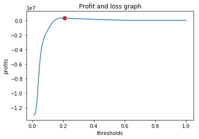

# 統計演習

https://archive.ics.uci.edu/ml/datasets/bank+marketing  
のデータを利用

## サマリ

### ターゲットのユーザー像(ペルソナ)

契約成否でデータを比較（Excelで）  
以下の像が浮かび上がった

* 若者か高齢者（学生か退職者）で
* 前回電話したときに携帯でかけていて
* それも3月、4月、10月のいずれかだった人

### ROIを最大化させるための予測モデル

* 基本的なアプローチ
 1. 以下のCategoryを組み合わせた新しいCategoryを作成
    * age
    * job
    * contact
    * month
 2. logistic回帰でモデルを作成
 3. モデル作成時に利用したデータを利用して予測結果を取得
 4. 予測結果からモデルを評価（AUC）
 5. 良いモデルだったら、ROIが最大となるようなしきい値を算出（電話1回500円、契約成功LTVは2000円）
 6. テストデータを上記のモデルで評価する

* と思ったが、組み合わせのロジックがまずくて、trainとtestのカラム数が異なったので、一旦諦めて、
* 1. については以下で単純に実施
    * const
    * campaign
    * pdays
    * previous
    * emp.var.rate
    * nr.employed
    * job
    * marital
    * education
    * housing
    * loan
    * contact
    * poutcome
    * range_age (10歳おきのCategory)


* テストデータの予測結果から算出すると
  - 310,500 円の利益がでる。しきい値は 0.19
* その時のConfusionMatrix

|        |          | Predict  |          |
|--------|----------|----------|----------|
|        |          | Positive | Negative |
| Actual | Positive | 559      | 2188     |
|        | Negative | 1056      | 33265    |

* 適合率: 34.5%

# データ補完パート

## ライブラリの読み込み


```python
import pandas as pd
import pandas.io.sql as psql
import numpy as np
import matplotlib
import matplotlib.pyplot as plt
import pymysql
import random
import copy
import statsmodels.api as sm
random.seed(0)
import pylab as pl
from sklearn.metrics import roc_curve, auc as calc_auc
from sklearn.metrics import confusion_matrix

%matplotlib inline
```

    /Users/isapro/.pyenv/versions/anaconda3-5.1.0/lib/python3.6/site-packages/statsmodels/compat/pandas.py:56: FutureWarning: The pandas.core.datetools module is deprecated and will be removed in a future version. Please use the pandas.tseries module instead.
      from pandas.core import datetools


## 関数定義

### 欠損値カウント処理


```python
# 指定されたDataFrameのうちObjectタイプになっているカラムについて、欠損値名（指定しなければunknown）でチェックする
def count_nan_value_at_object(data, nan_value = "unknown"):
    for obj in data.select_dtypes(include=object).columns:
        num = data[data[obj] == nan_value][obj].count()
        print('column %s\tnum %d' % (obj, num))
```

### 欠損値補完処理


```python
# 指定されたDataFrameのうち、対象として選択したカラム名の欠損値（指定しなければunknown)を他の値の出現割合に応じて保管する
# 破壊的メソッド
def comp_missing_category_value(data, target, nan_value = "unknown"):
    if data.job.dtype != "object":
        return

    # 値が入っているところだけを取り出す（出現頻度に応じた補完をするため）
    not_unknown_df = data[data[target] != nan_value][target]
    not_unknown_df.reset_index(drop=True,inplace=True)
    
    # 値が入っている割合に従い、欠損値を補正する
    data.loc[data[target] == nan_value, target] = pd.Categorical(not_unknown_df[random.randint(0,not_unknown_df.count())])

```

### 不要カラム削除処理


```python
def drop_columns_as_start_with(data, drop_list):
    X = data.copy()
    for c in drop_list:
        for t in [s for s in X if s.startswith(c)]:
            X.drop(t, axis=1, inplace=True)
    return X
```

### CPRProt作成処理


```python
def CPRProtFigure(X, result):
    total = len(X.columns)
    ncol = 3
    nrow = int(total / ncol) + 1
    fig = plt.figure(figsize=(20, nrow*4))
    plt.subplots_adjust(wspace=0.3, hspace=0.5)
    for i in range(0,total):
        ax = fig.add_subplot(nrow,ncol,i+1)
        result.plot_partial_residuals(X.columns[i], ax)

    return plt
```

### ROCプロット作成処理


```python
def ROCPlot(Y, prY):
    # 偽陽性、真陽性、しきい値の組み合わせを取得する
    fpr, tpr, thresholds = roc_curve(Y, prY)
    # AUCを計算する
    roc_auc = calc_auc(fpr, tpr)
   
    # ROC曲線用の処理
    i = np.arange(len(tpr)) # index for df
    roc = pd.DataFrame({'fpr' : pd.Series(fpr, index=i),'tpr' : pd.Series(tpr, index = i), '1-fpr' : pd.Series(1-fpr, index = i), 'tf' : pd.Series(tpr - (1-fpr), index = i), 'thresholds' : pd.Series(thresholds, index = i)})
    roc.loc[(roc.tf-0).abs().argsort()[:1]]

    # 描画
    fig = plt.figure(figsize=(6, 6))
    plt.plot(roc['fpr'],roc['tpr'])
    plt.xlabel('False Positive Rate')
    plt.ylabel('True Positive Rate')
    plt.ylim([0,1])
    plt.xlim([0,1])
    plt.plot([[0,0],[1,1]], c='r')
    plt.title('ROC')

    return plt, roc_auc
```


```python
def TestModel1(data):
     # 新しい変数の作成
    new_category = ["job","range_age","education"]
    for job in data["job"].unique():
        for range_age in data["range_age"].unique():
            for edu in data["education"].unique():
                data.loc[(data["job"] == job) & (data["range_age"] == range_age) & (data["education"] == edu), "personal"] = f'{job}+{range_age}+{edu}'
    for cat in new_category:
        data.drop(cat, axis=1, inplace=True)
    return new_category

```


```python
def TestModel2(data):
     # 新しい変数の作成
    new_category = ["contact","education"]
    for k1 in data["contact"].unique():
        for k2 in data["education"].unique():
                data.loc[(data["contact"] == k1) & (data["education"] == k2), "personal"] = f'{k1}+{k2}'
    for cat in new_category:
        data.drop(cat, axis=1, inplace=True)                
    return new_category
```


```python
def TestModel3(data):
     # 新しい変数の作成
    new_category = ["contact","month","range_age","job"]
    for k1 in data["contact"].unique():
        for k2 in data["month"].unique():
            for k3 in data["range_age"].unique():
                for k4 in data["job"].unique():
                    data.loc[\
                        (data["contact"] == k1) &\
                        (data["month"] == k2) &\
                        (data["range_age"] == k3) &\
                        (data["job"] == k4), "personal"] = f'{k1}+{k2}+{k3}+{k4}'
    for cat in new_category:
        data.drop(cat, axis=1, inplace=True)                
    return new_category
```


```python
def TestModel4(data):
     # 新しい変数の作成
    new_category = ["contact","range_age","job"]
    for k1 in data["contact"].unique():
        for k2 in data["range_age"].unique():
            for k3 in data["job"].unique():
                    data.loc[\
                        (data["contact"] == k1) &\
                        (data["range_age"] == k2) &\
                        (data["job"] == k3), "personal"] = f'{k1}+{k2}+{k3}'
    for cat in new_category:
        data.drop(cat, axis=1, inplace=True)                
    return new_category
```

## MAIN関数


```python
def BANKMarketingDataCrensing(data):
    # 変数定義
    comp_list = ["job","marital","education","default","housing","loan"]
#     dummy_list = ["job","marital","education","default","housing","loan","contact","month","day_of_week","poutcome","range_age","personal"]
    dummy_list = ["job","marital","education","default","housing","loan","contact","month","day_of_week","poutcome","range_age"]

    # データの補完
    for target in comp_list:
        comp_missing_category_value(data, target, nan_value = "unknown")
    
    # ageのビンズ化(10歳ずつのカテゴリ)
    age_labels = [ "{0}_{1}".format(i, i + 9) for i in range(0, 100, 10) ]
    data.loc[:, "range_age"] = pd.cut(data.loc[:,'age'], np.arange(0, 101, 10), labels = age_labels)
    
    # 新しい変数の作成
#     used_array =  TestModel1(data)
#     used_array = TestModel2(data)
#     used_array = TestModel3(data)
#     used_array = TestModel4(data)
#     for v in used_array:
#         dummy_list.remove(v)
    
    # ダミー化
    analyze_data = data.copy()
    analyze_data = pd.get_dummies(analyze_data, columns=dummy_list, drop_first=True)
    
    # 切片の追加
    analyze_data = sm.add_constant(analyze_data)
    
    return analyze_data

def BANKMarketingCreateTrainData(data):
    # 変数定義
    drop_list = ['contract', 'duration','age','month','default','euribor3m','cons.','day_of','y']

    # dataの整形
    analyze_data = BANKMarketingDataCrensing(data)

    # 目的変数の作成
    analyze_data['contract'] = data['y'].apply(lambda x : 1 if x == "yes" else 0)
    
    # 目的変数と説明変数を抜き出して作成。説明変数からは不要なカラムを削除
    analyze_data_Y = analyze_data['contract']
    analyze_data_X = drop_columns_as_start_with(analyze_data, drop_list)

    # 分析用データの返却
    return analyze_data_X, analyze_data_Y

def BANKMarketingCreateTestData(data):
    # 変数定義
    drop_list = ['contract', 'duration','age','month','default','euribor3m','cons.','day_of','y']

    # dataの整形
    analyze_data = BANKMarketingDataCrensing(data)
    
    # 説明変数からは不要なカラムを削除
    analyze_data_X = drop_columns_as_start_with(analyze_data, drop_list)

    # 分析用データの返却
    return analyze_data_X

def BANKMarketingGLM(X, Y):
    # GLMの実行
    #モデルの構築
    model = sm.GLM(Y.astype(float), X, family=sm.families.Binomial())
    #fitに回帰した結果が入っているので、これをresに代入する
    res = model.fit()

    return res, X, Y

def BANKMarketingPredictProfit(Y, prY):
    # 変数定義
    thresholds = np.arange(0.01, 1.01, 0.01)
    profits = []
    max_t = 0
    max_p = 0
    max_tn = 0
    max_fp = 0
    max_fn = 0
    max_tp = 0

    # 最大値を探す
    for t in thresholds:
        # しきい値に対して0,1に変換する
        prY2 = prY.map(lambda x: 1 if x > t else 0)
        
        # 混同行列を作成
        tn, fp, fn, tp = confusion_matrix(Y, prY2).ravel()
        
        # 評価結果と最大値の更新
        y = 2000 * tp - 500 * (tp + fp)
        profits.append(y)
        if(max_t==0 or max_y < y):
            max_t = t
            max_y = y
            max_tn = tn
            max_fp = fp
            max_fn = fn
            max_tp = tp

    # 評価結果の描画
    fig, ax = plt.subplots()
    plt.plot(thresholds, profits)
    plt.scatter(max_t, max_y, marker='o', color='r', s=50)
    plt.xlabel('thresholds')
    plt.ylabel('profits')
    plt.title('Profit and loss graph')

    return plt, max_y, max_t, max_tp, max_fn, max_fp, max_tn

```

### 一発で予測結果を取得する関数


```python
def ippatu(train, test):
    # 整形
    trainX, trainY = BANKMarketingCreateTrainData(train)
    testX = BANKMarketingCreateTestData(test)

    # 予測モデル
    res, trainX, trainY = BANKMarketingGLM(trainX,trainY)
    
    # 予測結果の取得
    train_predY = res.predict(trainX)
    test_predY = res.predict(testX)

    # しきい値の最適化
    plt, y, t, tp, fn, fp, tn = BANKMarketingPredictProfit(trainY, train_predY)

    # 最適化された予測結果の格納
    temp = test.copy()
    temp['predict'] = test_predY.map(lambda x: 1 if x > t else 0)
    
    return temp, plt, y, t, tp, fn, fp, tn
```

## Main処理


```python
# データの読み込み
data = pd.read_csv('bank_marketing_train.csv')
# データの整形
X, Y = BANKMarketingCreateTrainData(data)
# 予測結果の取得
res, X, Y = BANKMarketingGLM(X,Y)
# 予測結果の表示
res.summary()
```


<table class="simpletable">
<caption>Generalized Linear Model Regression Results</caption>
<tr>
  <th>Dep. Variable:</th>      <td>contract</td>     <th>  No. Observations:  </th>  <td> 37068</td> 
</tr>
<tr>
  <th>Model:</th>                 <td>GLM</td>       <th>  Df Residuals:      </th>  <td> 37031</td> 
</tr>
<tr>
  <th>Model Family:</th>       <td>Binomial</td>     <th>  Df Model:          </th>  <td>    36</td> 
</tr>
<tr>
  <th>Link Function:</th>        <td>logit</td>      <th>  Scale:             </th>    <td>1.0</td>  
</tr>
<tr>
  <th>Method:</th>               <td>IRLS</td>       <th>  Log-Likelihood:    </th> <td> -9000.7</td>
</tr>
<tr>
  <th>Date:</th>           <td>Thu, 11 Apr 2019</td> <th>  Deviance:          </th> <td>  18001.</td>
</tr>
<tr>
  <th>Time:</th>               <td>20:28:58</td>     <th>  Pearson chi2:      </th> <td>3.81e+04</td>
</tr>
<tr>
  <th>No. Iterations:</th>        <td>19</td>        <th>                     </th>     <td> </td>   
</tr>
</table>
<table class="simpletable">
<tr>
                <td></td>                   <th>coef</th>     <th>std err</th>      <th>z</th>      <th>P>|z|</th>  <th>[0.025</th>    <th>0.975]</th>  
</tr>
<tr>
  <th>const</th>                         <td>  -35.0112</td> <td> 1773.082</td> <td>   -0.020</td> <td> 0.984</td> <td>-3510.188</td> <td> 3440.166</td>
</tr>
<tr>
  <th>campaign</th>                      <td>   -0.0436</td> <td>    0.010</td> <td>   -4.392</td> <td> 0.000</td> <td>   -0.063</td> <td>   -0.024</td>
</tr>
<tr>
  <th>pdays</th>                         <td>   -0.0010</td> <td>    0.001</td> <td>   -1.597</td> <td> 0.110</td> <td>   -0.002</td> <td>    0.000</td>
</tr>
<tr>
  <th>previous</th>                      <td>    0.1647</td> <td>    0.224</td> <td>    0.735</td> <td> 0.462</td> <td>   -0.275</td> <td>    0.604</td>
</tr>
<tr>
  <th>emp.var.rate</th>                  <td>   -0.6351</td> <td>    0.068</td> <td>   -9.328</td> <td> 0.000</td> <td>   -0.769</td> <td>   -0.502</td>
</tr>
<tr>
  <th>nr.employed</th>                   <td>    0.0067</td> <td>    0.002</td> <td>    3.974</td> <td> 0.000</td> <td>    0.003</td> <td>    0.010</td>
</tr>
<tr>
  <th>job_blue-collar</th>               <td>   -0.1646</td> <td>    0.076</td> <td>   -2.169</td> <td> 0.030</td> <td>   -0.313</td> <td>   -0.016</td>
</tr>
<tr>
  <th>job_entrepreneur</th>              <td>   -0.0672</td> <td>    0.114</td> <td>   -0.589</td> <td> 0.556</td> <td>   -0.291</td> <td>    0.157</td>
</tr>
<tr>
  <th>job_housemaid</th>                 <td>   -0.1366</td> <td>    0.160</td> <td>   -0.851</td> <td> 0.395</td> <td>   -0.451</td> <td>    0.178</td>
</tr>
<tr>
  <th>job_management</th>                <td>   -0.1313</td> <td>    0.087</td> <td>   -1.508</td> <td> 0.131</td> <td>   -0.302</td> <td>    0.039</td>
</tr>
<tr>
  <th>job_retired</th>                   <td>    0.2412</td> <td>    0.132</td> <td>    1.828</td> <td> 0.067</td> <td>   -0.017</td> <td>    0.500</td>
</tr>
<tr>
  <th>job_self-employed</th>             <td>   -0.0410</td> <td>    0.114</td> <td>   -0.361</td> <td> 0.718</td> <td>   -0.264</td> <td>    0.182</td>
</tr>
<tr>
  <th>job_services</th>                  <td>   -0.1590</td> <td>    0.084</td> <td>   -1.901</td> <td> 0.057</td> <td>   -0.323</td> <td>    0.005</td>
</tr>
<tr>
  <th>job_student</th>                   <td>    0.3423</td> <td>    0.139</td> <td>    2.465</td> <td> 0.014</td> <td>    0.070</td> <td>    0.614</td>
</tr>
<tr>
  <th>job_technician</th>                <td>   -0.0105</td> <td>    0.072</td> <td>   -0.147</td> <td> 0.883</td> <td>   -0.151</td> <td>    0.130</td>
</tr>
<tr>
  <th>job_unemployed</th>                <td>   -0.0362</td> <td>    0.127</td> <td>   -0.285</td> <td> 0.775</td> <td>   -0.285</td> <td>    0.213</td>
</tr>
<tr>
  <th>marital_married</th>               <td>    0.0320</td> <td>    0.070</td> <td>    0.457</td> <td> 0.648</td> <td>   -0.105</td> <td>    0.169</td>
</tr>
<tr>
  <th>marital_single</th>                <td>    0.1276</td> <td>    0.078</td> <td>    1.637</td> <td> 0.102</td> <td>   -0.025</td> <td>    0.280</td>
</tr>
<tr>
  <th>education_basic.6y</th>            <td>    0.2129</td> <td>    0.115</td> <td>    1.847</td> <td> 0.065</td> <td>   -0.013</td> <td>    0.439</td>
</tr>
<tr>
  <th>education_basic.9y</th>            <td>    0.0843</td> <td>    0.090</td> <td>    0.935</td> <td> 0.350</td> <td>   -0.092</td> <td>    0.261</td>
</tr>
<tr>
  <th>education_high.school</th>         <td>    0.1066</td> <td>    0.096</td> <td>    1.112</td> <td> 0.266</td> <td>   -0.081</td> <td>    0.294</td>
</tr>
<tr>
  <th>education_illiterate</th>          <td>    0.8867</td> <td>    0.782</td> <td>    1.134</td> <td> 0.257</td> <td>   -0.646</td> <td>    2.420</td>
</tr>
<tr>
  <th>education_professional.course</th> <td>    0.1181</td> <td>    0.107</td> <td>    1.101</td> <td> 0.271</td> <td>   -0.092</td> <td>    0.328</td>
</tr>
<tr>
  <th>education_university.degree</th>   <td>    0.2856</td> <td>    0.096</td> <td>    2.971</td> <td> 0.003</td> <td>    0.097</td> <td>    0.474</td>
</tr>
<tr>
  <th>housing_yes</th>                   <td>   -0.0631</td> <td>    0.041</td> <td>   -1.527</td> <td> 0.127</td> <td>   -0.144</td> <td>    0.018</td>
</tr>
<tr>
  <th>loan_yes</th>                      <td>   -0.0206</td> <td>    0.057</td> <td>   -0.361</td> <td> 0.718</td> <td>   -0.132</td> <td>    0.091</td>
</tr>
<tr>
  <th>contact_telephone</th>             <td>   -0.2399</td> <td>    0.058</td> <td>   -4.165</td> <td> 0.000</td> <td>   -0.353</td> <td>   -0.127</td>
</tr>
<tr>
  <th>poutcome_nonexistent</th>          <td>    0.8898</td> <td>    0.248</td> <td>    3.591</td> <td> 0.000</td> <td>    0.404</td> <td>    1.376</td>
</tr>
<tr>
  <th>poutcome_success</th>              <td>    1.0044</td> <td>    0.616</td> <td>    1.629</td> <td> 0.103</td> <td>   -0.204</td> <td>    2.213</td>
</tr>
<tr>
  <th>range_age_10_19</th>               <td>   -1.2609</td> <td> 1773.065</td> <td>   -0.001</td> <td> 0.999</td> <td>-3476.404</td> <td> 3473.882</td>
</tr>
<tr>
  <th>range_age_20_29</th>               <td>   -2.0600</td> <td> 1773.065</td> <td>   -0.001</td> <td> 0.999</td> <td>-3477.203</td> <td> 3473.083</td>
</tr>
<tr>
  <th>range_age_30_39</th>               <td>   -2.2984</td> <td> 1773.065</td> <td>   -0.001</td> <td> 0.999</td> <td>-3477.441</td> <td> 3472.844</td>
</tr>
<tr>
  <th>range_age_40_49</th>               <td>   -2.3508</td> <td> 1773.065</td> <td>   -0.001</td> <td> 0.999</td> <td>-3477.494</td> <td> 3472.792</td>
</tr>
<tr>
  <th>range_age_50_59</th>               <td>   -2.1866</td> <td> 1773.065</td> <td>   -0.001</td> <td> 0.999</td> <td>-3477.329</td> <td> 3472.956</td>
</tr>
<tr>
  <th>range_age_60_69</th>               <td>   -1.1708</td> <td> 1773.065</td> <td>   -0.001</td> <td> 0.999</td> <td>-3476.314</td> <td> 3473.972</td>
</tr>
<tr>
  <th>range_age_70_79</th>               <td>   -1.3855</td> <td> 1773.065</td> <td>   -0.001</td> <td> 0.999</td> <td>-3476.528</td> <td> 3473.757</td>
</tr>
<tr>
  <th>range_age_80_89</th>               <td>   -0.8718</td> <td> 1773.065</td> <td>   -0.000</td> <td> 1.000</td> <td>-3476.015</td> <td> 3474.271</td>
</tr>
<tr>
  <th>range_age_90_99</th>               <td>  -21.4263</td> <td>  1.6e+04</td> <td>   -0.001</td> <td> 0.999</td> <td>-3.13e+04</td> <td> 3.13e+04</td>
</tr>
</table>


### AICの確認


```python
print("AIC: {0}".format(res.aic))
```

    AIC: 18075.45427925655


### CPR(Component Plus Residual) プロットで目的関数と説明変数の線形性を確認


```python
# plt = CPRProtFigure(X, res)
```

## 予測パート

### AUCを確認する


```python
# とりあえず、元データから予測する
predictData = X.copy()

# 予測の実施
prY = res.predict(predictData)
#  予測結果と実際の値よりAUCを計算する
plt, auc = ROCPlot(Y, prY)
print("AUC: {0}".format(auc))
```

    AUC: 0.6910283006897332


### 利益が最大化するポイントを算出


```python
plt, y, t, tp, fn, fp, tn = BANKMarketingPredictProfit(Y, prY)
print("Max Profit: {0}, Threshold: {1}".format(y, t))
print("ConfusionMatrix\n\t{0}\t\t{1}\n\t{2}\t\t{3}".format(tp, fn, fp, tn))
```

    Max Profit: 313000, Threshold: 0.18000000000000002
    ConfusionMatrix
    	620		2127
    	1234		33087


## （おまけ）一発で予測結果取得


```python
train = pd.read_csv('bank_marketing_train.csv')
test = pd.read_csv('bank_marketing_test-1.csv')
result, plt, y, t, tp, fn, fp, tn = ippatu(train,test)
print("Max Profit: {0}, Threshold: {1}".format(y, t))
print("ConfusionMatrix\n\t{0}\t\t{1}\n\t{2}\t\t{3}".format(tp, fn, fp, tn))
plt.show()
result
```

    Max Profit: 310500, Threshold: 0.19
    ConfusionMatrix
    	559		2188
    	1056		33265





<div>
<style scoped>
    .dataframe tbody tr th:only-of-type {
        vertical-align: middle;
    }

    .dataframe tbody tr th {
        vertical-align: top;
    }

    .dataframe thead th {
        text-align: right;
    }
</style>
<table border="1" class="dataframe">
  <thead>
    <tr style="text-align: right;">
      <th></th>
      <th>age</th>
      <th>job</th>
      <th>marital</th>
      <th>education</th>
      <th>default</th>
      <th>housing</th>
      <th>loan</th>
      <th>contact</th>
      <th>month</th>
      <th>day_of_week</th>
      <th>...</th>
      <th>previous</th>
      <th>poutcome</th>
      <th>emp.var.rate</th>
      <th>cons.price.idx</th>
      <th>cons.conf.idx</th>
      <th>euribor3m</th>
      <th>nr.employed</th>
      <th>y</th>
      <th>range_age</th>
      <th>predict</th>
    </tr>
  </thead>
  <tbody>
    <tr>
      <th>0</th>
      <td>32</td>
      <td>admin.</td>
      <td>single</td>
      <td>university.degree</td>
      <td>no</td>
      <td>yes</td>
      <td>no</td>
      <td>cellular</td>
      <td>jul</td>
      <td>wed</td>
      <td>...</td>
      <td>0</td>
      <td>nonexistent</td>
      <td>-2.9</td>
      <td>92.469</td>
      <td>-33.6</td>
      <td>1.029</td>
      <td>5076.2</td>
      <td>yes</td>
      <td>30_39</td>
      <td>1</td>
    </tr>
    <tr>
      <th>1</th>
      <td>59</td>
      <td>admin.</td>
      <td>married</td>
      <td>high.school</td>
      <td>no</td>
      <td>yes</td>
      <td>no</td>
      <td>cellular</td>
      <td>jul</td>
      <td>wed</td>
      <td>...</td>
      <td>0</td>
      <td>nonexistent</td>
      <td>-2.9</td>
      <td>92.469</td>
      <td>-33.6</td>
      <td>1.029</td>
      <td>5076.2</td>
      <td>no</td>
      <td>50_59</td>
      <td>1</td>
    </tr>
    <tr>
      <th>2</th>
      <td>40</td>
      <td>technician</td>
      <td>married</td>
      <td>high.school</td>
      <td>no</td>
      <td>yes</td>
      <td>no</td>
      <td>cellular</td>
      <td>jul</td>
      <td>wed</td>
      <td>...</td>
      <td>1</td>
      <td>success</td>
      <td>-2.9</td>
      <td>92.469</td>
      <td>-33.6</td>
      <td>1.029</td>
      <td>5076.2</td>
      <td>no</td>
      <td>30_39</td>
      <td>1</td>
    </tr>
    <tr>
      <th>3</th>
      <td>26</td>
      <td>admin.</td>
      <td>single</td>
      <td>university.degree</td>
      <td>no</td>
      <td>yes</td>
      <td>no</td>
      <td>cellular</td>
      <td>jul</td>
      <td>wed</td>
      <td>...</td>
      <td>0</td>
      <td>nonexistent</td>
      <td>-2.9</td>
      <td>92.469</td>
      <td>-33.6</td>
      <td>1.029</td>
      <td>5076.2</td>
      <td>yes</td>
      <td>20_29</td>
      <td>1</td>
    </tr>
    <tr>
      <th>4</th>
      <td>36</td>
      <td>technician</td>
      <td>married</td>
      <td>professional.course</td>
      <td>no</td>
      <td>yes</td>
      <td>no</td>
      <td>cellular</td>
      <td>jul</td>
      <td>wed</td>
      <td>...</td>
      <td>0</td>
      <td>nonexistent</td>
      <td>-2.9</td>
      <td>92.469</td>
      <td>-33.6</td>
      <td>1.029</td>
      <td>5076.2</td>
      <td>no</td>
      <td>30_39</td>
      <td>1</td>
    </tr>
    <tr>
      <th>5</th>
      <td>32</td>
      <td>admin.</td>
      <td>single</td>
      <td>university.degree</td>
      <td>no</td>
      <td>yes</td>
      <td>no</td>
      <td>cellular</td>
      <td>jul</td>
      <td>wed</td>
      <td>...</td>
      <td>0</td>
      <td>nonexistent</td>
      <td>-2.9</td>
      <td>92.469</td>
      <td>-33.6</td>
      <td>1.029</td>
      <td>5076.2</td>
      <td>yes</td>
      <td>30_39</td>
      <td>1</td>
    </tr>
    <tr>
      <th>6</th>
      <td>38</td>
      <td>admin.</td>
      <td>married</td>
      <td>high.school</td>
      <td>no</td>
      <td>yes</td>
      <td>yes</td>
      <td>telephone</td>
      <td>jul</td>
      <td>wed</td>
      <td>...</td>
      <td>0</td>
      <td>nonexistent</td>
      <td>-2.9</td>
      <td>92.469</td>
      <td>-33.6</td>
      <td>1.029</td>
      <td>5076.2</td>
      <td>no</td>
      <td>30_39</td>
      <td>0</td>
    </tr>
    <tr>
      <th>7</th>
      <td>29</td>
      <td>student</td>
      <td>single</td>
      <td>high.school</td>
      <td>no</td>
      <td>yes</td>
      <td>no</td>
      <td>cellular</td>
      <td>jul</td>
      <td>thu</td>
      <td>...</td>
      <td>0</td>
      <td>nonexistent</td>
      <td>-2.9</td>
      <td>92.469</td>
      <td>-33.6</td>
      <td>1.018</td>
      <td>5076.2</td>
      <td>yes</td>
      <td>20_29</td>
      <td>1</td>
    </tr>
    <tr>
      <th>8</th>
      <td>33</td>
      <td>technician</td>
      <td>single</td>
      <td>university.degree</td>
      <td>no</td>
      <td>yes</td>
      <td>no</td>
      <td>cellular</td>
      <td>jul</td>
      <td>thu</td>
      <td>...</td>
      <td>0</td>
      <td>nonexistent</td>
      <td>-2.9</td>
      <td>92.469</td>
      <td>-33.6</td>
      <td>1.018</td>
      <td>5076.2</td>
      <td>no</td>
      <td>30_39</td>
      <td>1</td>
    </tr>
    <tr>
      <th>9</th>
      <td>32</td>
      <td>admin.</td>
      <td>single</td>
      <td>university.degree</td>
      <td>no</td>
      <td>yes</td>
      <td>no</td>
      <td>cellular</td>
      <td>jul</td>
      <td>thu</td>
      <td>...</td>
      <td>0</td>
      <td>nonexistent</td>
      <td>-2.9</td>
      <td>92.469</td>
      <td>-33.6</td>
      <td>1.018</td>
      <td>5076.2</td>
      <td>no</td>
      <td>30_39</td>
      <td>1</td>
    </tr>
    <tr>
      <th>10</th>
      <td>23</td>
      <td>blue-collar</td>
      <td>single</td>
      <td>high.school</td>
      <td>no</td>
      <td>no</td>
      <td>no</td>
      <td>cellular</td>
      <td>jul</td>
      <td>fri</td>
      <td>...</td>
      <td>0</td>
      <td>nonexistent</td>
      <td>-2.9</td>
      <td>92.469</td>
      <td>-33.6</td>
      <td>1.007</td>
      <td>5076.2</td>
      <td>yes</td>
      <td>20_29</td>
      <td>1</td>
    </tr>
    <tr>
      <th>11</th>
      <td>32</td>
      <td>admin.</td>
      <td>single</td>
      <td>university.degree</td>
      <td>no</td>
      <td>yes</td>
      <td>no</td>
      <td>telephone</td>
      <td>jul</td>
      <td>fri</td>
      <td>...</td>
      <td>0</td>
      <td>nonexistent</td>
      <td>-2.9</td>
      <td>92.469</td>
      <td>-33.6</td>
      <td>1.007</td>
      <td>5076.2</td>
      <td>no</td>
      <td>30_39</td>
      <td>1</td>
    </tr>
    <tr>
      <th>12</th>
      <td>23</td>
      <td>technician</td>
      <td>single</td>
      <td>professional.course</td>
      <td>no</td>
      <td>yes</td>
      <td>no</td>
      <td>telephone</td>
      <td>jul</td>
      <td>fri</td>
      <td>...</td>
      <td>0</td>
      <td>nonexistent</td>
      <td>-2.9</td>
      <td>92.469</td>
      <td>-33.6</td>
      <td>1.007</td>
      <td>5076.2</td>
      <td>yes</td>
      <td>20_29</td>
      <td>1</td>
    </tr>
    <tr>
      <th>13</th>
      <td>29</td>
      <td>technician</td>
      <td>single</td>
      <td>university.degree</td>
      <td>no</td>
      <td>yes</td>
      <td>yes</td>
      <td>cellular</td>
      <td>jul</td>
      <td>mon</td>
      <td>...</td>
      <td>0</td>
      <td>nonexistent</td>
      <td>-2.9</td>
      <td>92.469</td>
      <td>-33.6</td>
      <td>0.996</td>
      <td>5076.2</td>
      <td>no</td>
      <td>20_29</td>
      <td>1</td>
    </tr>
    <tr>
      <th>14</th>
      <td>51</td>
      <td>management</td>
      <td>divorced</td>
      <td>university.degree</td>
      <td>no</td>
      <td>yes</td>
      <td>no</td>
      <td>telephone</td>
      <td>jul</td>
      <td>wed</td>
      <td>...</td>
      <td>0</td>
      <td>nonexistent</td>
      <td>-2.9</td>
      <td>92.469</td>
      <td>-33.6</td>
      <td>0.979</td>
      <td>5076.2</td>
      <td>no</td>
      <td>50_59</td>
      <td>1</td>
    </tr>
    <tr>
      <th>15</th>
      <td>26</td>
      <td>admin.</td>
      <td>single</td>
      <td>university.degree</td>
      <td>no</td>
      <td>yes</td>
      <td>no</td>
      <td>cellular</td>
      <td>jul</td>
      <td>wed</td>
      <td>...</td>
      <td>0</td>
      <td>nonexistent</td>
      <td>-2.9</td>
      <td>92.469</td>
      <td>-33.6</td>
      <td>0.979</td>
      <td>5076.2</td>
      <td>no</td>
      <td>20_29</td>
      <td>1</td>
    </tr>
    <tr>
      <th>16</th>
      <td>51</td>
      <td>management</td>
      <td>divorced</td>
      <td>university.degree</td>
      <td>no</td>
      <td>no</td>
      <td>no</td>
      <td>cellular</td>
      <td>jul</td>
      <td>wed</td>
      <td>...</td>
      <td>1</td>
      <td>failure</td>
      <td>-2.9</td>
      <td>92.469</td>
      <td>-33.6</td>
      <td>0.979</td>
      <td>5076.2</td>
      <td>no</td>
      <td>50_59</td>
      <td>0</td>
    </tr>
    <tr>
      <th>17</th>
      <td>45</td>
      <td>admin.</td>
      <td>married</td>
      <td>university.degree</td>
      <td>no</td>
      <td>yes</td>
      <td>no</td>
      <td>telephone</td>
      <td>jul</td>
      <td>thu</td>
      <td>...</td>
      <td>0</td>
      <td>nonexistent</td>
      <td>-2.9</td>
      <td>92.469</td>
      <td>-33.6</td>
      <td>0.969</td>
      <td>5076.2</td>
      <td>no</td>
      <td>40_49</td>
      <td>0</td>
    </tr>
    <tr>
      <th>18</th>
      <td>27</td>
      <td>management</td>
      <td>single</td>
      <td>university.degree</td>
      <td>no</td>
      <td>yes</td>
      <td>no</td>
      <td>cellular</td>
      <td>jul</td>
      <td>mon</td>
      <td>...</td>
      <td>0</td>
      <td>nonexistent</td>
      <td>-2.9</td>
      <td>92.469</td>
      <td>-33.6</td>
      <td>0.944</td>
      <td>5076.2</td>
      <td>yes</td>
      <td>20_29</td>
      <td>1</td>
    </tr>
    <tr>
      <th>19</th>
      <td>37</td>
      <td>services</td>
      <td>married</td>
      <td>high.school</td>
      <td>no</td>
      <td>yes</td>
      <td>no</td>
      <td>cellular</td>
      <td>jul</td>
      <td>mon</td>
      <td>...</td>
      <td>0</td>
      <td>nonexistent</td>
      <td>-2.9</td>
      <td>92.469</td>
      <td>-33.6</td>
      <td>0.944</td>
      <td>5076.2</td>
      <td>no</td>
      <td>30_39</td>
      <td>0</td>
    </tr>
    <tr>
      <th>20</th>
      <td>27</td>
      <td>technician</td>
      <td>single</td>
      <td>university.degree</td>
      <td>no</td>
      <td>yes</td>
      <td>no</td>
      <td>cellular</td>
      <td>jul</td>
      <td>mon</td>
      <td>...</td>
      <td>0</td>
      <td>nonexistent</td>
      <td>-2.9</td>
      <td>92.469</td>
      <td>-33.6</td>
      <td>0.944</td>
      <td>5076.2</td>
      <td>no</td>
      <td>20_29</td>
      <td>1</td>
    </tr>
    <tr>
      <th>21</th>
      <td>36</td>
      <td>admin.</td>
      <td>married</td>
      <td>high.school</td>
      <td>no</td>
      <td>yes</td>
      <td>no</td>
      <td>telephone</td>
      <td>jul</td>
      <td>tue</td>
      <td>...</td>
      <td>0</td>
      <td>nonexistent</td>
      <td>-2.9</td>
      <td>92.469</td>
      <td>-33.6</td>
      <td>0.937</td>
      <td>5076.2</td>
      <td>no</td>
      <td>30_39</td>
      <td>0</td>
    </tr>
    <tr>
      <th>22</th>
      <td>53</td>
      <td>management</td>
      <td>married</td>
      <td>university.degree</td>
      <td>no</td>
      <td>yes</td>
      <td>yes</td>
      <td>telephone</td>
      <td>jul</td>
      <td>tue</td>
      <td>...</td>
      <td>0</td>
      <td>nonexistent</td>
      <td>-2.9</td>
      <td>92.469</td>
      <td>-33.6</td>
      <td>0.937</td>
      <td>5076.2</td>
      <td>no</td>
      <td>50_59</td>
      <td>0</td>
    </tr>
    <tr>
      <th>23</th>
      <td>35</td>
      <td>entrepreneur</td>
      <td>married</td>
      <td>high.school</td>
      <td>no</td>
      <td>no</td>
      <td>no</td>
      <td>cellular</td>
      <td>jul</td>
      <td>wed</td>
      <td>...</td>
      <td>0</td>
      <td>nonexistent</td>
      <td>-2.9</td>
      <td>92.469</td>
      <td>-33.6</td>
      <td>0.933</td>
      <td>5076.2</td>
      <td>yes</td>
      <td>30_39</td>
      <td>1</td>
    </tr>
    <tr>
      <th>24</th>
      <td>33</td>
      <td>admin.</td>
      <td>divorced</td>
      <td>university.degree</td>
      <td>no</td>
      <td>no</td>
      <td>yes</td>
      <td>cellular</td>
      <td>jul</td>
      <td>thu</td>
      <td>...</td>
      <td>0</td>
      <td>nonexistent</td>
      <td>-2.9</td>
      <td>92.469</td>
      <td>-33.6</td>
      <td>0.927</td>
      <td>5076.2</td>
      <td>no</td>
      <td>30_39</td>
      <td>1</td>
    </tr>
    <tr>
      <th>25</th>
      <td>27</td>
      <td>student</td>
      <td>single</td>
      <td>high.school</td>
      <td>no</td>
      <td>no</td>
      <td>no</td>
      <td>cellular</td>
      <td>jul</td>
      <td>thu</td>
      <td>...</td>
      <td>0</td>
      <td>nonexistent</td>
      <td>-2.9</td>
      <td>92.469</td>
      <td>-33.6</td>
      <td>0.927</td>
      <td>5076.2</td>
      <td>no</td>
      <td>20_29</td>
      <td>1</td>
    </tr>
    <tr>
      <th>26</th>
      <td>51</td>
      <td>admin.</td>
      <td>married</td>
      <td>university.degree</td>
      <td>no</td>
      <td>yes</td>
      <td>no</td>
      <td>cellular</td>
      <td>jul</td>
      <td>fri</td>
      <td>...</td>
      <td>0</td>
      <td>nonexistent</td>
      <td>-2.9</td>
      <td>92.469</td>
      <td>-33.6</td>
      <td>0.921</td>
      <td>5076.2</td>
      <td>yes</td>
      <td>50_59</td>
      <td>1</td>
    </tr>
    <tr>
      <th>27</th>
      <td>51</td>
      <td>admin.</td>
      <td>married</td>
      <td>university.degree</td>
      <td>no</td>
      <td>no</td>
      <td>no</td>
      <td>telephone</td>
      <td>jul</td>
      <td>fri</td>
      <td>...</td>
      <td>0</td>
      <td>nonexistent</td>
      <td>-2.9</td>
      <td>92.469</td>
      <td>-33.6</td>
      <td>0.921</td>
      <td>5076.2</td>
      <td>no</td>
      <td>50_59</td>
      <td>1</td>
    </tr>
    <tr>
      <th>28</th>
      <td>50</td>
      <td>self-employed</td>
      <td>married</td>
      <td>university.degree</td>
      <td>no</td>
      <td>no</td>
      <td>no</td>
      <td>cellular</td>
      <td>jul</td>
      <td>mon</td>
      <td>...</td>
      <td>0</td>
      <td>nonexistent</td>
      <td>-2.9</td>
      <td>92.469</td>
      <td>-33.6</td>
      <td>0.914</td>
      <td>5076.2</td>
      <td>no</td>
      <td>40_49</td>
      <td>1</td>
    </tr>
    <tr>
      <th>29</th>
      <td>38</td>
      <td>admin.</td>
      <td>single</td>
      <td>university.degree</td>
      <td>no</td>
      <td>yes</td>
      <td>no</td>
      <td>telephone</td>
      <td>jul</td>
      <td>mon</td>
      <td>...</td>
      <td>0</td>
      <td>nonexistent</td>
      <td>-2.9</td>
      <td>92.469</td>
      <td>-33.6</td>
      <td>0.914</td>
      <td>5076.2</td>
      <td>no</td>
      <td>30_39</td>
      <td>1</td>
    </tr>
    <tr>
      <th>...</th>
      <td>...</td>
      <td>...</td>
      <td>...</td>
      <td>...</td>
      <td>...</td>
      <td>...</td>
      <td>...</td>
      <td>...</td>
      <td>...</td>
      <td>...</td>
      <td>...</td>
      <td>...</td>
      <td>...</td>
      <td>...</td>
      <td>...</td>
      <td>...</td>
      <td>...</td>
      <td>...</td>
      <td>...</td>
      <td>...</td>
      <td>...</td>
    </tr>
    <tr>
      <th>4090</th>
      <td>35</td>
      <td>technician</td>
      <td>divorced</td>
      <td>basic.4y</td>
      <td>no</td>
      <td>no</td>
      <td>no</td>
      <td>cellular</td>
      <td>nov</td>
      <td>tue</td>
      <td>...</td>
      <td>0</td>
      <td>nonexistent</td>
      <td>-1.1</td>
      <td>94.767</td>
      <td>-50.8</td>
      <td>1.035</td>
      <td>4963.6</td>
      <td>yes</td>
      <td>30_39</td>
      <td>0</td>
    </tr>
    <tr>
      <th>4091</th>
      <td>35</td>
      <td>technician</td>
      <td>divorced</td>
      <td>basic.4y</td>
      <td>no</td>
      <td>yes</td>
      <td>no</td>
      <td>cellular</td>
      <td>nov</td>
      <td>tue</td>
      <td>...</td>
      <td>4</td>
      <td>success</td>
      <td>-1.1</td>
      <td>94.767</td>
      <td>-50.8</td>
      <td>1.035</td>
      <td>4963.6</td>
      <td>yes</td>
      <td>30_39</td>
      <td>0</td>
    </tr>
    <tr>
      <th>4092</th>
      <td>33</td>
      <td>admin.</td>
      <td>married</td>
      <td>university.degree</td>
      <td>no</td>
      <td>no</td>
      <td>no</td>
      <td>cellular</td>
      <td>nov</td>
      <td>tue</td>
      <td>...</td>
      <td>0</td>
      <td>nonexistent</td>
      <td>-1.1</td>
      <td>94.767</td>
      <td>-50.8</td>
      <td>1.035</td>
      <td>4963.6</td>
      <td>yes</td>
      <td>30_39</td>
      <td>0</td>
    </tr>
    <tr>
      <th>4093</th>
      <td>33</td>
      <td>admin.</td>
      <td>married</td>
      <td>university.degree</td>
      <td>no</td>
      <td>yes</td>
      <td>no</td>
      <td>cellular</td>
      <td>nov</td>
      <td>tue</td>
      <td>...</td>
      <td>1</td>
      <td>failure</td>
      <td>-1.1</td>
      <td>94.767</td>
      <td>-50.8</td>
      <td>1.035</td>
      <td>4963.6</td>
      <td>no</td>
      <td>30_39</td>
      <td>0</td>
    </tr>
    <tr>
      <th>4094</th>
      <td>60</td>
      <td>blue-collar</td>
      <td>married</td>
      <td>basic.4y</td>
      <td>no</td>
      <td>yes</td>
      <td>no</td>
      <td>cellular</td>
      <td>nov</td>
      <td>tue</td>
      <td>...</td>
      <td>1</td>
      <td>success</td>
      <td>-1.1</td>
      <td>94.767</td>
      <td>-50.8</td>
      <td>1.035</td>
      <td>4963.6</td>
      <td>no</td>
      <td>50_59</td>
      <td>0</td>
    </tr>
    <tr>
      <th>4095</th>
      <td>35</td>
      <td>technician</td>
      <td>divorced</td>
      <td>basic.4y</td>
      <td>no</td>
      <td>yes</td>
      <td>no</td>
      <td>cellular</td>
      <td>nov</td>
      <td>tue</td>
      <td>...</td>
      <td>2</td>
      <td>success</td>
      <td>-1.1</td>
      <td>94.767</td>
      <td>-50.8</td>
      <td>1.035</td>
      <td>4963.6</td>
      <td>yes</td>
      <td>30_39</td>
      <td>0</td>
    </tr>
    <tr>
      <th>4096</th>
      <td>54</td>
      <td>admin.</td>
      <td>married</td>
      <td>professional.course</td>
      <td>no</td>
      <td>no</td>
      <td>no</td>
      <td>cellular</td>
      <td>nov</td>
      <td>tue</td>
      <td>...</td>
      <td>1</td>
      <td>success</td>
      <td>-1.1</td>
      <td>94.767</td>
      <td>-50.8</td>
      <td>1.035</td>
      <td>4963.6</td>
      <td>yes</td>
      <td>50_59</td>
      <td>0</td>
    </tr>
    <tr>
      <th>4097</th>
      <td>38</td>
      <td>housemaid</td>
      <td>divorced</td>
      <td>university.degree</td>
      <td>no</td>
      <td>no</td>
      <td>no</td>
      <td>cellular</td>
      <td>nov</td>
      <td>wed</td>
      <td>...</td>
      <td>0</td>
      <td>nonexistent</td>
      <td>-1.1</td>
      <td>94.767</td>
      <td>-50.8</td>
      <td>1.030</td>
      <td>4963.6</td>
      <td>yes</td>
      <td>30_39</td>
      <td>0</td>
    </tr>
    <tr>
      <th>4098</th>
      <td>32</td>
      <td>admin.</td>
      <td>married</td>
      <td>university.degree</td>
      <td>no</td>
      <td>no</td>
      <td>no</td>
      <td>telephone</td>
      <td>nov</td>
      <td>wed</td>
      <td>...</td>
      <td>1</td>
      <td>failure</td>
      <td>-1.1</td>
      <td>94.767</td>
      <td>-50.8</td>
      <td>1.030</td>
      <td>4963.6</td>
      <td>yes</td>
      <td>30_39</td>
      <td>0</td>
    </tr>
    <tr>
      <th>4099</th>
      <td>32</td>
      <td>admin.</td>
      <td>married</td>
      <td>university.degree</td>
      <td>no</td>
      <td>yes</td>
      <td>no</td>
      <td>cellular</td>
      <td>nov</td>
      <td>wed</td>
      <td>...</td>
      <td>0</td>
      <td>nonexistent</td>
      <td>-1.1</td>
      <td>94.767</td>
      <td>-50.8</td>
      <td>1.030</td>
      <td>4963.6</td>
      <td>no</td>
      <td>30_39</td>
      <td>0</td>
    </tr>
    <tr>
      <th>4100</th>
      <td>38</td>
      <td>entrepreneur</td>
      <td>married</td>
      <td>university.degree</td>
      <td>no</td>
      <td>no</td>
      <td>no</td>
      <td>cellular</td>
      <td>nov</td>
      <td>wed</td>
      <td>...</td>
      <td>0</td>
      <td>nonexistent</td>
      <td>-1.1</td>
      <td>94.767</td>
      <td>-50.8</td>
      <td>1.030</td>
      <td>4963.6</td>
      <td>no</td>
      <td>30_39</td>
      <td>0</td>
    </tr>
    <tr>
      <th>4101</th>
      <td>62</td>
      <td>services</td>
      <td>married</td>
      <td>high.school</td>
      <td>no</td>
      <td>yes</td>
      <td>no</td>
      <td>cellular</td>
      <td>nov</td>
      <td>wed</td>
      <td>...</td>
      <td>0</td>
      <td>nonexistent</td>
      <td>-1.1</td>
      <td>94.767</td>
      <td>-50.8</td>
      <td>1.030</td>
      <td>4963.6</td>
      <td>no</td>
      <td>60_69</td>
      <td>0</td>
    </tr>
    <tr>
      <th>4102</th>
      <td>40</td>
      <td>management</td>
      <td>divorced</td>
      <td>university.degree</td>
      <td>no</td>
      <td>yes</td>
      <td>no</td>
      <td>cellular</td>
      <td>nov</td>
      <td>wed</td>
      <td>...</td>
      <td>4</td>
      <td>failure</td>
      <td>-1.1</td>
      <td>94.767</td>
      <td>-50.8</td>
      <td>1.030</td>
      <td>4963.6</td>
      <td>no</td>
      <td>30_39</td>
      <td>0</td>
    </tr>
    <tr>
      <th>4103</th>
      <td>33</td>
      <td>student</td>
      <td>married</td>
      <td>professional.course</td>
      <td>no</td>
      <td>yes</td>
      <td>no</td>
      <td>telephone</td>
      <td>nov</td>
      <td>thu</td>
      <td>...</td>
      <td>0</td>
      <td>nonexistent</td>
      <td>-1.1</td>
      <td>94.767</td>
      <td>-50.8</td>
      <td>1.031</td>
      <td>4963.6</td>
      <td>yes</td>
      <td>30_39</td>
      <td>0</td>
    </tr>
    <tr>
      <th>4104</th>
      <td>31</td>
      <td>admin.</td>
      <td>single</td>
      <td>university.degree</td>
      <td>no</td>
      <td>yes</td>
      <td>no</td>
      <td>cellular</td>
      <td>nov</td>
      <td>thu</td>
      <td>...</td>
      <td>0</td>
      <td>nonexistent</td>
      <td>-1.1</td>
      <td>94.767</td>
      <td>-50.8</td>
      <td>1.031</td>
      <td>4963.6</td>
      <td>yes</td>
      <td>30_39</td>
      <td>0</td>
    </tr>
    <tr>
      <th>4105</th>
      <td>62</td>
      <td>retired</td>
      <td>married</td>
      <td>university.degree</td>
      <td>no</td>
      <td>yes</td>
      <td>no</td>
      <td>cellular</td>
      <td>nov</td>
      <td>thu</td>
      <td>...</td>
      <td>2</td>
      <td>failure</td>
      <td>-1.1</td>
      <td>94.767</td>
      <td>-50.8</td>
      <td>1.031</td>
      <td>4963.6</td>
      <td>yes</td>
      <td>60_69</td>
      <td>0</td>
    </tr>
    <tr>
      <th>4106</th>
      <td>62</td>
      <td>retired</td>
      <td>married</td>
      <td>university.degree</td>
      <td>no</td>
      <td>yes</td>
      <td>no</td>
      <td>cellular</td>
      <td>nov</td>
      <td>thu</td>
      <td>...</td>
      <td>6</td>
      <td>success</td>
      <td>-1.1</td>
      <td>94.767</td>
      <td>-50.8</td>
      <td>1.031</td>
      <td>4963.6</td>
      <td>yes</td>
      <td>60_69</td>
      <td>1</td>
    </tr>
    <tr>
      <th>4107</th>
      <td>34</td>
      <td>student</td>
      <td>single</td>
      <td>university.degree</td>
      <td>no</td>
      <td>yes</td>
      <td>no</td>
      <td>cellular</td>
      <td>nov</td>
      <td>thu</td>
      <td>...</td>
      <td>2</td>
      <td>failure</td>
      <td>-1.1</td>
      <td>94.767</td>
      <td>-50.8</td>
      <td>1.031</td>
      <td>4963.6</td>
      <td>no</td>
      <td>30_39</td>
      <td>0</td>
    </tr>
    <tr>
      <th>4108</th>
      <td>38</td>
      <td>housemaid</td>
      <td>divorced</td>
      <td>high.school</td>
      <td>no</td>
      <td>yes</td>
      <td>yes</td>
      <td>cellular</td>
      <td>nov</td>
      <td>thu</td>
      <td>...</td>
      <td>0</td>
      <td>nonexistent</td>
      <td>-1.1</td>
      <td>94.767</td>
      <td>-50.8</td>
      <td>1.031</td>
      <td>4963.6</td>
      <td>no</td>
      <td>30_39</td>
      <td>0</td>
    </tr>
    <tr>
      <th>4109</th>
      <td>57</td>
      <td>retired</td>
      <td>married</td>
      <td>professional.course</td>
      <td>no</td>
      <td>yes</td>
      <td>no</td>
      <td>cellular</td>
      <td>nov</td>
      <td>thu</td>
      <td>...</td>
      <td>0</td>
      <td>nonexistent</td>
      <td>-1.1</td>
      <td>94.767</td>
      <td>-50.8</td>
      <td>1.031</td>
      <td>4963.6</td>
      <td>no</td>
      <td>50_59</td>
      <td>0</td>
    </tr>
    <tr>
      <th>4110</th>
      <td>62</td>
      <td>retired</td>
      <td>married</td>
      <td>university.degree</td>
      <td>no</td>
      <td>no</td>
      <td>no</td>
      <td>cellular</td>
      <td>nov</td>
      <td>thu</td>
      <td>...</td>
      <td>3</td>
      <td>success</td>
      <td>-1.1</td>
      <td>94.767</td>
      <td>-50.8</td>
      <td>1.031</td>
      <td>4963.6</td>
      <td>yes</td>
      <td>60_69</td>
      <td>1</td>
    </tr>
    <tr>
      <th>4111</th>
      <td>64</td>
      <td>retired</td>
      <td>divorced</td>
      <td>professional.course</td>
      <td>no</td>
      <td>yes</td>
      <td>no</td>
      <td>cellular</td>
      <td>nov</td>
      <td>fri</td>
      <td>...</td>
      <td>0</td>
      <td>nonexistent</td>
      <td>-1.1</td>
      <td>94.767</td>
      <td>-50.8</td>
      <td>1.028</td>
      <td>4963.6</td>
      <td>no</td>
      <td>60_69</td>
      <td>0</td>
    </tr>
    <tr>
      <th>4112</th>
      <td>36</td>
      <td>admin.</td>
      <td>married</td>
      <td>university.degree</td>
      <td>no</td>
      <td>no</td>
      <td>no</td>
      <td>cellular</td>
      <td>nov</td>
      <td>fri</td>
      <td>...</td>
      <td>0</td>
      <td>nonexistent</td>
      <td>-1.1</td>
      <td>94.767</td>
      <td>-50.8</td>
      <td>1.028</td>
      <td>4963.6</td>
      <td>no</td>
      <td>30_39</td>
      <td>0</td>
    </tr>
    <tr>
      <th>4113</th>
      <td>37</td>
      <td>admin.</td>
      <td>married</td>
      <td>university.degree</td>
      <td>no</td>
      <td>yes</td>
      <td>no</td>
      <td>cellular</td>
      <td>nov</td>
      <td>fri</td>
      <td>...</td>
      <td>0</td>
      <td>nonexistent</td>
      <td>-1.1</td>
      <td>94.767</td>
      <td>-50.8</td>
      <td>1.028</td>
      <td>4963.6</td>
      <td>yes</td>
      <td>30_39</td>
      <td>0</td>
    </tr>
    <tr>
      <th>4114</th>
      <td>29</td>
      <td>unemployed</td>
      <td>single</td>
      <td>basic.4y</td>
      <td>no</td>
      <td>yes</td>
      <td>no</td>
      <td>cellular</td>
      <td>nov</td>
      <td>fri</td>
      <td>...</td>
      <td>1</td>
      <td>success</td>
      <td>-1.1</td>
      <td>94.767</td>
      <td>-50.8</td>
      <td>1.028</td>
      <td>4963.6</td>
      <td>no</td>
      <td>20_29</td>
      <td>0</td>
    </tr>
    <tr>
      <th>4115</th>
      <td>73</td>
      <td>retired</td>
      <td>married</td>
      <td>professional.course</td>
      <td>no</td>
      <td>yes</td>
      <td>no</td>
      <td>cellular</td>
      <td>nov</td>
      <td>fri</td>
      <td>...</td>
      <td>0</td>
      <td>nonexistent</td>
      <td>-1.1</td>
      <td>94.767</td>
      <td>-50.8</td>
      <td>1.028</td>
      <td>4963.6</td>
      <td>yes</td>
      <td>70_79</td>
      <td>0</td>
    </tr>
    <tr>
      <th>4116</th>
      <td>46</td>
      <td>blue-collar</td>
      <td>married</td>
      <td>professional.course</td>
      <td>no</td>
      <td>no</td>
      <td>no</td>
      <td>cellular</td>
      <td>nov</td>
      <td>fri</td>
      <td>...</td>
      <td>0</td>
      <td>nonexistent</td>
      <td>-1.1</td>
      <td>94.767</td>
      <td>-50.8</td>
      <td>1.028</td>
      <td>4963.6</td>
      <td>no</td>
      <td>40_49</td>
      <td>0</td>
    </tr>
    <tr>
      <th>4117</th>
      <td>56</td>
      <td>retired</td>
      <td>married</td>
      <td>university.degree</td>
      <td>no</td>
      <td>yes</td>
      <td>no</td>
      <td>cellular</td>
      <td>nov</td>
      <td>fri</td>
      <td>...</td>
      <td>0</td>
      <td>nonexistent</td>
      <td>-1.1</td>
      <td>94.767</td>
      <td>-50.8</td>
      <td>1.028</td>
      <td>4963.6</td>
      <td>no</td>
      <td>50_59</td>
      <td>0</td>
    </tr>
    <tr>
      <th>4118</th>
      <td>44</td>
      <td>technician</td>
      <td>married</td>
      <td>professional.course</td>
      <td>no</td>
      <td>no</td>
      <td>no</td>
      <td>cellular</td>
      <td>nov</td>
      <td>fri</td>
      <td>...</td>
      <td>0</td>
      <td>nonexistent</td>
      <td>-1.1</td>
      <td>94.767</td>
      <td>-50.8</td>
      <td>1.028</td>
      <td>4963.6</td>
      <td>yes</td>
      <td>40_49</td>
      <td>0</td>
    </tr>
    <tr>
      <th>4119</th>
      <td>74</td>
      <td>retired</td>
      <td>married</td>
      <td>professional.course</td>
      <td>no</td>
      <td>yes</td>
      <td>no</td>
      <td>cellular</td>
      <td>nov</td>
      <td>fri</td>
      <td>...</td>
      <td>1</td>
      <td>failure</td>
      <td>-1.1</td>
      <td>94.767</td>
      <td>-50.8</td>
      <td>1.028</td>
      <td>4963.6</td>
      <td>no</td>
      <td>70_79</td>
      <td>0</td>
    </tr>
  </tbody>
</table>
<p>4120 rows × 23 columns</p>
</div>


